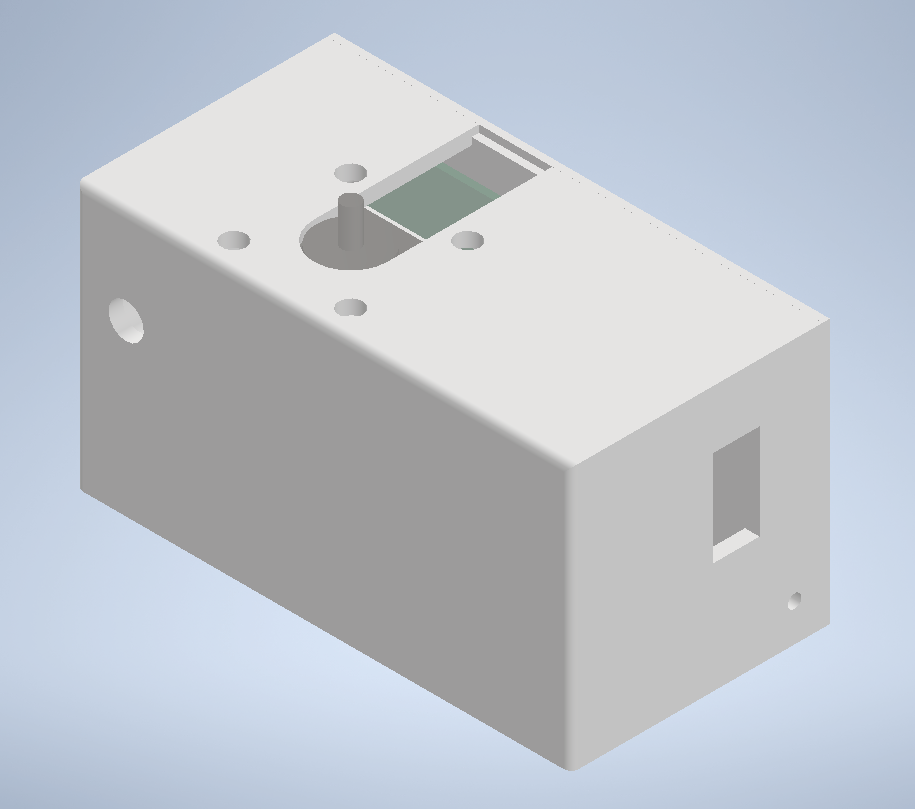
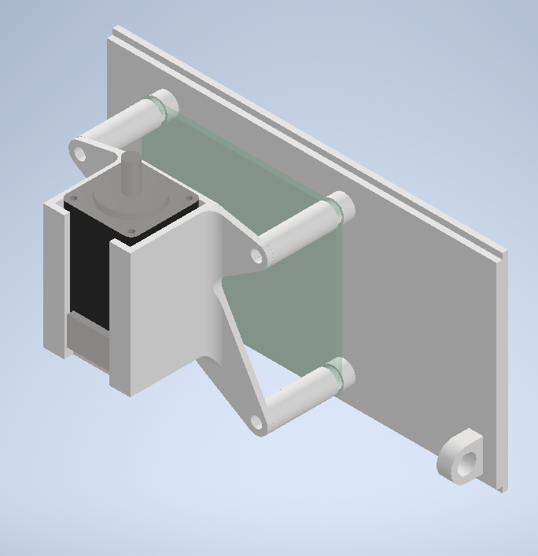
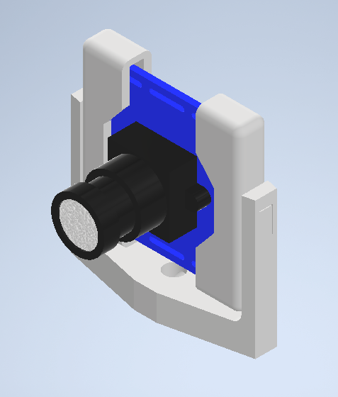
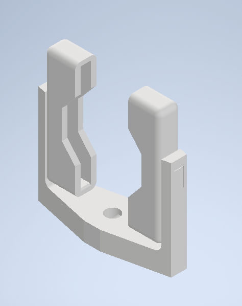
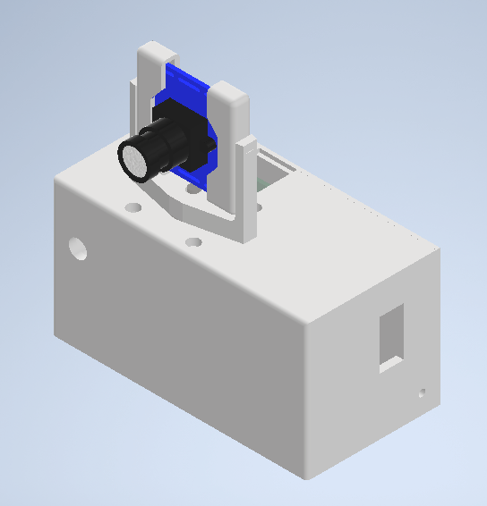

# Project Information
### Name: Transcription Study Assistant  
  
### Team Members:  
- Angela Christie [Computer Engineering]
- Grant Fass [Computer Science]
- Nicholas Kaja [Computer Science]
- Alexander Karpov [Computer Engineering]
- Teresa Toohill [Software Engineering]  
  
### Faculty Advisor: Dr. Sohum Sohoni

# Executive Summary
The Transcript Study Assistant provides aid to both instructors and students during the learning
process. This project provides a more affordable option for presentation-focused recording
devices than what is currently offered in the market. Using machine learning, the study assistant
helps break down large amounts of information into manageable pieces to help students
understand key concepts. This tool also helps educators identify the key concepts they are
teaching. A custom, all-in-one device has been developed and tailored to the classroom environment. A custom PCB has been designed to control the onboard camera, motor, and microphones. Files can be uploaded through our frontend (written in Angular) to our backend (written in Flask). The backend uses HuggingFace transformers and Latent Dirichlet Allocation to perform transcription, create summaries, extract keywords, and answer questions. Overall, the Study Assistant makes it easier for students to learn and for educators to communicate lecture material.   
  
One major accomplishment for the hardware team has been getting a working device. While the device could still use some improvements, we were able to implement most of our original design. Along with this, we were able to identify and solve some of the more important issues during the design process. This included having to add an amplification circuit to the design, needing to switch to a different camera choice, and having to alter the connection of the on-board potentiometer. Even though we ran into these issues, we were still able to create a device that works.  

One of the main accomplishments of the software team was getting the backend working. We setup the backend as a REST service with proper API documentation. This meant that we could theoretically let any frontend communicate with our backend. This allows for some flexibility. Moreover, we were able to overcome some learning-curves with Angular to create navigatable pages that communicate with the Backend successfully.

The machine learning team accomplished a lot this year. Much of the ML team's work required extensive research into unfamiliar models. The main accomplishment of the team would likely be the understanding and implementation of the various models that support our project. These include facets such as text summarization and topic modeling.

# Project Summary
### Machine Learning Team

The start of the project saw the machine learning team conducting research into Natural Language Processing (NLP) algorithms and models. We needed to gauge what functionality was possible and which models were easily accessible. Much of the research was compiled into [this]([Investigation] Early Machine Learning Algorithm Analysis) wiki page. This initial research mainly consisted of familiarizing ourselves with libraries such as NLTK and spaCy. We also learned about standard NLP preprocessing techniques such as stemming, lemmatization, and stop word removal. Finally, we looked into a few models and algorithms such as bag of words, tfidf, word embeddings, n-grams, and topic modeling.

Another component that proved to be useful was python's BeautifulSoup library. This is a web scraping library that allowed us to gather natural language datasets of our own. We initially looked for a dataset of classroom lectures to train or tune models with, but we were unsuccessful in our search. We started off using a dataset of TED Talk transcripts for most of our prototyping, but eventually felt actual classroom lectures would yield better results. So, we ended up collecting a dataset of transcripts from Khan Academy lecture videos.

In the end, ideas for many of these algorithms were discarded upon the discovery of transformer neural networks and the HuggingFace platform. Using
HuggingFace allowed for very easy access to pre-trained, open-source transformer neural networks that could perform various NLP tasks. Ultimately, we ended up with the following collection of models:  

**[BART-Large-CNN-Khan](https://huggingface.co/kajan1/bart-large-cnn-khan) - Summary generation**  
This model is a version of [facebook/bart-large-cnn](https://huggingface.co/facebook/bart-large-cnn) that was fine-tuned on the aforementioned Khan Academy lecture dataset. The goal was to remove a lot of the conversational aspects of the original model's outputs. With this model, we can provide summaries of transcripts. Multiple short descriptions are generated to help students navigate through long lectures.

**[tuner007/t5_abs_qa](https://huggingface.co/tuner007/t5_abs_qa) and [distilbert-base-cased-distilled-squad](https://huggingface.co/distilbert-base-cased-distilled-squad) - Question answering**  
These two models are used for question answering, which aims to answer questions a student may have about the content of a lecture. t5_abs_qa is an abstractive question answering model, which means it can create novel sequences to answer questions. On the other hand, the distilbert model is an extractive
question answering model. This means its answers are sequences pulled directly from the context. We use both models to complement each other; the abstractive model provides more interesting, natural sounding output while the extractive model gives a confidence score and points to the location in the text where it gets its answer

**[allenai/t5-small-squad2-question-generation](https://huggingface.co/allenai/t5-small-squad2-question-generation) - Question generation**  
This model allows us to generate questions about a lecture transcript. The goal is to provide material that could go on quizzes or flashcards. This is a T5 model fine-tuned on the Sandford Question Answering Dataset (SQuAD) using the questions as the target.

**[openai/whisper](https://huggingface.co/openai/whisper-tiny) - Transcription**  
This model allows us to extract transcripts from audio recordings of lectures. This model comes in various sizes where smaller versions transcribe faster but might not be as accurate. After some testing, we found that the whisper-tiny model seemed to perform well despite being the smallest iteration.
  
**Latent Dirichlet Allocation- Topic Modelling**  
Latent Dirichlet Allocation (LDA) is not a transformer, but rather a generative statistical model that aims to extract topics from a corpus. We use an LDA model trained on a combination of the TED Talk and Khan Academy datasets. This model allows us to pull out topics and keywords from any transcript we give it.
  
### Software Development Team
The software portion of our project was split into two main components. The first component is a REST backend made using the Flask library in Python. The second component is a frontend that was written using AngularJS. 

#### Backend
Work on the backend began with creating a communication protocol. This protocol documented every REST endpoint. For each endpoint it detailed they information, types, and formats that would be sent. This communication document can be found at [[Documentation] API Communication Protocol]([Documentation] API Communication Protocol). This protocol allowed us to implement endpoints as they were needed. It also provided a living document that highlighted what communications needed to be sent to or from the frontend at any given time. 

Messages that are sent to our backend must include session tokens, usernames, timestamps, and correlation IDs. These are all used to ensure that the proper user is sending a message. These are also used to make sure that the response is sent out for the message that requested it. 

The backend utilizes the MinIO S3 Object Store. This is used to store logs of endpoint traffic, account information, user files, and more. This allows us to quickly access files as they are needed. Using a S3 Object Store also means we could quickly scale up our storage using something like AWS if needed. Files that are retrieved from MinIO are then returned to the frontend. This information is usually sent over the data keyword of the payload as a base64 encoded string.

#### Frontend
We started working on our frontend by planning out possible GUI designs. We also worked on designating requirements and criteria. Documentation of this process can be found in [[Frontend] Early Possible Application Criteria]([Frontend] Early Possible Application Criteria) and [[Frontend] Possible GUI Designs]([Frontend] Possible GUI Designs). This front end set up was itended to be intuitive and easy for users to navigate as to prevent hinderance to education.

We developed various Angular components to allow for reusable, easy to change webpages. This navigation followed that of the GUI designs thanks in part to Angular modules like Browser Module, which allows for navigation between different Angular components (which appear as different webpages to our end users).

For login services, we utilized Auth0 to obtain the login, logout, and sign-up for an account functions of the webpage. This allowed for users to upload and study their own individualized materials. Further development to wrap up the project and improve (touch-ups prior to the presentation) upon frontend web design will likely involve MatTab functionality to bring pop-ups within the browser window for users to navigate between various files. 

### Hardware Team
After extensive research and analysis, we decided to move forward with building a custom device. Justification for this decision may be found in the [[Justification] Building Our Own Device](https://gitlab.com/msoe.edu/sdl/y23-senior-design/24-transcription-study-assistant/-/wikis/%5BJustification%5D%20Building%20Our%20Own%20Device) wiki page. Several preliminary sketches were created to determine how the device should look and operate. These sketches may be found on the [[Justification] Custom Device Form Factor](https://gitlab.com/msoe.edu/sdl/y23-senior-design/24-transcription-study-assistant/-/wikis/%5BJustification%5D%20Custom%20Device%20Form%20Factor) wiki page. After several team discussions, it was decided that sketch 4 would be the best device design to move forward with. The following image depicts device sketch 4.  
  
The custom device includes a camera, a motor, microphones, and a microcontroller. The following wiki pages outline the individual component choices and the justification for those decisions:  
- [[Justification] Camera](https://gitlab.com/msoe.edu/sdl/y23-senior-design/24-transcription-study-assistant/-/wikis/%5BJustification%5D%20Camera)
- [[Justification] Motor](https://gitlab.com/msoe.edu/sdl/y23-senior-design/24-transcription-study-assistant/-/wikis/%5BJustification%5D%20Motor)
- [[Justification] Microphone](https://gitlab.com/msoe.edu/sdl/y23-senior-design/24-transcription-study-assistant/-/wikis/%5BJustification%5D%20Microphone)
- [[Justification] Microcontroller](https://gitlab.com/msoe.edu/sdl/y23-senior-design/24-transcription-study-assistant/-/wikis/%5BJustification%5D%20Microcontroller)
- [[Justification] Device Interfacing](https://gitlab.com/msoe.edu/sdl/y23-senior-design/24-transcription-study-assistant/-/wikis/%5BJustification%5D%20Device%20Interfacing)
- [[Justification] Other Hardware Components](https://gitlab.com/msoe.edu/sdl/y23-senior-design/24-transcription-study-assistant/-/wikis/%5BJustification%5D%20Other%20Hardware%20Components)
  
After the selection of hardware components, several versions of block diagrams, schematics, and PCB layouts were created so that a custom board could be finalized and placed inside the device casing. The following images depict the finalized block diagram, schematic, and PCB layout.  
[BlockDiagramRev2.pdf](uploads/479fd1900b5b8239cfb73d7d4ecdd689/BlockDiagramRev2.pdf)  
[SchematicRev5.pdf](uploads/96dad588c9dda1623aeb4947233bc8f3/SchematicRev5.pdf)  
[PCB_Rev4.pdf](uploads/b870681f96d4e7b3faffb9d141177e93/PCB_Rev4.pdf)  
  
**3D Model**
The physical enclosure for the device (henceforth referred to as the "package"), was composed of two primary parts: The device base, and the camera turret.

**Device Base**

The device base was contains the following components:
- Main Control Board (MCU)
- MCU Circuit board
- Omnidirectional microphone
- Turret stepper motor

The base provides stability to the entire stability, and provides the necessary structure to house most of the components.




**Camera Shell and Turret**

The turret is responsible for holding the camera, and allows the turret stepper motor (housed in the base) to rotate the camera.

In the interest of prototyping, and for easy removal of the camera, the turret is composed of parts that are held together by tension, thereby allowing the camera to be removed with ease.

The turret was also originally supposed to house the directional mic. However, due to some technical difficulties during assembly, that part had to be removed.




**Everything Together**

The two sections are held together at the stepper motor axle. The turret is affixed to the axle via a simple pinch mechanism via a screw in the turret base.



**Device Interfacing**
Device interfacing is done via a raw serial information that is sent via the USB to and from the device.

More specifically, this data typically takes the following form:
<category> <directive?> <data?>

For example:
```
PING
MOTOR SPEED 50
MOTOR STEP 10
AUDIO START
AUDIO STOP
```

As can be noted, the directive and the data are optional arguments that may or may not be present, depending on the category.

The category describes which category is being triggered. I.e. the motor, the audio, etc.
The directive describes what should be done in the category. I.e. set the speed, start or stop the transmission.
Finally, the data can be used to pass additional information, such as how many steps to go, or what to set the speed to.

Likewise, the device can also return its own information, such as when it sends a snippet of audio data: `AUDIO BIT 128` (sent bit of data 128 bytes long).

On the Python side of things, almost all of this communication is stripped away.
There, the developer is exposed only to the following methods under the `Device` object:
- `ping() -> str`
  - Used to determine when device is ready to communicate.
- `motorSpeed(speed:int) -> None`
  - Used to set the speed at which the stepper motor rotates.
- `motorStep(steps:int) -> None`
  - Used to tell device how many steps the motor should step.
- `startAudioFeed(callback:Callable[[bytes], None]) -> None`
  - Used to tell device to begin audio transmission, and is also used to receive raw audio byte data.
- `stopAudioFeed() -> None`
  - Used to tell device to end audio transmission.
- `open() -> None`
  - Used to open communication with device.
- `close() -> None`
  - Used to close communication with device.

The intent, of course, is for the developer to not have to worry about any of the background interfacing code, and for the library to handle everything they could need.

**Interfacing Flow**
Setting up the device to communicate is fairly straightforward for the developer.
1. Determine the COM port that the device is connected to, and use the COM string (e.g. 'COM7') to instantiate the device.
2. Open the device.
3. Repeatedly call the `ping` function until it returns "pong". This verified that the device is properly communicating.
4. Call any combination of functional methods to execute specific actions.

### Completed PBI's and Team Member Time Spent
Each sprint was 3 weeks, except for sprint 8. Sprint 8 was 4 weeks.  
#### Sprint 1
- Investigate Possible ML Algorithms
- Collect and Prepare Transcripts
- Determine Software Infrastructure
- Mock-up Possible GUI Design & Wireframes
- Refine Hardware Design Decisions
- Perform a Customer Discovery Survey of Students
  - Partially completed since the survey was drafted but we didn't send the survey out yet
- Perform a Customer Discovery Survey of Teachers
  - Partially completed since the survey was drafted but we didn't send the survey out yet  
  
| Team Member      | Total Time Spent [Hours] |
| ---------------- | ------------------------ |
| Angela Christie  | 32.5                     |
| Grant Fass       | 31.25                    |
| Nicholas Kaja    | 28.5                     |
| Alexander Karpov | 25.5                     |
| Teresa Toohill   | 27                       |  
  
#### Sprint 2
- Prototype Transformer Text Summaries
- Investigate Audio Transcription Software
- Compare Models and Decide
- Prototype Word2Vec Model and its Variations
- Prototype LDA Model and its Variations
- Prototype GUI Looks
- Create Protocol for Backend to Frontend Communications
- Select a Microphone and Supplementary Hardware
- Create a High-Level Design of a Device
- Investigate the OWL Device
- Move Surveys to Qualtrics and Make Necessary Changes
- End-Of-Quarter Presentation
- Sprint 2 Retro
- Sprint 3 Planning  
  
| Team Member      | Total Time Spent [Hours] |
| ---------------- | ------------------------ |
| Angela Christie  | 30.5                     |
| Grant Fass       | 31.25                    |
| Nicholas Kaja    | 30.5                     |
| Alexander Karpov | 24                       |
| Teresa Toohill   | 31                       |  
  
#### Sprint 3
- Investigate Transformer Variations
- Develop a NLP Preprocessing Pipeline
- Prototype Angular Backend
- Prototype GT Webassembly Backend
- Select Microcontroller
- Determine Interfacing Options for the Device
- Create Bill of Materials for Hardware Components
- Determine Other Materials Needed for the Device Design
- Select a Motor and Supplementary Hardware
- Select a Camera and Supplementary Hardware
- Meet With Dr. Panciera (UX) to Discuss the Surveys
- Update Surveys After Meeting With Dr. Panciera
- Software Engineering Team Components Document
- SO3-4
- End-Of-Quarter Presentation
- Sprint 4 Planning
- Sprint 3 Retro  
  
| Team Member      | Total Time Spent [Hours] |
| ---------------- | ------------------------ |
| Angela Christie  | 30                       |
| Grant Fass       | 30.75                    |
| Nicholas Kaja    | 26                       |
| Alexander Karpov | 25                       |
| Teresa Toohill   | 30                       |  
  
#### Sprint 4
- Build Database of Khan Academy Transcripts
- Add Acronym Evaluation to the Preprocessing Pipeline
- Investigate LDA Variations
- Decide QT vs Angular
- Update Communications API to Support Logins
- Review Communications API
- Create 3D Model of Electrical Components
- Create 3D Models of Device Base Shell Components
- Review Wiring Diagram
- Design Custom Board Schematic/Block Diagram
- Review Custom Board Schematic
- Create PCB Layout
- Order Materials
- Pilot the Surveys
- Sprint 5 Planning
- Sprint 4 Retro  
  
| Team Member      | Total Time Spent [Hours] |
| ---------------- | ------------------------ |
| Angela Christie  | 28.5                     |
| Grant Fass       | 28.75                    |
| Nicholas Kaja    | 30.5                     |
| Alexander Karpov | 21                       |
| Teresa Toohill   | 29                       |  
  
#### Sprint 5
- Khan Academy Transfer Learning Investigation
- Khan Academy Transfer Learning Implementation
- Implement Some of the Data Processing Topic Backend Methods
- Implement Frontend for Menus and Navigation
- Implement Frontend for Authentication Topic Pages
- Begin Implementing Basic Communications Between Backend and Frontend on Decided Platform
- Update API Comms Doc (API Communication Document)
- Refine Electrical Component 3D Models
- Design Test Bench as 3D Model
- Review PCB Layout
- Solder Pins
  - Some of the components like the microcontroller and motor controller required pins to be soldered onto them before use
- Wire Prototype
- Test Microphones
- Deploy the Surveys
- SO2-1 Quality Analysis
- SO4-3 ACM Code of Ethics
- SO7-4 Knowledge Acquisition
- SO6-3 Usability Experiments
- Sprint 6 Planning
- Sprint 5 Retro  
  
| Team Member      | Total Time Spent [Hours] |
| ---------------- | ------------------------ |
| Angela Christie  | 32                       |
| Grant Fass       | 30.5                     |
| Nicholas Kaja    | 29.5                     |
| Alexander Karpov | 23                       |
| Teresa Toohill   | 30                       |  
  
#### Sprint 6
- Implement Transformer Prediction Class
- Implement LDA Prediction Class
- Implement Authentication Backend
- Implement Account Info Backend Topics
- Implement File Management Backend Topics
- Test Motor
- Test Camera
- Find Amplification Circuit
- Find Voltage Regulator for Directional Microphone
- Investigate I2S
- Redesign PCB with Require Microphone Updates
- PCB Redesign Meeting
- Presentation Draft
- Update the Software Engineering Team Components Document
- Update the Tech Report
- Sprint 7 Planning
- Sprint 6 Retro  
  
| Team Member      | Total Time Spent [Hours] |
| ---------------- | ------------------------ |
| Angela Christie  | 31.25                    |
| Grant Fass       | 56                       |
| Nicholas Kaja    | 30.5                     |
| Alexander Karpov | 28.5                     |
| Teresa Toohill   | 34                       |  
  
#### Sprint 7
- Question and Answer Systems Investigation
- Question and Answer Systems Implementation
- Speech to Text (STT) Transcription Implementation
- Create Website Launch Script
- Installation Step Updates
- Fix Multiple Process Kill Issue
- Fix NLTK Package Redownload on Launch
- Update API Comms Doc UUID Ref
- Fix Plaintext Passwords & Tokens
- Create Backend Error Codes & Messages
- Microphone Testing
  - Testing the microphones with the amplification circuit to make sure they work as intended
- Camera Quality Investigation
- Create Device Base Part Files
- Create 3D Assembly of Device Base
- Final Report
  - This only involves creating an initial draft of the final report
- Sprint 8 Planning
- Sprint 7 Retro  
  
| Team Member      | Total Time Spent [Hours] |
| ---------------- | ------------------------ |
| Angela Christie  | 33.5                     |
| Grant Fass       | 24.75                    |
| Nicholas Kaja    | 30.25                    |
| Alexander Karpov | 25                       |
| Teresa Toohill   | 35                       |  
  
#### Sprint 8 
- Implement Question Generation
- Remove Get Sentences by Keyword
- Implement the Time Logout in Backend
- Test VTT File Upload
- Fix Endpoint Types
- Create Unit Tests for Backend Endpoints
- Update API Comms Doc JSON User Data File Format
- Assemble PCB
- Create 3D Models of Device Camera Shell Components
- OWASP Audit
- Collect Poster Field Notes
- Create Poster Concept Maps and Sketches
- Draft Poster
- Finalize Poster  
  
| Team Member      | Total Time Spent [Hours] |
| ---------------- | ------------------------ |
| Angela Christie  | 39                       |
| Grant Fass       | 37.25                    |
| Nicholas Kaja    | 24                       |
| Alexander Karpov | 36                       |
| Teresa Toohill   | 55                       |   

# Software Engineering Team Components Documentation
Refer to the [Software Engineering Team Components](https://gitlab.com/msoe.edu/sdl/y23-senior-design/24-transcription-study-assistant/-/wikis/Software%20Engineering%20Team%20Components) wiki page.  
    
# Project Postmortem
**_[Address how the project meets ABET requirements]_**  
Firstly, this project meets the primary constraints and considerations involved with economic and social impacts. Our tool is used to educate, a critical skill that should be available to anyone. The origin of this project concept came from our own educational experience. One student in the project proposed the idea after discussing the affects of ADHD on their education (from information overload and challenges with executive function) and wanted to improve the experience for others who are neurodivergent. However, this product can also help ALL students. Access to education can have major impacts on the economy and we believe that is a major benefit to accessible education.
  
**Software Development Meets ABET Requirements**  
  
The software portion of our project relied on a lot of the skills learned in earlier classes. The foremost skill used was following SCRUM and Agile development. We also utilized skills that we learned such as being able to solve problems on our own and search for solutions. Specific to certain front-end web development skills, the use of REST endpoints, front-end development with frameworks similar to Angular, and other web development skills were brought into this project from previous course work like the MSOE courses SDL & Web Development. In terms of more technical skills that we used, I would say that the use of some of the languages and software qualify. We based part of our decision to use Flask and MinIO off of familiarity from the ML Production Systems course. We based our decision to use AngularJS off of some web dev experience. Our backend was designed so it would be modifiable and sustainable in the future. This was done through the use of our API communications protocol document.
  
**Machine Learning Meets ABET Requirements**  
  
The Machine Learning portion of our project relied on a lot of the experience and skills that we had cultivated in our course work. The foremost skill used was almost certainly the ability to read research papers and documentation. The ML side of our project relied extensively on models and methods that we were unfamiliar with and not taught in class. As such, we needed to investigate and research solutions and evaluate options on our own. This involved prototyping and building small test implementations using Jupyter Notebooks. We then used some of the experiences in software development from courses such as ML Production Systems and Natural Language Processing to integrate these solutions into our backend.

**Hardware Meets ABET Requirements**

The electrical hardware meets ABET requirements due to incorporating knowledge from numerous previous classes. 
Classes like Circuits, Digital Interfacing, and Systems Fabrication adequately covered many similar challenges to the ones we encountered during the project. It is the foundations taught in many of our courses that allowed us to develop anything even resembling a finished product. And of course, the many lab hours of hands-on experience allowed for a significant amount of tinkering and figuring out our own solutions to problems.

As far as the non-electrical hardware goes, the curriculum went above and beyond what would normally be expected. Computer engineers would normally not encounter a lot of opportunities to learn CAD software in the classroom. At MSOE however, the curriculum enabled us to be able to pick up this valuable skill. And so, the project ended up using a skill taught within a prior class.

It is the combination of all these prior classes that allowed for the proper considerations to be made during the conceptualization phase of the project -- that is how it would be manufactured, how it would impact users, and how we can bring the cost of the product down.
  
**_[How did the project change/evolve?]_**  
Parts of the device design did change over the course of the academic year. While the original design for the case remained the same, we did end up making some changes to the PCB design and to the specific parts included in the design. For instance, the original schematic and PCB layout design did not include a microphone amplification circuit. After adding this change, the PCB increased in size and the casing needed to be altered so the larger board could fit. We also ran into frame rate issues with the original SPI camera we had selected for the device. It was found that the SPI camera we selected was not able to support video streaming at 30fps. Since this was discovered late into the academic year, we needed to select a camera with plug-and-play capabilities. We ended up moving forward with a design that uses a USB splitter within the device casing that attaches to the camera and the PCB. Along with the camera, we decided to move forward with the omnidirectional microphone since the directional microphone was damaged during the board assembly process. Slight modifications were made to the connection of the potentiometer as well, which resulted in a working audio amplification circuit.

The software and ML sides of the project were constantly in flux throughout the year. We spent a lot of time on investigations and documenting our findings. We also spent a lot of time working on communication documentation. This meant that we did not get around to finalizing our technical decisions until the middle of the year. As an upside, this meant that we did not need to redo a lot of work. We based many of our choices off of our schoolwork and what we were familiar with. This allowed for quick and easy implementation. The largest changes in software were updates to the communication protocol as we began implementation. These changes were relatively minor though. The ML side had many more changes. This was due to its research based nature. There were many changes due to the constant evaluation and updating of new models. This meant that the direction we took changed a lot. We did try to mitigate this effect by creating small prototypes. This allowed us to test early and often.
  
**_[How effective was our planning and management of project risk?]_**  
We managed most of our project risk adequately. This was likely due to the amount of time that we spent on documentation and finalizing our initial decisions. The risk that we mitigated the least was the work on the frontend. This work ended up snowballing since we were all unfamiliar with the language that we chose.
    
**_[What team work and management issues did we encounter? How did we deal with them? How successful were we in managing them?]_**  
One team management issue we encountered was keeping good communication between the team members. One way we dealt with this was by having a mandatory weekly team meeting where we each discussed what we had completed that week and how we planned to move forward. Along with this, we discussed during the sprint retros how we needed to communicate progress and meeting plans to other team members in the specific issues and in the MS Teams Students channel. We were still working on this management issue during the final sprint, but we were making some progress.  
  
**_[Review sprint retro - were we able to respond to identified issues?]_**  
One main issue we had was sprint planning. For the first few sprints, we were creating a lot large issues that could not be completed until the end of the sprint, or had to be moved to the next sprint. This initially impacted the burndown charts and our team progress. However, we recognized this early and we were able to adjust to a different sprint planning style. We started to create smaller pointed issues and broke up large tasks into several smaller tasks. We also started to budget time for non-technical tasks, like sprint planning, SO assignments, etc.  
In the sprint retros we also identified that we needed to separate investigation and implementation issues so that it was easier to track progress. We began implementing this after sprint 3 and we continued to implement it within each of the following sprints.
