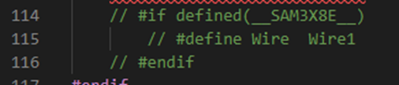

# [Test 1] Method of Testing  
ArduCAM provides a library and several Arduino sketch example programs to use with the 5MP Plus OV5462 camera. The provided ArduCAM repositories may be found here: [ArduCAM GitHub](https://github.com/ArduCAM). The Arduino repository was cloned and used for testing the camera. Several other documents were referenced while attempting to set up the camera example code. These may be found in the “Additional Resources” section on the camera product page found here: [Camera Product Page](https://www.uctronics.com/arducam-mini-module-camera-shield-5mp-plus-ov5642-camera-module-for-arduino-uno-mega-2560-board.html).  
  
The ArduCAM, ArduCAM_Touch, and UTFT4ArduCAM_SPI libraries were copied to the Arduino libraries directory so that the Arduino IDE was able to recognize them. The ArduCAM folder contains the file _memorysaver.h_ which contains the macro definitions of the hardware platforms and camera modules. For this project, “#define OV5642_MINI_5MP_PLUS” is the hardware platform macro definition that needs to be uncommented. The camera modules may be left commented out.  
  
While the camera can capture a single image, we are particularly concerned with the video streaming capabilities of the camera. ArduCAM provides an example video streaming sketch that is compatible with the camera we are using. The file may be found here: [ArduCAM_Mini_5MP_Plus_Video_Streaming.ino](https://github.com/ArduCAM/Arduino/tree/master/ArduCAM/examples/mini/ArduCAM_Mini_5MP_Plus_Video_Streaming).  
  
For our design, we will be connecting the CS pin on the camera directly to the +5V supply. The final design will have a switch that will either connect or disconnect this pin from the supply. The switch cannot fit on the breadboard so it has been left out of the prototype design and the CS pin will remain connected to the +5V supply for the duration of the test. The camera will also be tested with the CS pin connected to the SS pin [I/O pin 5] of the TinyPICO ESP32 Development board since the program assumes that the CS pin is already connected to the SS pin. The CS pin variable (line 38 of the example code below) needs to be set to 5 so that it matches the pin assignment of the development board.  

  

The baud rate needs to be set to 115200, so lines 55 and 56 of the sample code below may be left uncommented to ensure the correct baud rate is set for the Serial transfer. Once the COM port and the correct board type is selected, the sketch may be uploaded to the controller.  

  
 
ArduCAM also provides a host application that displays the streamed video on the computer. The host application executable may be found in the ArduCAM Arduino repository at this location: [Host Application](https://github.com/ArduCAM/Arduino/blob/master/ArduCAM/examples/host_app/ArduCAM_Host_V2.0_Windows/ArduCAM_Host_V2.exe). After opening the application, the COM port should be selected, and the baud rate should be set to 115200. After selecting open, the pixel window and the mode may be selected. For video streaming, the mode needs to be set to “Continuous,” which will be confirmed with a message in the terminal window. Once the settings have been configured, the capture button may be selected to begin the video streaming. The picture below shows the general settings that may be used to begin capturing the video streaming feed.  

  

The Arduino IDE should be closed and not running while running the host application since this may cause issues with connecting to the COM port.  
# [Test 1] Camera Test Results  
Camera video streaming was able to be captured while the CS pin of the camera was connected to the SS pin of the development board. When the CS pin of the camera was connected to the +5V supply, a SPI error would be printed to the console and the camera would not be functional. A screenshot of the video streaming working may be found below:  
  
 
The video camera quality was not very good and the frames per second [FPS] value was low (ranging between 0.10FPS to 0.32FPS).  
Before working, the example code would continue to stall at one point because a I2C transfer was unable to occur. It was found that having line 115, “#define Wire Wire1” uncommented in the ArduCAM.cpp file would disrupt the initialization process of the I2C peripheral. The stalling problem was fixed by commenting that line out.  
  
 
# [Test 1] Conclusion  
The ArduCAM 5MP Plus OV5462 camera does work properly when the CS pin is connected to the SS pin of the TinyPICO ESP32 Development board. However, the camera will not work with the current design that we have set in place. This would be connecting the CS pin of the camera to the +5V supply with a switch to enable and disable this connection. For this reason, we will need to re-think our design if we would like to incorporate a camera enable/disable switch. One possible solution is to move the switch to the VCC pin of the camera instead of having it connected to the CS pin. Other solutions will need to be discussed.  
 
While the camera works, it was found that the quality of the video was not very good. The video stream was blurry, and the FPS would only be around 0.10 to 0.32. The low FPS caused the video to have many cuts and delays. Further time and effort will need to be put towards looking into improving the video quality since this is an extremely important feature of the product.  
  
# [Test 2] Method of Testing  
The same video streaming sketch was used to attempt to stream 1080p resolution video at 30fps. The given host application was also used to display this video on the computer. Several different setup configurations were placed in the provided ArduCAM::InitCAM() function. The different configuration settings were found in the given [Software Application](https://www.uctronics.com/download/Image_Sensor/OV5642_camera_module_software_application_notes.pdf) document. For instance, the 1080p video streaming setting was placed in the initialization function to improve the video quality. In addition to this, an attempt was made to set the baud rate to 921600 instead of 115200 to see if that improved the frame rate. Further research into the ArduCAM documentation, video tutorials, and discussion forums was completed to determine if 1080p at 30fps video streaming was achievable with the given camera module. Along with this, ArduCAM support was contacted to discuss the capabilities of the given SPI camera.
# [Test 2] Camera Test Results  
It was found that the ArduCAM Mini 5MP Plus OV5642 Camera Module is **not** capable of streaming video at high frame rates. When running the given video streaming sketch, the highest frame rate that the camera was able to stream video at was around 3fps when the resolution was set to 320x240. When set to a resolution of 1080p, the frame rate dropped to around 0.4fps. When the given 1080p video streaming configuration setup was placed in the initialization function, the video quality improved significantly but the frame rate remained low. After talking with ArduCAM support, it was found that their SPI cameras don't support high frame rates. Instead, they recommended their MIPI cameras.
# [Test 2] Conclusion  
Because this SPI camera module is unable to support high frame rates, we will need to select a different camera for this project. Our goal is to provide end users with high quality lecture videos, which would require a frame rate of at least 30fps. When looking into a new camera, we will need to make sure the camera provides 1080p at 30fps video streaming. Along with this, we will need to consider how we will integrate a new camera into the design. Shipping times will be an even more important factor now that we are close to the end of this project.