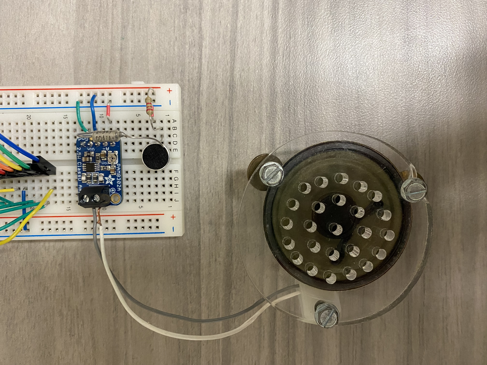
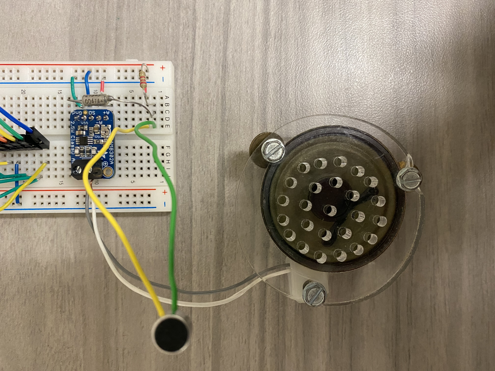

# [Test 1] Method of Testing  
A small test program was written to read the ADC pins that each microphone was connected to (GPIO pins 32 and 33) and then print those values to the console. Values were sampled at 1000ms, 500ms, and 0.5ms. These values were also checked with the serial plotter to see if the readings were changing with different sounds being directed towards the microphone (e.g. clapping).
# [Test 1] Microphone Test Results  
It was found that audio was unable to be received from both the directional and the omnidirectional microphones. Using a digital multimeter, the provided supply voltages were checked to ensure the controller was correctly providing the 3.3V and 5V supply voltage. It was found that the controller was providing the correct supply voltages. However, when the output voltage was read from the omnidirectional microphone, the values ranged from 0mV to 3mV. While the voltage was correctly changing based on the sound that the microphone was receiving, the signal was just too weak for the microcontroller to detect the signal. Along with this, it was found that the voltage divider was not providing the expected 2V supply voltage to the directional microphone. This is because the load that is connect to the Vout of the voltage divider causes a current flow to this load. The voltage divider resistors are no longer in series, so the expected output voltage no longer remains. Instead, the microphone is provided with a significantly smaller voltage value (around 0.106mV). 
# [Test 1] Conclusion  
Correct audio signals are unable to be received from both microphones. This is because both output signals require amplification, and a regulator is needed to provide a consistent 2V supply voltage to the directional microphone. Moving forward, we will need to research and select an audio amplification chip and a 5V to 2V regulator that will work best in our product. The audio amplification chip will handle the amplification of the microphone signals so that the microcontroller can detect the signals. The 5V to 2V linear voltage regulator will provide us with a fixed supply voltage of 2V, no matter what load is connected to it.  
  
An audio sampling protocol I2S was also investigated briefly. This may be the best method of sampling audio from the microphones because it eliminates the need for handling timing and interrupts. DMA (direct memory access) is used with this protocol, so it frees up the CPU and allows us to write samples to memory without the need for consistent interrupt handling. This protocol requires the use of three signals: a clock signal (BCLK), a word select signal (WS), and a data signal (DATA). The ESP32 controller has the capability of I2S communication and there are libraries that make setting up and using this protocol relatively easy. However, there may be an issue with access to pins and with the microphone peripherals themselves. First, we may need to have three pins available for each microphone. This is not currently possible since most of the pins are being used by other peripherals. Second, we may need a breakout board for each microphone that allows for I2S interfacing between the microphones and the controller. These breakout boards may also provide signal amplification, so this is something to keep in mind when researching amplification chips.  
  
Overall, it was verified via DMM measurements that the microphones do work. However, with our current wiring setup, the microcontroller is unable to process these signals. Further research and work will need to be put towards modifying the circuit so that audio is able to be correctly received and processed by the controller.
  
# [Test 2] Method of Testing  
The main difference between test 1 and test 2 is the introduction of an amplification circuit into the design. To ensure that the microphones work as intended, the output will be connected to an amplification circuit and analyzed. Since we are implementing the circuit ourselves for the final design, a breakout board will be used for testing purposes. The specific breakout board that was used during test 2 was the [Adafruit Mono 2.5W Class D Audio Amplifier - PAM8302](https://www.adafruit.com/product/2130). Both microphones were connected to the +5V supply provided by the TinyPico development board. The recommended configuration outlined in both microphone datasheets was used to receive the microphone output (2.2kOhm resistor and a 1uF capacitor). Since the microphones only provide one output, the A+ pin of the breakout board was connected to the microphone output and the A- pin was connected to GND. The board's SD pin was left unconnected, GND was connected to GND, and the VIN pin was connected to the +5V supply provided by the MCU. The breakout board requires a speaker to be directly connected to the output. Some time was spent looking into connecting the output to the MCU pins, but it was found that using a speaker was the best way to move forward with the test. For this reason, a speaker with an impedance of 8Ohms was used to determine if the microphones were operational. The following images show the circuit setup for testing each microphone:  
  
  
# [Test 2] Microphone Test Results  
Both microphones work as expected. Audio was able to be heard when the microphones were connected to the breakout board. A small hum was continuously heard during the test, so this may be something to keep in mind when using the microphones to record lecture audio.
# [Test 2] Conclusion  
While we are not using these exact breakout boards in the final design, the test results do help us confirm that the microphones will work with our version of the amplification circuit. The amplification circuit we are implementing is very similar to the one implemented on the breakout board. For this reason, we can confirm that the circuit we implemented will fix the issue we caught during test 1. Along with this, it's confirmed that the directional microphone will work fine when connected to a +5V supply.