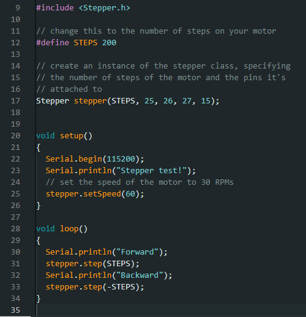

# Method of Testing  
Adafruit provides an example Arduino sketch that moves the motor forward and backwards in a loop. This example code may be copied from here: [Stepper Motor Example Sketch](https://learn.adafruit.com/adafruit-drv8833-dc-stepper-motor-driver-breakout-board/stepper-motor-usage). The example code has been modified so that the pin numbers and the baud rate match. Here is the example code:  
  

# Motor Test Results  
The motor is able to move as expected. The given Stepper Arduino library will work for the product we are developing.  

# Conclusion  
The motor works as expected. However, it is a bit loud while operating so this will be something we will need to consider as we continue to develop the product.  