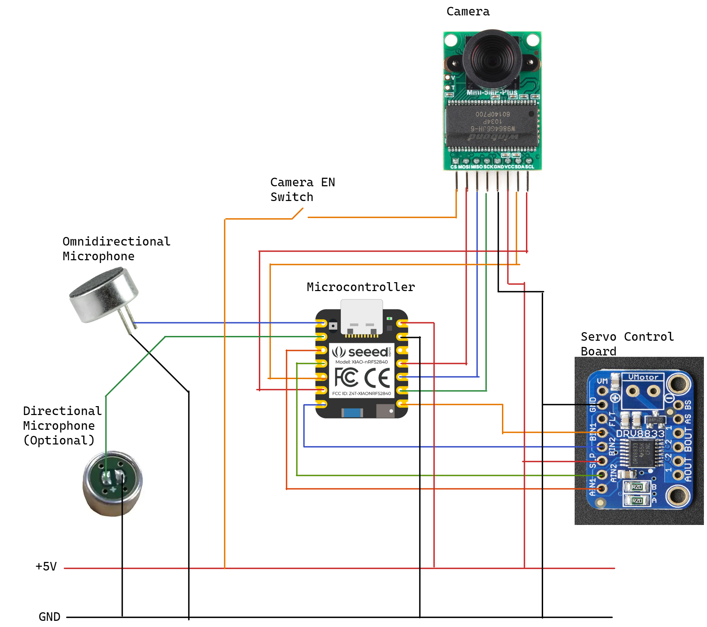
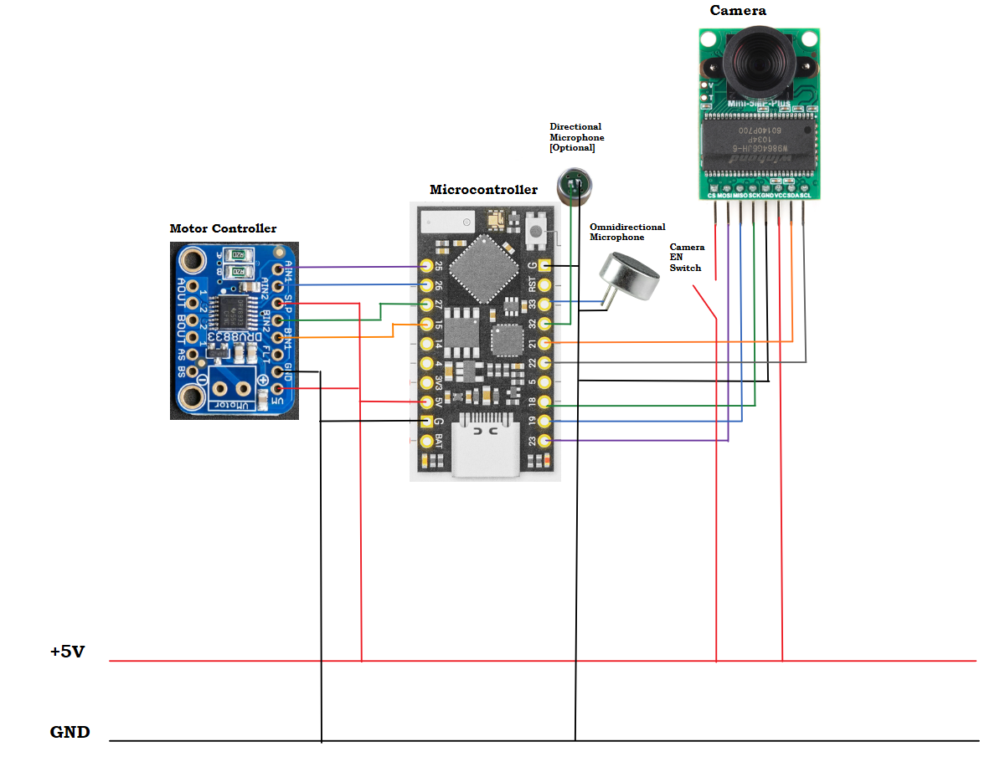

# Preliminary Design 1

This design features the ability to connect:
- 1x Directional Microphone (Optional)
- 1x Omnidirectional Microphone
- 1x Arduino Camera
- 1x Stepper Motor Driver

# Preliminary Design 2

This design features the ability to connect:
- 1x Directional Microphone (Optional)
- 1x Omnidirectional Microphone
- 1x Arduino Camera
- 1x Stepper Motor Driver

This design includes a microcontroller with more pins, allowing us some space to add more components to the design after prototyping.

## Preliminary Design Acceptance Criteria
The design is preliminary until the following acceptance criteria have been met:
- [ ] Current draw does not exceed the maximum for the microcontroller's pins
- [ ] Design has been verified by at least one member of the EECS department (i.e. Dr. Rothe, Dr. Meier, Dr. Sohoni)
- [ ] Integration of SD card via USB-C is discussed with other team members