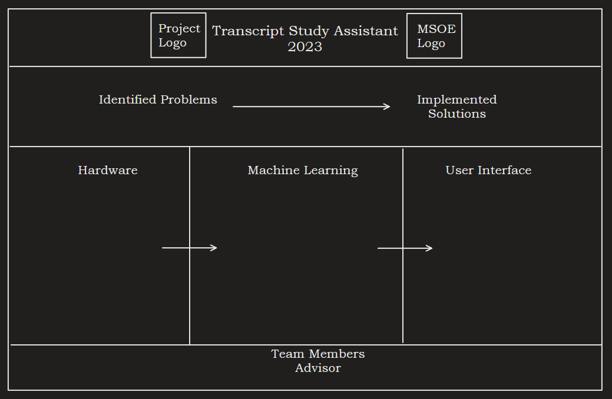

# Information Outline
_Project Logo:_  
- Use the bird logo (maybe we should not include the text since it is a logo and our project name will already be on the poster)

_Team Members/Advisor:_  
- Picture
- Name
- Major (Abbreviated, so CS, CE, SE)
- No Sponsors
  
_Project Summary/Identified Problems:_  
- Include bullet points of issues or a very brief summary of the problems that the project looks to solve  
  
_Requirements/Implemented Solutions:_  
- Include bullet points of the requirements or solutions
  
_Hardware:_  
- Picture of the device
- Include schematic, PCB layout, and/or block diagram
- Brief outline of hardware components (bullet points of these)  
  
_Machine Learning:_  
- Examples of the models used
- Images of what could be generated
- Brief explanations of any example/image that needs clarification  
  
_User Interface:_  
- Images of the user interface
- List of what the user is provided
- List of languages and framework used to develop this
- Briefly explain the main points that should be highlighted about the user interface
  
# Sketch 1
  
# Sketch 2
  
# Sketch 3
