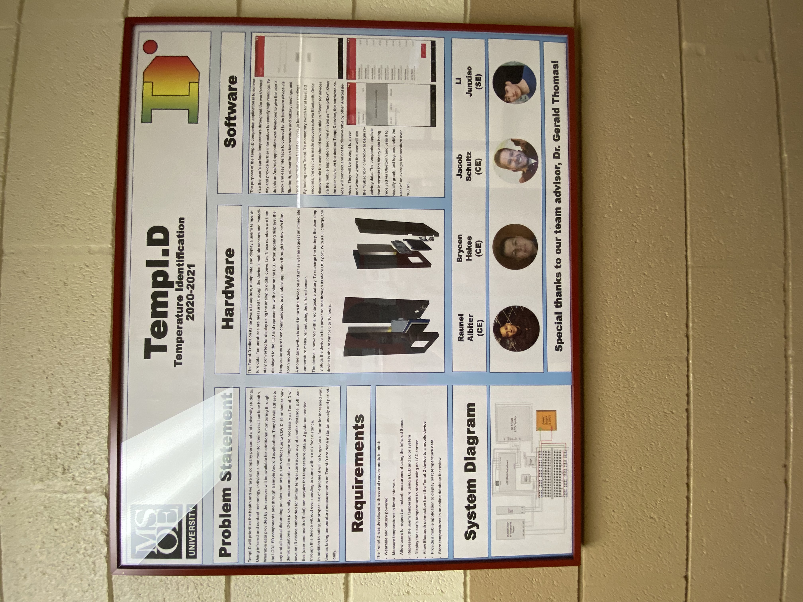
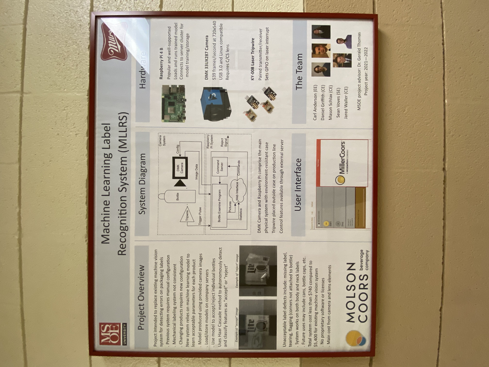
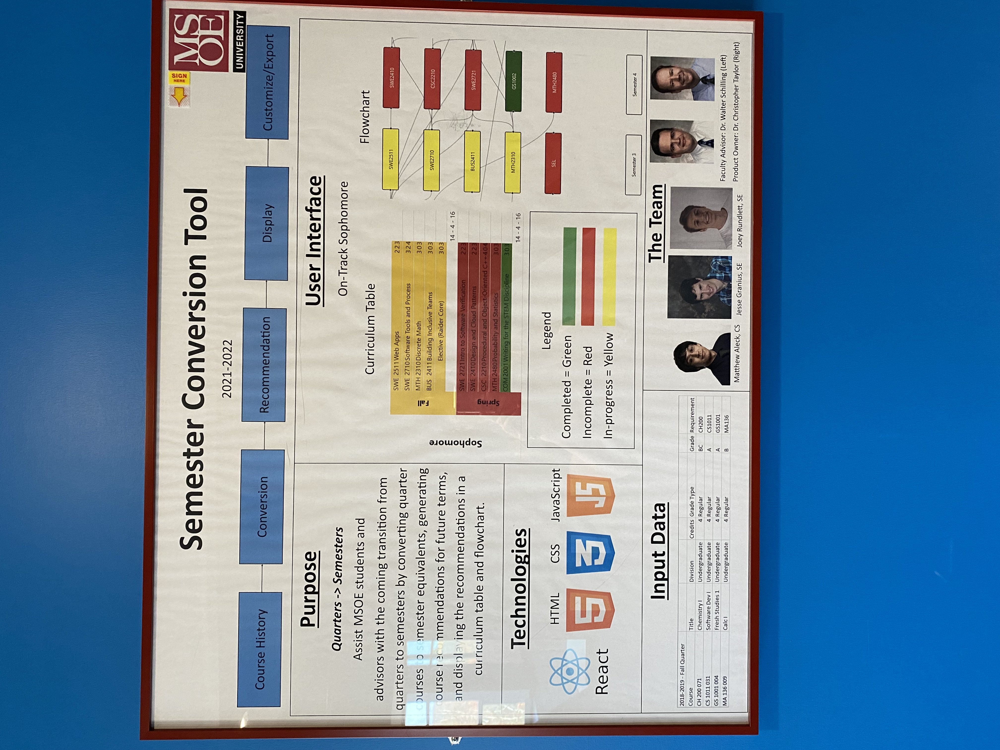
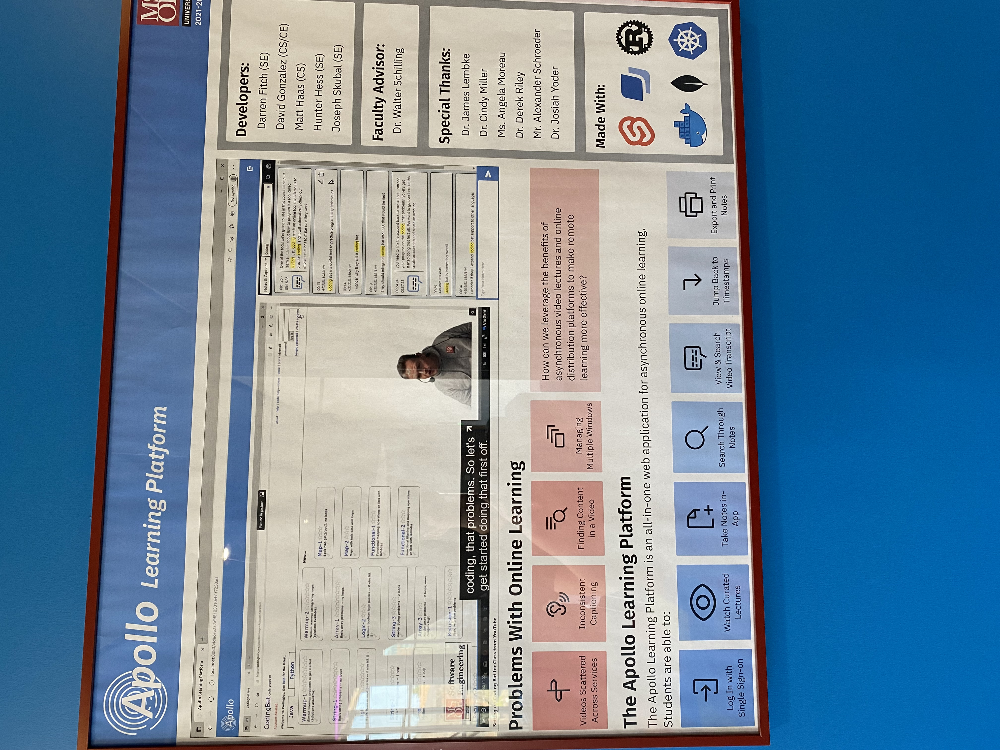
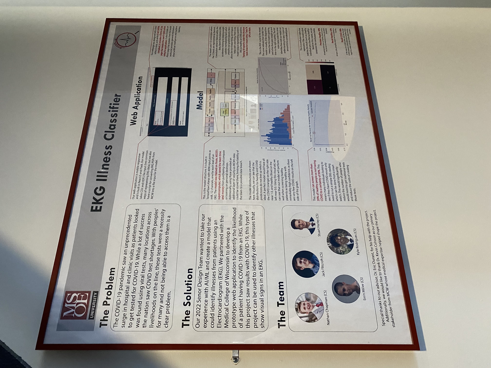

# TempI.D Temperature Identification
  
Pros:  
- The provided system diagram helps outline how the hardware components are connected
- It's good to see pictures of both the hardware designed and the software designed
- The bulleted list of requirements is good to have on the poster since it outlines their goals for the project
  
Cons:  
- Some of the large paragraphs could be changed to bullet points or smaller sentences
- They should include a picture of the finished product, possibly something displayed on the LCD screen

# Machine Learning Label Recognition System (MLLRS)
  
Pros:  
- The hardware section is nicely outlined and the individual pictures of the hardware helps with understanding the type of hardware that the team was using
- It's nice to see that the system diagram includes a brief outline of how data flows and how the hardware and software portions of the project are connected
- The examples of 'accept' and 'reject' bottles helps with understanding the goal of their project
  
Cons:  
- The user interface picture could be a bit bigger
- Some spacing between sections of bullet points might help make it look less like a big paragraph
- The sentences at the bottom of the system diagram section could be bullet points
  
# Semester Conversion Tool  
  
Pros:  
- The user interface section is nicely organized and provides good images of the information that is displayed
- It's good that the poster doesn't have a bunch of paragraphs and uses mostly images
- The purpose provides a good summary of their project
  
Cons:  
- A brief explanation of the input data may be beneficial
- The flowchart at the top should have larger arrows since it's difficult to see that it's suppose to be how their tool processes data
- 'React' should be above the logo like the other technology logos (small issue, not too important)
  
# Apollo Learning Platform
  
Pros:  
- It's good to have a picture of the learning platform
- The problem points and the learning platform points are nicely outlined
  
Cons:  
- The title should either be bigger or centered
- The poster should include some information on how the product works or some outline of what they worked on and how they designed it
  
# EKG Illness Classifier
  
Pros:  
- The web application and model images are good to have on the poster
- The lines pointing to parts of the images with descriptions of the images is good
- The problem and solution sections are good summaries of the project
  
Cons:  
- Bullet points or smaller paragraph descriptions could be used for the image descriptions