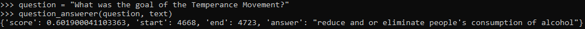
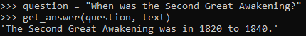
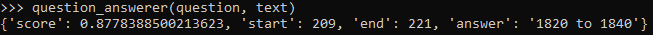
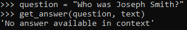
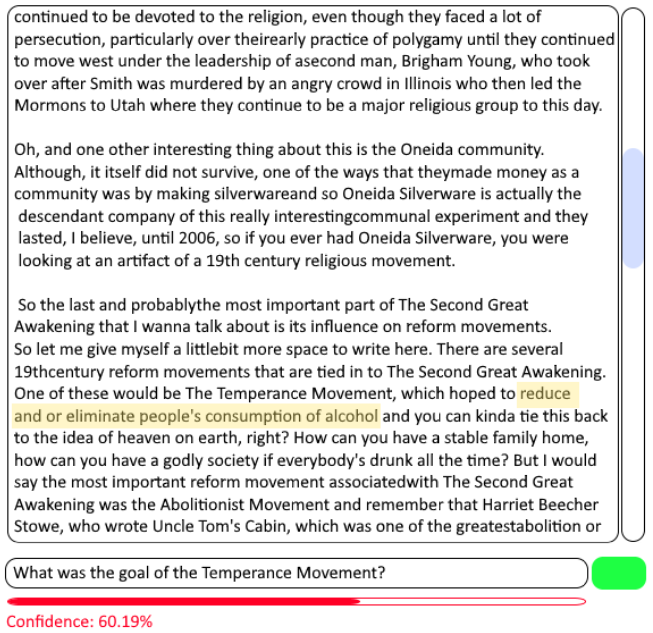

Once again, HuggingFace is here to save the day as they also organize a section of models tuned for [Question Answering](https://huggingface.co/models?pipeline_tag=question-answering&sort=downloads). This means we won't have to implement or train the model ourselves. From testing a number of the most popular models, I discovered a few things:  

## Abstractive vs Extractive Q&A  
Just like summarization, Q&A also comes in these 2 flavors.  

**Extractive** models will generate outputs that are just snippets taken from the text that are most likely to answer the given question. For example, here is an output from [distilbert-base-cased-distilled-squad](https://huggingface.co/distilbert-base-cased-distilled-squad), an lightweight version of BERT that was fine-tuned on the [Stanford Question Answering Dataset (SQuAD)](https://huggingface.co/datasets/squad) dataset:  
  
  
  
What is really nice about extractive models is that they can give you indices to the parts of the text where they got their answer from. This model also gives us a score which we could interpret as the model's confidence. I will bring up more about these points below.

**Abstractive** models on the other hand attempt to generate new sequences of tokens using the reference text as a basis. One model I found to be pretty good was [tuner007/t5_abs_qa](https://huggingface.co/tuner007/t5_abs_qa). While I found that abstractive models tend to spit out better and more generalized answers, the main drawback from this is that they cannot point to the indices in the text where they get their answer. This model also does not return a score we can interpret.  
  
Here is an example output with this model:  
  
This exact phrase isn't anywhere in the context lecture.  
  
Compare this to the output of the **extractive** Q&A model:  
  
The phrase '1820 to 1840' is exactly in the text.  
  
One thing to note however is that often times, the **abstractive** model will return the following:  
  
What's interesting here is that Joseph Smith is a person mentioned in the context lecture. Obviously these models aren't perfect. I believe what is happening is that the model has a score under the hood and if it isn't above a certain threshold, it gives this 'no answer available' output. I could be wrong though.
  
### Extractive vs Abstractive Conclusion  
Extractive model answers are short, to the point, and probably more likely to be correct since they pull text straight out of the context. However, they rely on the full answer being contiguously in the text. Abstractive models on the other hand give us nicer sounding, fuller answers, and can collate information from various parts of the text.
  
  
## Q&A Usage Idea  
With all of this information in mind, I thought of a potential interesting use case for this system in our project. Take a look at the following:   
    
  
I think what we can do is alongside the transcript viewer / editor, include a question bar for students to ask whatever questions they have about the lecture. In the case where we use an extractive model, we could highlight or move to the part of the lecture that answers (or is likely to answer) the given question. In the case where we use an abstractive model, we could just display the answer somewhere.  
  
In both cases, the model will either have a score, or consider the answer 'not available' in the text. When this happens, or when the score is below a certain threshold, we could save the question and include the option to "send question to instructor" or something (in a potential future where our application has students and professors connected by class or something). This would help instructors collect questions that students have that might not be directly answered in the lectures.  
  
## Model Usage Differences
One last thing to note is how these two models I describe here are set up differently. This isn't really that important but just something to keep in mind for implementation.  
  
The BERT based extractive model can be used with the transformers pipeline. This means all we have to do is use:  
`qa = pipeline("question-answering", model='distilbert-base-cased-distilled-squad')`  
and then can just directly call:  
`result = qa(question, context)`  
which gives us our scores, start/end points, and answer  
  
The abstractive model on the other hand is based off a T5 model. This one is apparently not compatible with the transformers pipeline so we would need to use another tokenizer + model pair. The inputs to this model are a bit different (this is something I noticed with T5 based summarizers as well where you had to input something like "Summarize this article: \<article\>")  
  
The input is formatted like so:  
`input_text = "context: %s <question for context: %s </s>" % (context,question)`  
  
You then tokenize / generate output from that entire string:  
`features = tokenizer([input_text], return_tensors='pt')`  
`out = model.generate(input_ids=features['input_ids'], attention_mask=features['attention_mask'])`