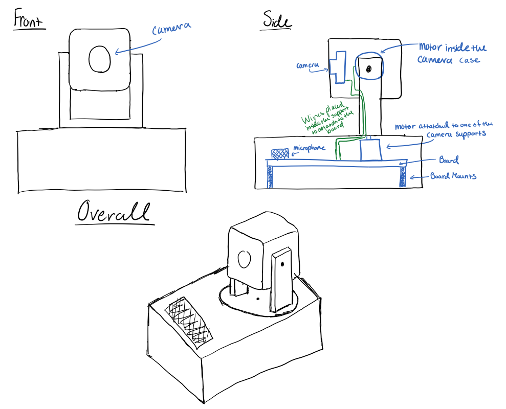
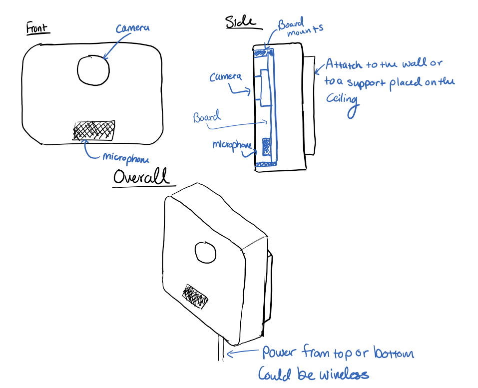
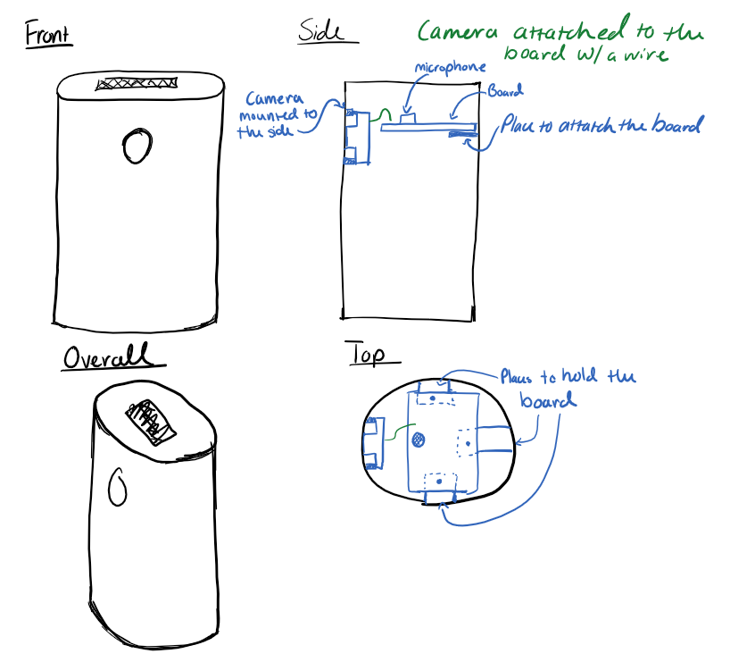
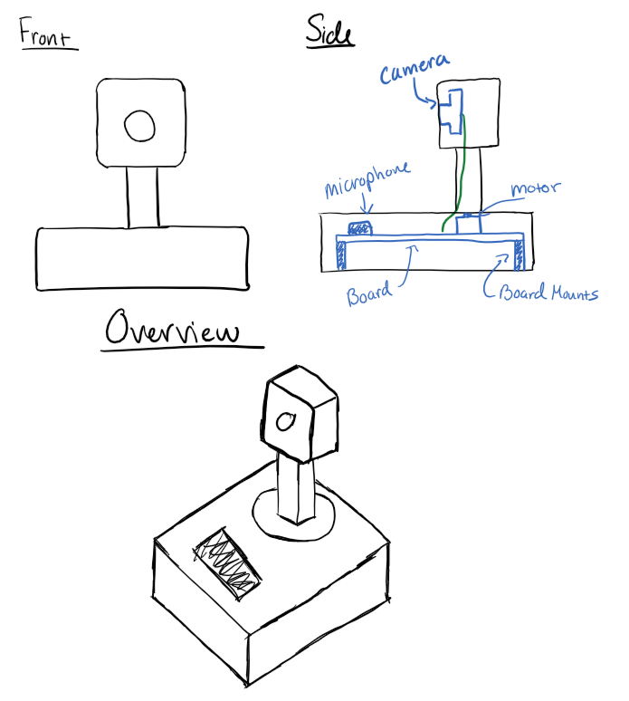

[[_TOC_]]

## Potential Technology Options

_Note: These devices may connected with a wire or may be wireless._  
  
### Sketch 1  
  
#### Notes  
- Intended to be placed on a desk
- Two stepper motors
  - One will be placed in the base so that the camera can pan left to right
  - The other will be placed in the camera case so that the camera can pan up and down
- The camera is attached to the board via a cable through the camera support on the device
- The microphone is placed in the base of the device
#### Pros  
- The camera's position can be easily adjusted from a distance (e.g. with a remote or with a laptop)
- The camera can follow an instructor
- The camera can pan left to right, as well as up and down (this allows for more control over where the camera points)
- The design can simply be placed on a desk and it's not required to be mounted anywhere
#### Cons
- This will be the most expensive design since it includes two stepper motors
- Noise from the motors may interfere with the lecture audio
- If not designed with some safety protections, the design has possible "pinch risks"

### Sketch 2
  
#### Notes
- Intended to be attached to a wall or to a support placed on a ceiling
- Fixed point camera -- not adjustable
- The camera and microphone are placed on the front-face of the device
#### Pros  
- Cheaper than design 1 and 4 (this is because the design does not require stepper motors)
- The design is more simple compared to design 1 and 4
- The design allows the device to be mounted in a more permanent location instead of placed on a desk
#### Cons
- Video can't be captured from behind the device (this is an issue if a professor is writing on a dry erase board behind the device)
- Student audio may be picked up more easily if the device is placed on a wall in the back of the classroom (this will be an issue if it's decided that we don't want student answers/questions to be recorded)
- If placed on a wall in the back of the classroom, students' laptop screens may be recorded (this may result in issues with privacy)
- If placed near a projector on the ceiling, the device may pick up the noise of the projector
- Doesn't allow for the camera to be re-positioned
  - Won't follow an instructor
  - Can't be adjusted with a remote or from a laptop

### Sketch 3
  
#### Notes
- Intended to be placed on a desk
- Fixed point camera -- not adjustable
- The camera is placed on the front-face of the device
- The microphone is placed at the top of the device
- Similar to the design of the Meeting OWL 3
#### Pros
- Cheaper than design 1 and 4 (this is because the design does not require stepper motors)
- The design is more simple compared to design 1 and 4
- Can be simply placed on a desk -- it doesn't require to be attached to a wall or ceiling attachment
  - This also allows the device to be moved around the room if necessary
- No noise issues with projectors or stepper motors
#### Cons  
- Video can't be captured from behind the device (this is an issue if a professor is writing on a dry erase board behind the device)
- Doesn't allow for the camera to be re-positioned
  - Won't follow an instructor
  - Can't be adjusted with a remote or from a laptop  

### Sketch 4

#### Notes
- Intended to be placed on a desk
- One stepper motor
  - The stepper motor is placed in the base of the device
  - Allows for the camera to pan left and right
- The camera is attached to a stand that is attached to the stepper motor
- The microphone is placed in the base of the device
#### Pros  
- The camera's position can be easily adjusted from a distance (e.g. with a remote or with a laptop)
- The camera can follow an instructor
- The camera can pan left to right
- The design can simply be placed on a desk and it's not required to be mounted anywhere
#### Cons
- This will be the second most expensive design since it includes one stepper motor
- Noise from the motor may interfere with the lecture audio
- If not designed with some safety protections, the design has possible "pinch risks"
- This design does not allow for the camera to be panned up and down

## Evaluation Strategies
- Cost of device
- Ease of programming
- Ease of manufacturing & Assembly
- Ease of connection

## Choice & Rationale
We decided to pursue Sketch 4. This design has most of the benefits of sketch 1 but at a much lower cost. It is cheaper to manufacture because it needs one less motor and associated controller. This also means it needs fewer IO ports on the microcontroller. Having one fewer degree of motion also makes it much easier to program the device.

## Prototypes & Images
This was prototyped through the above sketches. These sketches were then discussed as a team in order to determine which would work best. 

