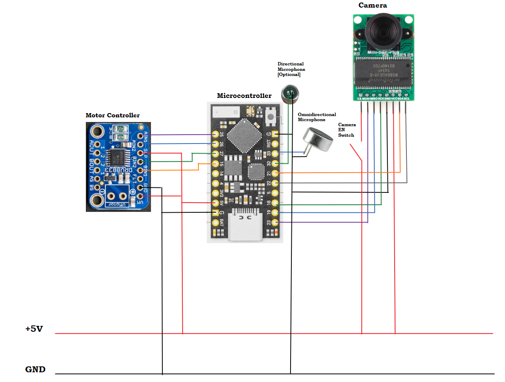

[[_TOC_]]

## Potential Technology Options
The following is a list of various microcontrollers that we might be able to make use of.

---

### [Seeed Studio XIAO SAMD21 - Arduino Microcontroller](https://www.seeedstudio.com/Seeeduino-XIAO-Arduino-Microcontroller-SAMD21-Cortex-M0+-p-4426.html)

**Specifications**
- Chipset: SAMD21G18
- Operational Frequency: 48MHz
- SRAM: 32KB
- Flash Memory: 256KB
- Size: 21mm x 17.5mm
- Pins:
  - 14 total GPIO pins
  - 11x analog / 11x digital
  - 1x I2C interface
  - 1x UART
  - 1x SPI
  - A1/D1 $\to$ A10/D10 pins have PWM
  - A0/D0 has DAC
  - Logic Voltage: 3.3V
- Development Support:
  - Arduino IDE
  - Microphython
  - CircuitPython
- Ports: USB-C
- Breadboard/SMD friendly

**Pinout**

---

### [SAM D21 Curiosity Nano](https://www.microchip.com/en-us/product/ATsamd21g18)

**Specifications**
- Chipset: ATSAMD21G18
- Operational Frequency: 48MHz
- SRAM: 32KB
- Flash Memory: 256KB
- Size: ???
- Pins:
  - 16 external interrupts
  - Up to 6 serial communication interfaces
    - USART w/ full/half-duplex
    - I2C up to 3.4 MHz
    - SPI
    - LIN client
  - 12-bit ADC w/ up to 20 channels
  - 10-bit DAC
  - Up to 52 programmable I/O pins
- Development Support
  - MPLAB X IDE
- Ports: USB-B
- Breadboard friendly

**Board Layout**

**Pinout**

---

### [Seeed Studio XIAO nRF52840 (Sense)](https://wiki.seeedstudio.com/XIAO_BLE/#:~:text=If%20you%20don%27t%20have,a%20USB%20Type-C%20cable.)

**Specifications**
- Chipset: Nordic nRF52840 ARM Cortex-M4 32-bit processor
- Operational Frequency: 64MHz
- RAM: 256KB
- Flash Memory: 1MB flash, 2MB onboard flash
- Size: 20mm x 17.5mm
- Pins:
  - 11 digital I/O (GPIO)
  - 6 analog I/O (ADC)
  - Rich Interfaces
    - 1x UART
    - 1x I2C
    - 1x SPI
    - 1x NFC
    - 1x SWD
- Wireless Connectivity
  - Bluetooth 5.0
  - BLE
  - NFC
- Built-In Sensors
  - 6-axis IMU
  - PDM Microphone
- Development Support:
  - Arduino IDE
  - MicroPython
  - CircuitPython
- Ports: USB-C
- Breadboard/SMD Friendly

**Board Layout**

**Pinout**

---

### [Arduino Nano](https://store.arduino.cc/products/arduino-nano)

**Specifications**
- Chipset: ATmega328
- Operational Frequency: 16MHz
- SRAM: 2KB
- Flash Memory: 32KB, 2KB used by bootloader
- Size: 18mm x 45mm
- Pins:
  - 22x digital I/O (6 PWM)
  - 8x 10-bit ADC
  - Serial TX/RX: 0, 1
  - 2x External Interrupts: 2, 3
  - PWM: 3, 5, 6, 9, 10, 11
  - SPI: 10 (SS), 11 (MOSI), 12 (MISO), 13 (SCK)
  - LED: 13
  - I2C: A4 (SDA), A5 (SCL)
- Development Support:
  - Arduino IDE
- Ports: USB-B
- Breadboard friendly

**Board Layout**

**Pinout**

## Evaluation Strategies
The primary metric that we will use for evaluating the microcontroller is if they have enough IO pins for all of our devices. The secondary metric for evaluation is ease of programming. The final evaluation metric is their interfacing capabilities.

## Choice & Rationale
### Selection
[TinyPICO ESP32 Development Board with USB-C](https://www.adafruit.com/product/5028?gclid=Cj0KCQiA54KfBhCKARIsAJzSrdrkesdK14VlUC_w7x6ETG5TturjnYn57L2NqA9KJukv6JeWIB2euoYaAk3aEALw_wcB)  

### Reasoning
The TinyPICO ESP32 Development Board is very small, which will allow us to create a more portable device. In addition to this, the MCU provides enough pins for each of the device components with a few pins left for any additional expansion. Refer to the diagram below:

The MCU may be used with the Arduino IDE and there are many libraries that can be used to interface with the board. The MCU also provides support for I2S, which may be useful when sampling the microphone audio data.

Furthermore, the board itself has a USB-C port, which would allow for the higher data transfer rates that would likely be necessary for sending the collected data to the host computer. The board also provides a +5V and +3.3V supply which we will use to power the other components.

### Possible Challenges
- We are not left with a significant amount of open pins, so this may be an issue if we need to expand the design further
  - We can combat this by taking some extra time to re-think the design
  - We can re-select a different MCU if we see the need to do so
    - If this is the case, we will need to make sure this redesign decision is made as soon as possible (during the prototyping phase)
- There is not enough space for an SD card
  - We could interface with a reader through the USB-C port, but this may or may not work 
  - An SD card may not be necessary for our design, but this decision may be made after prototyping

## Prototypes & Images
This was partially prototyped as a part of [[Hardware] Wiring Design]([Hardware] Wiring Design). Related prototyping that is partially applicable is [[Hardware] Schematic and Block Diagram]([Hardware] Schematic and Block Diagram) and [[Hardware] PCB Layout]([Hardware] PCB Layout).

