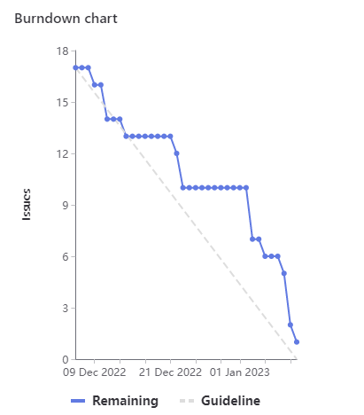

## Sprint Statistics
*Planned:* $`116`$  
*Added:*  $`15`$

The 15 points that were added were budgeted into the sprint as a part of the 30pt placeholder issue. 7pts were added to #91. The other points were for issue #67. The remaining 15pts were not used. This sets our new benchmark for points per sprint to 100 instead of 120.

## Burndown Chart

## Notable Issues Pointed Incorrectly:
- #92 LDA Variations was about 3hrs over budget
- Most of our meeting issues were 1hr under budget (budgeted 5pts)
- #91 Comms API issue was so far off budget it had to be compensated for with some points from the placeholder issue. It was originally a 7pt and ended up being 14pts. If this issue were to be done again it should have been broken into separate issues for the error codes, example messages, and then requests and responses most likely.
- #114 Pilot the surveys was about 2hrs under budget
- #60 custom board schematic was about 3 hrs over budget.

---
## Things to Keep:
- keep doing the more subdivided issues with things sliced down.
- keep labeling the issues for the different teams as it is easier to prioritize and search for issues.
- Keep performing weekly meetings.
- Keep performing teams communication in the student channel.
- Budgeting meetings / reviews into their own issues seems to be working well

## Things to Stop:
- Over allocating the sprint. We need to keep the total points of the sprint to no more than 100. It is hard to complete many more points than that in a single sprint.

## Things to Start:
- Performing smaller break out meetings as needed, even if they are just to collaborate or work on some task.