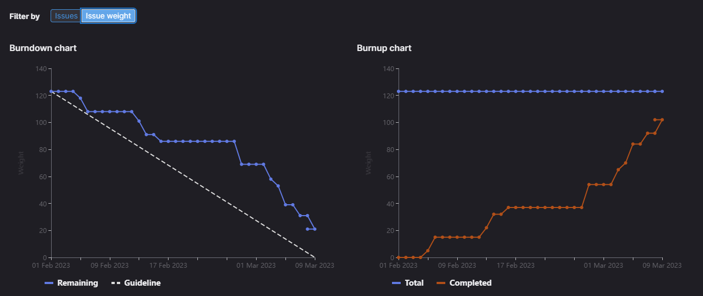
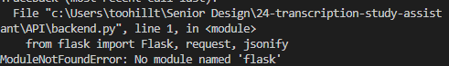

# [Sprint Goal](https://gitlab.com/msoe.edu/sdl/y23-senior-design/24-transcription-study-assistant/-/milestones/6#tab-issues): 
***Goal:***   
Hardware: Begin Assembling Prototype & Printing. Update designs based on survey feedback.

ML: Build out classes for Summarizers, Topic Modeling, and Sentences.

Software: Implement API endpoints in backend. Get frontend to be minimally viable.

## Burndown Chart

# Team Member Contributions:
## *Christie, Angela*
### Weekly Hours: 11
### Weekly Rating: $`\frac{8}{10}`$
### Weekly Summary: 
- Attended the Friday team meeting
- Completed the motor test and created a [Motor Test Report](https://gitlab.com/msoe.edu/sdl/y23-senior-design/24-transcription-study-assistant/-/wikis/%5BHardware%5D%20Motor%20Test%20Report) (issue #142)
- Updated the presentation to include the motor and camera testing
- Ordered the amplification breakout board (issue #155)
- Updated the schematic and PCB layout designs (issue #153)
  - Added new parts to the [Project BOM](https://gitlab.com/msoe.edu/sdl/y23-senior-design/24-transcription-study-assistant/-/wikis/%5BDocumentation%5D-Project-BOM)
  - Removed the switch
  - Added a section to connect the motor wires
  - Added the amplification circuit to the design
  - Connected both microphones to the 5V supply
- Attended and presented the redesigned PCB at the PCB review meeting (issue #152)
  - Made any final changes before ordering
- Ordered the PCB and all the remaining parts listed in the [Project BOM](https://gitlab.com/msoe.edu/sdl/y23-senior-design/24-transcription-study-assistant/-/wikis/%5BDocumentation%5D-Project-BOM) (issue #152)
  - All order information may be found on the [Part Order Information](https://gitlab.com/msoe.edu/sdl/y23-senior-design/24-transcription-study-assistant/-/wikis/%5BDocumentation%5D-Part-Order-Information) wiki page
  - All total prices have been updated and communicated to the team
- Attended the presentation and presented with the team

## *Fass, Grant*
### Weekly Hours: 30.00
### Weekly Rating: $`\frac{10}{10}`$ 
### Weekly Summary:
- 5.75hrs Working on Graph based representation for topic modeling using Doc2Vec and MultiLabelBinarizer
- Drafted Status Report
- Friday Meeting
- final presentations
- [commit 075c1b5c](https://gitlab.com/msoe.edu/sdl/y23-senior-design/24-transcription-study-assistant/-/commit/075c1b5ce120eb7721515502a262fe52df4baa9a) drafted the API endpoints.
- [commit c6ee1409](https://gitlab.com/msoe.edu/sdl/y23-senior-design/24-transcription-study-assistant/-/commit/c6ee1409b1f1073558d46ffcaf90e028afdcc4ec) cleaned up how message responses are generated to use a more universal 'respond' method that finally allows for returning error codes. Cleaned up the auth/new endpoint so it no longer performs a user login after signup. updated some env variables for log paths. changed auth/exchange to return 501 not implemented for now.
- [commit 82250002](https://gitlab.com/msoe.edu/sdl/y23-senior-design/24-transcription-study-assistant/-/commit/822500027100c70f82fadf877e7e22e8dab12876) Converted inbound message parsing to new 'recieve' method. Improved logging verbosity on inbound and outbound messages. made logging more consistent.
- [commit 13260e01](https://gitlab.com/msoe.edu/sdl/y23-senior-design/24-transcription-study-assistant/-/commit/13260e01c3e1a0908d9cb3c3514f4e52ba589a21) added a maximum concurrent sessions check to login
- [commit e36adb70](https://gitlab.com/msoe.edu/sdl/y23-senior-design/24-transcription-study-assistant/-/commit/e36adb704f835868d191bc08daf155a403120753) combined the two logout endpoints under auth/out. This was also updated in the api comms doc
- [commit cdc87bb0](https://gitlab.com/msoe.edu/sdl/y23-senior-design/24-transcription-study-assistant/-/commit/cdc87bb0217143655943120e61c7f9b742159098) Added username and token validation method. Allowed for simplification of logic in the logout method by offloading it to this method. Will also help with the other main topics which require a username and token validation. Updated readme to contain new bucket name.
- [commit 5c9b5444](https://gitlab.com/msoe.edu/sdl/y23-senior-design/24-transcription-study-assistant/-/commit/5c9b54444e402b3a303005601d3620adb8d27b74) Fixed errors in how validate session checked tokens. Made it faster and fixed the error messages being flipped. Other fixes in the auth methods and testing performed.
- Completed issue #149. Parts of it are left undone to be moved to breakout issues in next sprint.
- [commit 76a1ebc8](https://gitlab.com/msoe.edu/sdl/y23-senior-design/24-transcription-study-assistant/-/commit/76a1ebc866bdbe3e96769700a2f7ad2f9d200f39) updated the auth dataframe of currently active sessions to store a timestamp of when the last action occurred
- Think through how the device history list will work and how to clear it in a reasonable time. Ref #148 
- [commit 4c1b5b13](https://gitlab.com/msoe.edu/sdl/y23-senior-design/24-transcription-study-assistant/-/commit/4c1b5b131f1fb15d850c06ecf37ff200c06d0e3b) setup minio bucket for login events.
- [commit e76f00c4](https://gitlab.com/msoe.edu/sdl/y23-senior-design/24-transcription-study-assistant/-/commit/e76f00c4b123faacb21fe8f2bca27da613da8426) implement and test the acc/list endpoint. found a method on stack overflow to get all file keys in a bucket using pagination. created method to read relevant files from bucket and load data into pandas dataframe.
- [commit 8fefb178](https://gitlab.com/msoe.edu/sdl/y23-senior-design/24-transcription-study-assistant/-/commit/8fefb1785ac559fd50922ecce3c9476ab0dfabcb) implemented and tested the acc/clear endpoint. supports deletion of one or all records. tested to make sure the method works when no records to delete.
- [commit 2d48ab4a](https://gitlab.com/msoe.edu/sdl/y23-senior-design/24-transcription-study-assistant/-/commit/2d48ab4a211a7fad288512b5e0c1627ee28984eb) Updated login method to use a timestamp variable instead of live timestamps at each step. Changed so that the timestamps are consistent across storage locations.
- [commit e7e7c99b](https://gitlab.com/msoe.edu/sdl/y23-senior-design/24-transcription-study-assistant/-/commit/e7e7c99b847af9516d7468ff8d9b05f95a9fb987) updated acc/list and acc/clear to share more methods. Involved creating a method for getting a dataframe of the keys and timestamps of user records. This handles the truncation for most recent 'n' records automatically. Converted the user login records dataframe method to take a list of file keys as input instead of a username. This means it should only read the data of necessary files instead of all files, thus improving performance.
- [commit c2f13e77](https://gitlab.com/msoe.edu/sdl/y23-senior-design/24-transcription-study-assistant/-/commit/c2f13e7776453155fb96a860ed44e7f939cad54c) implemented and tested acc/connected. included pep8 reformatting in parts. modified the auth_df of accounts that are logged into the system to store both login time and last active time. This was needed so checks against the timestamp could be performed to see which accounts were currently connected and return their data. Updated the login method to reflect the changes to the auth_df.
- [commit 5145bd33](https://gitlab.com/msoe.edu/sdl/y23-senior-design/24-transcription-study-assistant/-/commit/5145bd3352dcc496aa8abdb404e2da68a72db0b2) implemented and tested the acc/max endpoint.
- [commit 4c919b13](https://gitlab.com/msoe.edu/sdl/y23-senior-design/24-transcription-study-assistant/-/commit/4c919b136dec794efcd8047545b17e3a71fe4993) implemented and tested the acc/info endpoint. Currently missing the storage space used for the account still. Returns -1 for storage space instead.
- [commit 04e32480](https://gitlab.com/msoe.edu/sdl/y23-senior-design/24-transcription-study-assistant/-/commit/04e324801bcbff39125323402abfd0fb7a50ef40) Implemented and tested acc/delete endpoint.
- [commit 15d44bb9](https://gitlab.com/msoe.edu/sdl/y23-senior-design/24-transcription-study-assistant/-/commit/15d44bb9ce377333219d60f62e27102054ac9c0f) merge branch into main
- Finish and close issue #148
- Some checks on chunks of code relating to what still needs to be done in backend.
- Writing up a teams message about plans for next sprint.
- Drafted up a unit test class that we can use to test backend functions next sprint
- sprint planning
- sprint retro

## *Kaja, Nicholas*
### Weekly Hours: 10
### Weekly Rating: $`\frac{7}{10}`$
### Weekly Summary: 
- Attended the weekly team meetings
- Working on, attending, and giving final presentations
- Implemented backend functionality relating to file management (#147)
- Attended the PCB Review / Sprint planning meeting on Monday

## *Karpov, Alexander*
### Weekly Hours: 10.5
### Weekly Rating: $`\frac{x}{10}`$
### Weekly Summary:
- Attended Friday team meeting
- Completed (I2C investigation)[https://gitlab.com/msoe.edu/sdl/y23-senior-design/24-transcription-study-assistant/-/issues/156] (Issue #156)
- Practiced for presentation
- Attended PCB review meeting
- Attended presentation with team

## *Toohill, Teresa*
### Weekly Hours: 9 Hours
### Weekly Rating: $`\frac{x}{10}`$
### Weekly Summary:
- Presentation Practice, Presentation (3 hours)
- Trying to run backend to test file uploads, was not able to, getting specific error regarding flask despite pip install running
- 
- Also tried to follow documentation, hope to meet with Grant to finally close these issues, have written a draft of specific questions
- Rewatched the video of our backend discussion in close detail in attempt to resolve the problem
- Research solutions for plain text
- Started documentation for running website
- Two not great things occurred within the last week: a close friend's only parent passed away on 3/3 and I've been assisting her with fundraising for the funeral since she cannot afford it. I also got sick pretty badly on Tuesday with a cold. Hence why my mind has not been very focused but I'm working on improving communication.

# Discussion:
## Meetings:
Weekly Meeting Notes:
- No Weekly Meeting

Friday Meeting Notes:
- Status Report
  - Angela: Got camera working. Wrote a report on how setup works and results description. Got motor working (was quick). Updated presentation to include camera and motor testing. Going to work on PCB redesign going forward.
  - Teresa: #131. Needs to put stuff in readme about running the website. should have things connected to backend.
  - Nick: LDA prediction class. Stored one model for each of the domains. Have main functionality but no error checking yet. Going to take the File Management Backend Topics.
  - Grant: Plan to do backend stuff and planning.
  - Xander: looking over amplification circuit. Need a voltage regulator as well.
- Presentation Review.
- 1hr total

Final Presentations

PCB Review Meeting March 6th
- Lot of changes to the PCB
- Added a few parts to the BOM (the two op amps to the BOM)
- Updated the schematic and PCB Layout wiki pages
- The op amps are just a standalone chip
- The breakout boards came in and are available for use with testing
- Got two breakout boards, one for each microphone.
- Using a 10k potentiometer off digikey
- added motor and place to connect motor in wiring schematic
- Camera pin the switch is on has been changed as there must be a way to control the CS pin instead of just connecting to 5v as it did not work in the second case. Switch on the VCC pin of the camera instead to turn it on and off.
- cannot add in an I2S chip as we do not have enough pins.
- Microphone testing will be done during sprint 7
- Will not have time to resize the PCB from here on out as we are close to the end of the quarter.
- going to order PCB
- Some sprint planning & retro related issues at the end.
- 45 min

Meeting With Teresa
- Had issues launching the backend.
- Had things occur over break
- #129, #130, #131 are thus not done
- helped fix issue with backend where flask was not installing due to trying to install through the visual studio terminal and not an admin command line.
- Helped get some of the new MINIO stuff setup
- Helped setup pycharm

# Advisor Questions:
- None

# Conclusion.
- None