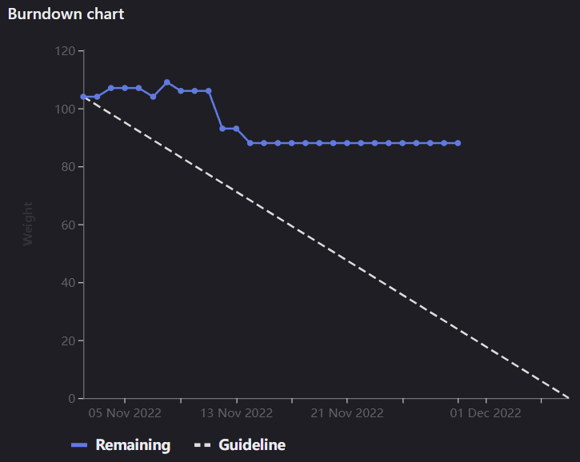

# [Sprint Goal](https://gitlab.com/msoe.edu/sdl/y23-senior-design/24-transcription-study-assistant/-/milestones/3#tab-issues): 
Goal: Keep Prototyping and Improving Prototypes
# Burndown Chart:
  
So Far we have added three issues into the sprint: #97, #98, and #80 

# Team Member Contributions:
## *Christie, Angela*
### Weekly Hours: 10.5
### Weekly Rating: $`\frac{7}{10}`$
### Weekly Summary: 
- Attended the meeting with Dr. Sohoni
- Attended the Friday meeting with the team to go over the presentation (Refer to issue #87)
- Attended the senior design presentation meeting (Refer to issue #87)
- Researched interfacing options, which can be found in the [[Documentation] Device Interfacing Research](https://gitlab.com/msoe.edu/sdl/y23-senior-design/24-transcription-study-assistant/-/wikis/%5BDocumentation%5D%20Device%20Interfacing%20Research) wiki page (Refer to issue #97)
- Updated the instructor and student surveys based on Dr. Panciera's advice (Refer to issue #98)

## *Fass, Grant*
### Weekly Hours: 11
### Weekly Rating: $`\frac{9}{10}`$
### Weekly Summary:
- Attended the weekly meeting and took notes
- Set up the status report for the week
- Updated the [Software Engineering Team Components Document](https://gitlab.com/msoe.edu/sdl/y23-senior-design/24-transcription-study-assistant/-/wikis/Software%20Engineering%20Team%20Components) to add some more RFC standards and also break up the walls of text. #90
- Added the additional RFC standards to the [Project Proposal](https://gitlab.com/msoe.edu/sdl/y23-senior-design/24-transcription-study-assistant/-/wikis/Project%20Proposal) ABET section
- Spent time dealing with issues getting notebooks with ipywidgets running on my laptop.
- Implemented the basic preprocessing pipeline #93 
- Worked on the final presentation for the quarter with the team #87 
- Did our weekly standup as a team after presentation practice and planned out hardware schedule.
- Worked on setting up Unit Tests and reading in sample text to compare against for #93 
- Attended the final project presentations

## *Kaja, Nicholas*
### Weekly Hours: 10
### Weekly Rating: $`\frac{x}{10}`$
### Weekly Summary: 
- Attended the Friday meeting for presentation prep
- Attended the Wednesday meeting
- Completed SO3-4
- Continued work on [transformers](https://gitlab.com/msoe.edu/sdl/y23-senior-design/24-transcription-study-assistant/-/issues/94)
  - Added section for comparing ROUGE metrics
  - Added some parameter options for summary generation (decoding strategies)
  - Read HuggingFace article on decoding strategies
  - Found out certain parameters aren't available for use with certain models

## *Karpov, Alexander*
### Weekly Hours: 10
### Weekly Rating: $`\frac{x}{10}`$
### Weekly Summary:
- Attended Friday meeting for presentation preparation
- Attended Tuesday and Wednesday meetings
- Completed SO3-4
- Practiced presenting on my own time
- Read up on various documentation for the proposed [Microcontrollers](https://gitlab.com/msoe.edu/sdl/y23-senior-design/24-transcription-study-assistant/-/issues/99)

## *Toohill, Teresa*
### Weekly Hours: 10
### Weekly Rating: $`\frac{x}{10}`$
### Weekly Summary:
- Running through Angular tutorial to implement backend
- Running through QTC++ beginnings for backend
- Implementing Backend Research Page for personal use in Wiki

# Discussion:
## Meetings:
Weekly Meeting Notes:
- Send reminder if weekly meeting notes grade is not updated by Friday
- Sprint 3 planning document format looks good.
- It may be a little too early to nail down the communications API in detail.
- Software Engineering team components document
  - may want to look more at standards.
    - Standards for video format, storing video, ect.
    - How do third party apps follow these standards
    - Not being able to view standards without paying is a constraint
    - go ask the library if they have access to technical standards
  - details look good. Level of detail is good.
  - Break up walls of text into paragraphs more.
- Sprint Prep Performance
  - Accidentally graded based on the Sprint 1 Performance so may need to be regraded.
  - Message if not updated by Friday
- Sprint 1 Performance
  - The steady progress relates to the burndown chart
  - commitment to quality the points decrease relates to having a lot of big issues. Overall quality of the gitlab contents
  - SE Process links to the steady progress.
  - are issues created well enough so that we can show good progress?
  - Have a placeholder issue in the sprint so we can decrease the points of this placeholder as we add new issues from standby.
- Dr. Panciera Meeting
  - Happy with how the meeting turned out
  - Happy that Angela was very prepared and brought good questions.
  - Can reach out to Dr. Jill Meyer if we need the paid version of qualatrics
  - Once the surveys are done send an email with the links. 
- Next Term Meeting
  - 8AM, 9AM, or 10AM.
  - Can do half hour meetings
  - WhenIsGood will be sent out.
- SO3-4 Due Friday.
- Presentations Due Monday.

# Advisor Questions:
- No questions this week.

# Conclusion
- Spent time before break on the final presentations and finishing up some issues. Then had the extended break.

