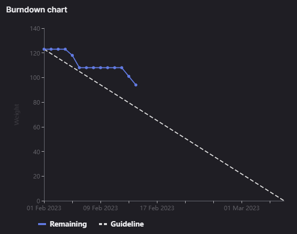

# [Sprint Goal](https://gitlab.com/msoe.edu/sdl/y23-senior-design/24-transcription-study-assistant/-/milestones/6#tab-issues): 
***Goal:***   
Hardware: Begin Assembling Prototype & Printing. Update designs based on survey feedback.

ML: Build out classes for Summarizers, Topic Modeling, and Sentences.

Software: Implement API endpoints in backend. Get frontend to be minimally viable.

## Burndown Chart

# Team Member Contributions:
## *Christie, Angela*
### Weekly Hours: 10.25
### Weekly Rating: $`\frac{9}{10}`$
### Weekly Summary: 
- Attended the meeting with Dr. Sohoni
- Attended the Friday team meeting
- Attended a meeting with Xander to discuss amplifiers and regulators (issues #155 and #154)
- Completed the camera testing and documented all of the work in the [Camera Test Report](https://gitlab.com/msoe.edu/sdl/y23-senior-design/24-transcription-study-assistant/-/wikis/%5BHardware%5D-Camera-Test-Report) wiki page (issue #141)
  - Testing progress was documented in the issue

## *Fass, Grant*
### Weekly Hours: 8.5
### Weekly Rating: $`\frac{7}{10}`$ 
### Weekly Summary:
- Drafted weekly status report
- Weekly meeting
- 2.75 hrs (graph ml) looking more at embeddings and topic modeling.
- 1.25 hrs (graph ml) training models on the embedded sentences
- Friday meeting
- A little more graph ML training on a larger set of the data with random sampling
- SE Team Components Doc Revisions
- Reviewed issues #129 and #130

## *Kaja, Nicholas*
### Weekly Hours: 10.5
### Weekly Rating: $`\frac{7}{10}`$
### Weekly Summary: 
- Attended the Tuesday and Friday weekly meetings
- Attended the Amplifier/Regulator meeting on Thursday
- Implemented main functionality for the LDA prediction class (#144)
  - Trained a few LDA models on combined and individual Khan Academy domains

## *Karpov, Alexander*
### Weekly Hours: 8
### Weekly Rating: $`\frac{x}{10}`$
### Weekly Summary:
- Attended Tuesday meeting
- Attended meeting with Angela in regards to issues #154 and #155
- Met with Dr. Faulkner to discuss issue #154
- Reworked issue #154 due to above

## *Toohill, Teresa*
### Weekly Hours: 15
### Weekly Rating: $`\frac{x}{10}`$
### Weekly Summary:
- Spent the bulk of time implementing #129 and #130, which is waiting for review tonight (2/13) by Grant or another team member before being closed
- Working on implementing #131, right now trying to figure out internal modules/pages for study materials page
- Friday Meeting
- Software Components
- Meeting with Sohoni

# Discussion:
## Meetings:
Weekly Meeting Notes:
- Currently the 'survey' which has been renamed to a 'poll' is out and getting responses.
- Remember status report is due the night before.
- Week 10 status report is not due at all but still going to create it for our own records.
- Final presentations: even with only 9/20 of responses we currently have no full half hour blocks available.
- Other presentation times for other groups will be shared, attend if you want.
- How do peer reviews work: some members of each team can make some of the other presentations. Need to make at least one other time.
- for the presentation we should add pictures of the OWL device on the slide with the price. We should gray out software requirements that we may not be able to complete. We should fix the website contrast. Show either the site images or the demo. Fix the ML example output to show old model output vs new model output with an animation.
- 30 min meeting

Friday Meeting Notes:
- Nick: implemented the transformer prediction class. Downloaded some more of the Dr. Sohoni teams transcripts
- Teresa: Worked on #129. Adding account deletion button.
- Angela: working on camera issue. Got past the stalling issue but now there is an issue with a lock. Met with Xander and Nick on the amplifier and regulator. Made a decision on the amplifier. Getting 2 of those and can mount them inside the device so we do not need to modify the board. Xander is looking a bit more into regulators. Try using 3.3v for directional mic. May move on to motor issue then double back.
- Grant: worked on some node embeddings and graph ml related stuff so far.
- 15m meeting

# Advisor Questions:
- None

# Conclusion.
- None