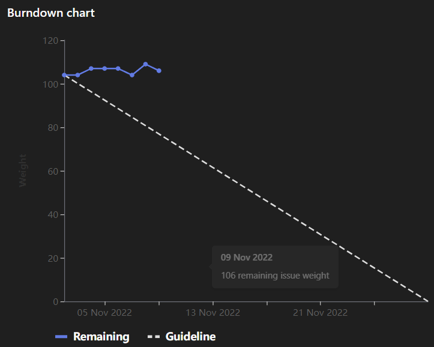

# [Sprint Goal](https://gitlab.com/msoe.edu/sdl/y23-senior-design/24-transcription-study-assistant/-/milestones/3#tab-issues): 
Goal: Keep Prototyping and Improving Prototypes
# Burndown Chart:

So Far we have added three issues into the sprint: #97, #98, and #80 

# Team Member Contributions:
## *Christie, Angela*
### Weekly Hours: 10.5
### Weekly Rating: $`\frac{10}{10}`$
### Weekly Summary: 
- Cleaned up the presentation
- Met with Dr. Panciera to discuss survey feedback (notes may be found [here](https://gitlab.com/msoe.edu/sdl/y23-senior-design/24-transcription-study-assistant/-/wikis/Notes%20From%20The%20Meeting%20With%20Dr.%20Panciera))
- Created wiki pages to document our reasoning for hardware decisions and placed those in the tech report
- Researched examples of motors and controllers (issue #58)
- Provided the reasoning for [building our own device](https://gitlab.com/msoe.edu/sdl/y23-senior-design/24-transcription-study-assistant/-/wikis/Justification-For-Building-Our-Own-Device) and for the [motor selection](https://gitlab.com/msoe.edu/sdl/y23-senior-design/24-transcription-study-assistant/-/wikis/Motor-Selection)
- Added some issues to the sprint (e.g. issues #98 and #99)
- Attended the meeting with Dr. Sohoni
- Attended a meeting with Alexander to discuss camera and motor options
- Attended the Tuesday team meeting

## *Fass, Grant*
### Weekly Hours: 10.5
### Weekly Rating: $`\frac{9}{10}`$
### Weekly Summary:
- Created the Week 10 status report
- Attended the weekly team meeting with advisor
- Updated the project proposal with the ABET criteria
- Updated the sprint 3 planning document to have sections more condensed and open by default
- Updated the sidebar and homepage to have sections open by default
- Updated the sidebar to not use headers anymore
- Drafted the software engineering team components document
- Added issue #97 
- Spent time reviewing issues and their progress
- Attended the Tuesday meeting
- Filled in more parts of the weekly status report like the burndown and conclusion.
- Worked on and mostly completed SO3-4 on the ML Algorithms component of the Tech Report

## *Kaja, Nicholas*
### Weekly Hours: 7
### Weekly Rating: $`\frac{6}{10}`$
### Weekly Summary: 
- Attended the Wednesday and Tuesday team meetings
- Showcased long document summarization with Transformers using chunking
- Looked a little bit into "Longformers"
- Incorporated transformer generation parameters into a summarization method
- Looked a little into BeautifulSoup and the idea of grabbing Khan Academy lecture transcripts + articles
- Will add screenshots to the Summarization Demo for our presentation

## *Karpov, Alexander*
### Weekly Hours: 7
### Weekly Rating: $`\frac{6}{10}`$
### Weekly Summary:
- Attended Tuesday and Wednesday team meetings
- Did research into microcontrollers that we can use for the product
- Did more research into cameras to use for project, documented in Wiki
- Attended meeting with Angela to discuss camera and motor options

## *Toohill, Teresa*
### Weekly Hours: 8
### Weekly Rating: $`\frac{x}{10}`$
### Weekly Summary:
- Weekly Meeting on Tuesday
- Meeting with Sohoni on Wednesday
- Making Wiki Pages
  - [Temp] GUI
  - Draft Finance Research To Be Uploaded Soon
- Prototyping Software & Work
  - Began coding, reading documentation
  - Downloaded software to code in QTC++ & Angular
  - Debugging stuff

# Discussion:
## Meetings:
- Weekly Meeting
  - may want to start leaving space for standby issues.
  - break up into epics
  - stop using dropdowns
  - Remove more spacing where possible
  - Add screen shots for the functionality demo in the presentation
  - Update presentation conclusion section
  - Add the sketches to the tech report slides
  - add in pictures to the slides.
  - Break up the slide show text.
- Tuesday Meeting
  - May want to set up beautiful soup to scrape khan academy.
  - May want to grid search models.

# Advisor Questions:
- Does the updated version of the sprint 3 planning document show a format that would be acceptable going forward?
- Can we look through and get thoughts on the API Communication Protocol document?
- Can we look through and get throughs on the Software Engineering Team Components Document?
- Can you explain the points deduction for the Sprint Prep Performance assignment so we can improve in the future?
- Can you explain the points deduction for the Sprint 1 Performance assignment as there is no rubric?

# Conclusion
Spent time working towards various hardware milestones and assignments due for senior design. Due to it being week 10, and many of us having presentations in other classes keeping us busy, our hours for this week are a little bit lower than expected. This should not pose a problem due to the extra time allocated during finals week and break week.