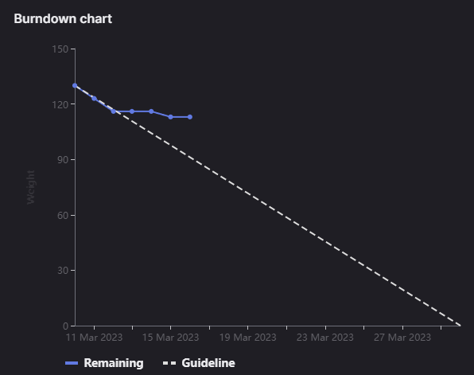

# [Sprint Goal](https://gitlab.com/msoe.edu/sdl/y23-senior-design/24-transcription-study-assistant/-/milestones/7#tab-issues): 
***Goal:***   
Hardware: Review Survey Feedback, 3d modeling, camera / microphone testing

ML: Investigate Missing Functionality (STT & Question Answer Systems)

Software: Finish Backend, Link Backend to Frontend

## Burndown Chart

# Team Member Contributions:
## *Christie, Angela*
### Weekly Hours: 10
### Weekly Rating: $`\frac{7}{10}`$
### Weekly Summary: 
- Attended the meeting with Dr. Sohoni
- Attended the Tuesday team meeting
- Completed the microphone testing (issue #161)
  - Soldered pins on the breakout boards
  - Looked into connecting the output to the MCU pins (ended up going with the speaker instead)
  - Tested each microphone and documented the results in the [Microphone Test Report](https://gitlab.com/msoe.edu/sdl/y23-senior-design/24-transcription-study-assistant/-/wikis/%5BHardware%5D-Microphone-Test-Report) wiki page
- Began the camera quality investigation (issue #162)
- NOTE: Both surveys have been disabled and the responses are ready for review

## *Fass, Grant*
### Weekly Hours: 2.5
### Weekly Rating: $`\frac{6}{10}`$ 
### Weekly Summary:
- meeting with Teresa
- Weekly Status Report Draft
- Swapped OWASP Audit #158 & Final Report #176 
- Tuesday meeting
- Final status report updates before Thursday meeting

## *Kaja, Nicholas*
### Weekly Hours: 13.5
### Weekly Rating: $`\frac{9}{10}`$
### Weekly Summary: 
- Attended the Tuesday and Thursday weekly meetings
- Completed the Speech to Text Implementation (#163)
- Completed the Question Answering Investigation (#164)

## *Karpov, Alexander*
### Weekly Hours: 6
### Weekly Rating: $`\frac{x}{10}`$
### Weekly Summary:
- Attended Tuesday team meeting
- Worked on Issue #165 
  - Hit a snag on the last day of sprint (personal emergency), was not able to finalize issue in time. Will finalize the next day.

## *Toohill, Teresa*
### Weekly Hours: 10
### Weekly Rating: $`\frac{x}{10}`$
### Weekly Summary:
- Weekly meeting with group, Sohoni
- Meeting with Grant
- Got backend running from said meeting, working on connecting the front end to close out issues (#129, #130, #131)
- Tried to rewatch videos to debug backend when having issues

# Discussion:
## Meetings:
Meeting With Teresa
- Had issues launching the backend.
- Had things occur over break
- #129, #130, #131 are thus not done
- helped fix issue with backend where flask was not installing due to trying to install through the visual studio terminal and not an admin command line.
- Helped get some of the new MINIO stuff setup
- Helped setup pycharm
- 30m

Weekly Meeting Notes
- sprints are off by one week, he had thought it would be next week not this week
- 2 sprints left, meaning end by week 6
- OWASP Audit issue
- lot fewer SO assignments this term
- Final report should have some time dedicated to it in each sprint
- Poster submission is a hard deadline
- The OWASP Audit is not not a hard deadline.
- Swap OWASP Audit issue to next sprint (done by week 5) move Final Paper to this sprint with Xander & Angela on it.
- 30m

Tuesday Meeting Notes
- Xander: working on the 3d modeling. Press fit gear on motor. Modeling the turret is not included in this issue. Base should be modeled by Thursday.
- Angela: working on the camera quality investigation. may have found something but is not tested yet. The PCB has come in. Can begin assembling them soon. Defer decision to assemble PCB until next week. We have 5 copies of the board. Drop off one motor and one PCB in the locker for use with modeling. Going in tomorrow to solder pins to the amplification boards to test the microphones again. Continuing with camera investigation
- Nick: Lots of work. Two of the stories got completed. Speech-to-text results are really good, even with a small model. Works similar to our summarizers with hugging face. 55 seconds to transcribe one hour of audio. Works pretty well with domain specific acronyms such as "ERD" as well. Added a `file/proc/transcribe` endpoint. Assumes the read from s3 file would return the raw bytes instead of the .decode() (can technically reencode in the endpoint but is a bit redundant). Will also need to update the API comms doc to allow for supports of audio files. accepts .wav, .mp3, and a few others with torch audio. Question and Answer systems can do abstractive and extractive questions through a hugging face library. Distilbert is very light weight and very fast. Second or two per question. Score might be able to be inferred as the confidence. If score is too low it sometimes returns 'no answer available in context'. Cannot really generate questions but we can answer them. May want to record. Transcription may want to be run on file upload. May want to run both abstractive and extractive. Fixed Cuda summarizer GPU issue now. Implement the Q&A endpoint is what is left.
- Teresa: had an issue with running the backend again that never got sent out. Python environment issue. Started writing up some of the frontend where possible.
- Grant: no major progress as of now.
- 30 min meeting with extra 30 min of helping fix backend issues for Teresa

# Advisor Questions:
- None

# Conclusion.
- None