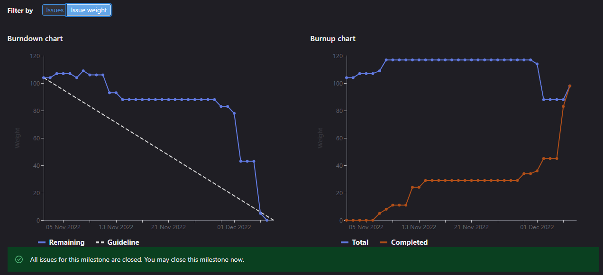

# [Sprint Goal](https://gitlab.com/msoe.edu/sdl/y23-senior-design/24-transcription-study-assistant/-/milestones/3#tab-issues): 
Goal: Keep Prototyping and Improving Prototypes

# Burndown Chart:

So Far we have added three issues into the sprint: #97, #98, and #80 

# Team Member Contributions:
## *Christie, Angela*
### Weekly Hours: 9
### Weekly Rating: $`\frac{8}{10}`$
### Weekly Summary: 
- Attended the meeting with Dr. Sohoni
- Attended the Friday team meeting to discuss the sprint 3 retro and sprint 4 planning
- Completed interfacing selection research (issue #97)
- Provided choices for powering the device and a decision on a battery backup (issue #59)
- Discussed microcontroller selection and wiring diagram with Alexander (issue #99)
- Completed the interface selection reasoning and added a cable to the BOM
- Completed the descriptions for issues #115 and #118
- Completed research for the other materials we would need and provided reasoning in the wiki for the decisions (issue #59)
- Finalized the BOM and made sure everyone was okay with the price/parts (issue #83)

## *Fass, Grant*
### Weekly Hours: 9.25
### Weekly Rating: $`\frac{7}{10}`$
### Weekly Summary:
- Attended the weekly meeting and took notes
- Set up the status report for the week
- Spent time on #85 to set up the [Sprint 3 Retro]([Retro] Sprint 3) and add some summary information
- Spent time on #93 working on making a VTT preprocessing method and getting it in the preprocessor class
- Spent time working on #86 to plan for the next sprint. Finished creating lots of issues we will need in the future but can also start soon. Added all of this to the sprint plan.
- Spent 1 hour in Friday meeting. Discussed current sprint progress, next sprint plan, and retro
- Finished out the sprint report and sprint retrospective issues. This included finishing reordering the sprint planning document.
- CATME and teams questions

## *Kaja, Nicholas*
### Weekly Hours: 9
### Weekly Rating: $`\frac{7}{10}`$
### Weekly Summary: 
- Attended the Wednesday and Friday meetings
- Finished the Transformers Investigation (issue #94)
  - Added a section to compare timings of transformer models at various steps (encode, generate, decode) 
  - Compared timings of models using different num_beams
  - Compared large vs base version of the facebook BART model checkpoint
  - Compared manually loaded models vs pipelined models
- Read up on some BeautifulSoup documentation in preparation for the next sprint's tasks 

## *Karpov, Alexander*
### Weekly Hours: 8
### Weekly Rating: $`\frac{x}{10}`$
### Weekly Summary:
- Attended half of Friday spring plan meeting
- Met with Angela on Friday to discuss and decide on a microcontroller (Issue 99), added results and reasoning to issue
- Added Microcontroller selection to BOM
- Added Microcontroller selection reasoning and justification to Wiki
- Performed additional research on selected microcontroller
- Began looking into interfacing using MISO/MOSI and I2C on Arduino (more of a refresher)

## *Toohill, Teresa*
### Weekly Hours: 12
### Weekly Rating: $`\frac{x}{10}`$
### Weekly Summary:
- Weekly meeting with Dr. Sohoni
- Friday Meeting
- Wrapped up Angular prototype (Pushed to the repo) for #
- Did Angular Research for prototype with multiple button (#65)
- Spent time researching & trying to understand QT C++
- Wrapped up QT C++ prototype with simple button in an application window (#64)

# Discussion:
## Meetings:
Weekly Meeting Notes:
- looked at issue list and what may need to be pushed back
  - #62 Research and Determine project funding may be retired
  - #60 design the custom board schematic is not ready yet and needs to go to standby
  - #63 prototype backend file IO on decided platform may need to go to standby / next sprint
  - #92 LDA variations may be kicked to next sprint (unsure yet)
  - #91 communications API may be moved to standby it also blocks #67 
  - #67 begin implementing basic communications may be moved to standby. This may also relate to the node red simulator issue.
- Piloting the survey will need a new issue in the next sprint.

Friday Meeting Notes:  
***Hardware***   
Interfacing #97 should be done soon  
determine other mats #59 should be all good but there might be a little more work  
BOM #83 should be done  
would like #99 microcontroller issue to be done by end of sprint  
upcoming added issue #115 for pcb layout and review. start the 3d modeling stuff. standby for #110. #116 might be pulled in  

***ML***   
Transformer Variations #94 will be done  
LDA Variations #92 might be kicked back  
upcoming want to do #108 to build the database, drop out the hyperparam stuff, keep the acronym one, drop greek one to standby and make a spacer issue  

***Software***
angular issue #65 will be done  
QT issue #64 will be worked on  

***Sprint Goal***   
Hardware: Have main electrical components ordered, have 3d model of base shell, and have custom board designed.  
ML: Collect the transcript dataset, and touch up preprocessing  
Software: Finish prototyping and finish planning for main software device.  

# Advisor Questions:
- No questions this week.

# Conclusion
- Worked on finishing up issues this week where possible. Hardware team should have a good idea of what needs to be ordered and so they can start planning design next sprint. ML team is moving forward with more model improvements. Software team is still prototyping.

