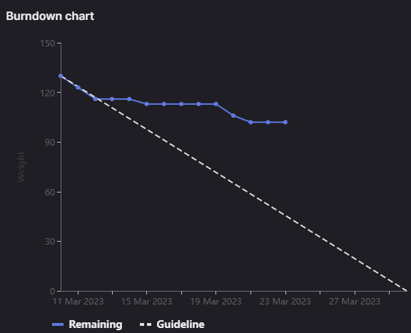

# [Sprint Goal](https://gitlab.com/msoe.edu/sdl/y23-senior-design/24-transcription-study-assistant/-/milestones/7#tab-issues): 
***Goal:***   
Hardware: Review Survey Feedback, 3d modeling, camera / microphone testing

ML: Investigate Missing Functionality (STT & Question Answer Systems)

Software: Finish Backend, Link Backend to Frontend

## Burndown Chart

# Team Member Contributions:
## *Christie, Angela*
### Weekly Hours: 12.25
### Weekly Rating: $`\frac{7}{10}`$
### Weekly Summary: 
- Attended the meeting with Dr. Sohoni
- Attended the Tuesday team meeting
- Recovered the recent schematic and PCB layout revisions after accidently deleting them (these files have been pushed to the repository to prevent this from happening again)
- Continued working on the camera investigation issue (issue #162)
  - The highest frame rate achieved at this point has been 3fps when the resolution was set to 320x240
  - A resolution of 1080p is achievable, but only when the frame rate is around 0.4fps
  - I contacted the team to discuss what the issue may be and how to move forward
    - For this reason, I'm holding off on writing a report and closing this issue until I discuss next-steps with the team
- Completed the CATME survey

## *Fass, Grant*
### Weekly Hours: 13
### Weekly Rating: $`\frac{7}{10}`$ 
### Weekly Summary:
- Weekly Status Report Draft
- Issue #171. Working on the unit tests for the backend. See the specific commits under the issue itself.
- CATME Survey
- Fixed issue #169 Multi-process kill issue
- Fixed issue #168 NLTK redownload on launch.
- Worked on #170 launcher and setup script
- Tuesday meeting.
- completed the backend installer setup script as part of issue #170. Currently only on branch 171 until merged.

## *Kaja, Nicholas*
### Weekly Hours: 7.5
### Weekly Rating: $`\frac{7}{10}`$
### Weekly Summary: 
- Attended the Thursday and Tuesday weekly meetings
- Finished the Q&A endpoint implementation (#165)
- Consistency changes for previous /proc endpoints
- CATME survey
 
## *Karpov, Alexander*
### Weekly Hours: 10
### Weekly Rating: $`\frac{x}{10}`$
### Weekly Summary
- Worked on 3D model enclosure (Issue #110)
- Attended Tuesday and Thursday weekly meetings

## *Toohill, Teresa*
### Weekly Hours: 10
### Weekly Rating: $`\frac{x}{10}`$
### Weekly Summary:
- Looking into API documentation
- Trying to communicate with backend
- Pushed to repo, working on completing issues
- Reinstalling software with new laptop

# Discussion:
## Meetings:
Weekly Meeting Notes
- 10 min meeting

Tuesday Meeting Notes
- Xander: having troubles with designing the base enclosure. Having to iterate on the design to make sure it is correct. Base design looks good finally.
- Angela: last week accidentally deleted the most recent designs so had to spend an hour restoring them. Working on the camera investigation. Last Friday switched to v1 of their host app and got better performance but cannot reproduce now. Found way to set the registers for 1080p video which changed the size of the viewing window and the quality. Video camera should be capable of 30fps. Hoping to close before Thursday. Have not assembled the board yet. Possibly next week or something with camera investigation being priority at the moment.
- Nick: finished up the last story for sprint. Question and Answer implementation. Both abstractive and extractive models are in a class. Worked through some of the other Proc endpoints to improve their consistency. Probably going to hop on some of the backend issues for next week.
- Grant: unit tests for backend and setup script.
- 30 min meeting

# Advisor Questions:
- None

# Conclusion.
- None