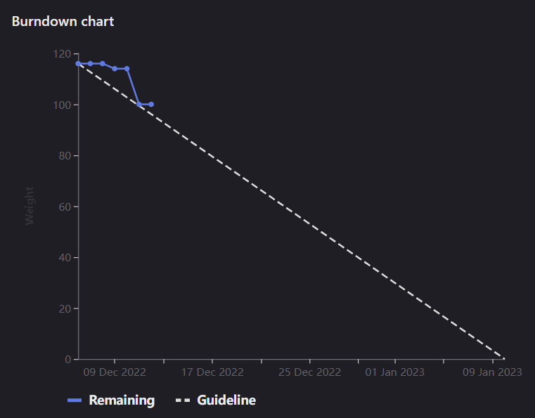

# [Sprint Goal](https://gitlab.com/msoe.edu/sdl/y23-senior-design/24-transcription-study-assistant/-/milestones/4#tab-issues): 
***Goal:***  
Hardware: Have main electrical components ordered, have 3d model of base shell, and have custom board designed.  
ML: Collect the transcript dataset, and touch up preprocessing  
Software: Finish prototyping and finish planning for main software device.

# Team Member Contributions:
## *Christie, Angela*
### Weekly Hours: 10
### Weekly Rating: $`\frac{8}{10}`$
### Weekly Summary: 
- Attended the meeting with Dr. Sohoni
- Attended the Friday team meeting
- Completed the CATME Survey
- Researched different microcontrollers with more pins (issue #118)
- Completed a new wiring diagram with the TinyPICO ESP32 Development Board with USB-C (issue #118)
- Determined if new symbols and footprints need to be designed for each of the components (issue #60)
- Created a custom symbol for the microcontroller and completed most of the schematic (issue #60)
- Altered the project BOM to show the new vendors we will purchase parts from (issue #84)
- Ordered the parts on the project BOM (issue #84)
- Started working on the block diagram (issue #60)

## *Fass, Grant*
### Weekly Hours: 14
### Weekly Rating: $`\frac{9.5}{10}`$
### Weekly Summary:
- Attended the weekly meeting and took notes
- Set up the status report for the week
- Worked on investigating login APIs for relevant information
- Redrafted the entire [API protocol document](https://gitlab.com/msoe.edu/sdl/y23-senior-design/24-transcription-study-assistant/-/wikis/%5BDocumentation%5D-API-Communication-Protocol) from scratch to support logins and the authentication exchange. See #91 and its review issue #102 
- Updated the key types as part of the communications API document.
- Prepared for and attended the meeting on Saturday at 9 AM about software issues and planning.
- Spent some time moving around issues for the current sprint due to a need to pull in #67.
- Weekly review and adding burndown chart

## *Kaja, Nicholas*
### Weekly Hours: 13
### Weekly Rating: $`\frac{x}{10}`$
### Weekly Summary: 
- Attended the Tuesday and Friday team meetings
- Finished building the Khan Academy web scraper + transcript datasets (issue #108)
- Attended the Sunday Software meeting

## *Karpov, Alexander*
### Weekly Hours: 5
### Weekly Rating: $`\frac{x}{10}`$
### Weekly Summary:
- Did research into simulating UART using 'Bit Bashing'/SoftUART
- Began modeling product package
- Completed CATME survey
- Bad week on my end, got sidetracked by other classes a lot

## *Toohill, Teresa*
### Weekly Hours: 7
### Weekly Rating: $`\frac{x}{10}`$
### Weekly Summary:
- Weekly meeting with group on Friday.
- Attended meeting with Grant regarding discussion on Communications API
- Decided to move forward with Angular and Node JS
- Began implementing communications API
- Feeling under the weather, so will work more next week. My apologies

# Discussion:
## Meetings:
Weekly Meeting Notes:
- Closed out all of the items from last week.
- Retro looks good, especially the level of detail.
- Structure of the sprint plan looks good as well.
- the microcontroller does look a little small ports wise so it may be better to use an Arduino or something during development
- The pilot the surveys issue #114 may need to include analysis of the survey piloting. With the analysis and changes it may end up closer to 10 points.
- there may end up being a little too much on the hardware side for now.

Saturday 9 A.M. Programming Meeting Notes:
- fix dropdown indentations.
- may want to store the data in the backend as base64 directly for storage.
- what happens if you process or clean a file multiple times
- will probably want issues in the future to look at databases and object stores.
- May want to actually store summaries.
- QT / Angular:
  - QT felt hard to use. 
  - More familiar with Angular
  - Angular will be the choice for frontend due to speed of writing.
  - Going to attempt to use Python with REST endpoints such as flutter for the backend instead of NodeJS. this is for better compatibility with the ML pipeline.

# Advisor Questions:
- No questions this week.

# Conclusion.
Ordered parts this week for hardware. ML collected the Kahn Academy lessons and transcripts. Software worked on a lot of planning including the communications document.

