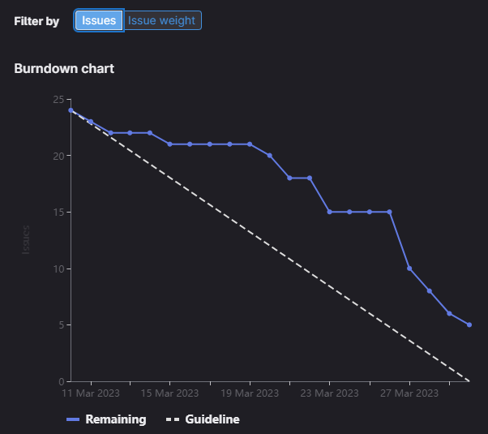

# [Sprint Goal](https://gitlab.com/msoe.edu/sdl/y23-senior-design/24-transcription-study-assistant/-/milestones/7#tab-issues): 
***Goal:***   
Hardware: Review Survey Feedback, 3d modeling, camera / microphone testing

ML: Investigate Missing Functionality (STT & Question Answer Systems)

Software: Finish Backend, Link Backend to Frontend

## Burndown Chart

# Team Member Contributions:
## *Christie, Angela*
### Weekly Hours: 11.25
### Weekly Rating: $`\frac{8}{10}`$
### Weekly Summary: 
- Attended the meeting with Dr. Sohoni
- Attended the Tuesday team meeting (stand-up, sprint planning, etc.)
- Completed the camera quality investigation (issue #162)
  - Reached out to ArduCAM support -- their SPI cameras don't support high frame rates
  - Updated the report with the new test information
- Drafted the Final Report (issue #176)
- Completed research for another camera (no issue for this - total time spent 4.5hrs)
  - Decided to go with the [SVPRO 2MP HD USB Camera Module w/ 3.6mm Lens](https://www.amazon.com/gp/product/B07CSSDTJ1/ref=ppx_yo_dt_b_asin_title_o00_s00?ie=UTF8&th=1)
  - We will be using a [USB splitter](https://www.amazon.com/gp/product/B098L7WJ4C/ref=ppx_yo_dt_b_asin_title_o01_s00?ie=UTF8&psc=1) as well

## *Fass, Grant*
### Weekly Hours: 9.25
### Weekly Rating: $`\frac{9}{10}`$ 
### Weekly Summary:
- Drafted sprint status report as well as meeting notes.
- Closed #170 #175
- Closed #166
- Closed #174
- Some preliminary sprint planning
- Closed #172
- Team meeting
- #159 and #160 Retro and Planning
- Reviewing team updates

## *Kaja, Nicholas*
### Weekly Hours: 9.25 
### Weekly Rating: $`\frac{6}{10}`$
### Weekly Summary: 
- Attended the Thursday and Tuesday weekly meetings
- Implemented unit tests for /proc endpoints (#171)
- Add handling for uploading non text files and storing raw bytes
- Added unit tests for file upload
 
## *Karpov, Alexander*
### Weekly Hours: 9
### Weekly Rating: $`\frac{x}{10}`$
### Weekly Summary:
- Attended weekly Tuesday and Thursday Meetings
- Completed CATME survey
- Closed out Task #110
  - Will be printing model Thursday (03/30)
- Began work on Task #112 
  - Stopped due to having to switch cameras

## *Toohill, Teresa*
### Weekly Hours: 15
### Weekly Rating: $`\frac{x}{10}`$
### Weekly Summary:
- Weekly Meeting Thursday and Tuesday
- Running API/Post man over weekend before Grant updated branch
- Was able to successfully launch setup.py from Pycharm
- Building webpages for #131, blocked by angular not running
- Code for communicating with python backend
- Angular running issues, resolving

# Discussion:
## Meetings:
Weekly Meeting Notes
- Still have frame rate issues with the camera.
- Probably going to need to contact the Arducam tech support about the camera. Especially since it seems like a known issue. May want to talk to Dr. Shilling or swap cameras if that does not work.
- #170 still needs frontend and readme updates to be marked as complete
- 3d model enclosure involved multiple iterations of the design. have settled on a design and just needs to finish up and 3d print it.
- Nick finished up the ML stories for this sprint. moving on to backend unit tests and other Misc backend things.
- Sprint planning in this upcoming week.
- 20 min meeting

Tuesday Meeting Notes
- Xander: Finished the base enclosure. Will be printing on Thursday. Working on modeling the Turret now. Cannot fully model turret due to missing camera.
- Angela: Finished the camera issue. Holding off on PCB assembly until we get a new camera. SPI camera does not support high framerate. Need an MPI camera. Stubbed out the final report. Began looking into another camera. MIPI cameras require 15 pins which we do not have. May need separate controller or converter. May need separate camera that runs off a USB with a USB splitter inside the device. Going to move final report back since camera is more important.
- Teresa: spent a few hours looking at a branch and trying to get things to run. Apparently the setup file does not work nicely with vscode. (Try using pycharm and vscode at the same time). Everything should be implemented by next sprint. 
- Nick: Worked on the PROC endpoint unit tests. They just send out a valid request and run some JSON validation. performs an invalid one and checks for error code. Could check if file in MINIO using the s3_connection and the check for file method. Everything we send over JSON as raw bytes is 30% larger. Need to convert to base 64 first then get the utf string of that and put that string inside the JSON object. This is because we cannot put the raw bytes into the JSON. 
- Grant: plaintext passwords, api coms doc UUID version 5 -> 4 update. setup.py and run.py. Did not encrypt tokens since they are like session tokens. Can perform the auto sign out after time inside the thread that performs the minio timed logging. I think the backend error code issue can be closed with just a review issue next sprint.
- Went through sprint planning as a team.
- Went through and drafted the student project show abstract as a team. Want to review Thursday.
- 1h 45m meeting.

# Advisor Questions:
- What do you think of the following Student Project Show Abstract?

The Transcript Study Assistant provides aid to both instructors and students during the learning process. This project provides a more affordable option for presentation-focused recording devices than what is currently offered in the market. Using machine learning, the study assistant helps break down large amounts of information into manageable pieces to help students understand key concepts. This tool also helps educators identify the key concepts they are teaching. Overall, the Study Assistant makes it easier for students to learn and for educators to communicate their ideas effectively.

A custom, all-in-one device has been developed and tailored to the classroom environment. It utilizes a custom PCB to control the onboard camera, motor, and microphones. Files can be uploaded through our frontend, written in Angular, to our backend, written in Flask. The backend utilizes HuggingFace transformers and Latent Dirichlet  Allocation to perform transcription, create summaries, extract keywords, and answer questions.

# Conclusion.
- None