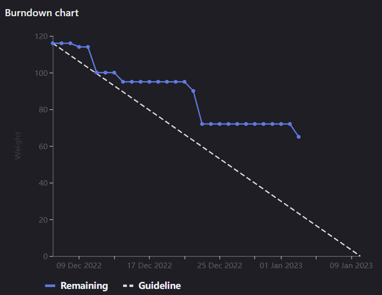

# [Sprint Goal](https://gitlab.com/msoe.edu/sdl/y23-senior-design/24-transcription-study-assistant/-/milestones/4#tab-issues): 
***Goal:***  
Hardware: Have main electrical components ordered, have 3d model of base shell, and have custom board designed.  
ML: Collect the transcript dataset, and touch up preprocessing  
Software: Finish prototyping and finish planning for main software device.

# Team Member Contributions:
## *Christie, Angela*
### Weekly Hours: 9.5
### Weekly Rating: $`\frac{8}{10}`$
### Weekly Summary: 
- Attended the meeting with Dr. Sohoni
- Attended the Friday team meeting
- Met with Xander and Nick to review the schematic
- Completed the schematic and performed an electrical rules check to ensure everything was connected correctly (issue #60)
- Completed a general block diagram for the device (issue #60)
- Piloted the student survey and made the necessary changes (issue #114)
- Worked on designing footprints for the switch, the directional microphone, and the microcontroller (issue #115)
- Revised the schematic based on the changes discussed in the meeting (issue #103)

## *Fass, Grant*
### Weekly Hours: 7
### Weekly Rating: $`\frac{7}{10}`$
### Weekly Summary:
- Prepared the weekly status report document
- attended the weekly instructor meeting and took notes.
- Friday meeting and related notes. Some additional planning.
- Did spellchecking and review of the API communication protocol document
- Added example messages and error codes to the API communication protocol document.
- Closed #91 and #102

## *Kaja, Nicholas*
### Weekly Hours: 10.5
### Weekly Rating: $`\frac{7}{10}`$
### Weekly Summary: 
- Attended the Tuesday meeting and Friday meetings (team & hardware)
- Reviewed LDA and looked into model evaluation
- Worked on #92 - created separate notebook for LDA model evaluation
  - Still need to expand grid-search 

## *Karpov, Alexander*
### Weekly Hours: 12
### Weekly Rating: $`\frac{x}{10}`$
### Weekly Summary:
- Attended Friday Team meeting
- Attended Friday Schematic Review meeting with Angela
- Completed issue #111, closed.
- Completed issue #109, but failed to hit each objective due to encountered roadblock, moved to 'In Review'

## *Toohill, Teresa*
### Weekly Hours: 12
### Weekly Rating: $`\frac{x}{10}`$
### Weekly Summary:
- Attended Friday meeting with Team
- Read through API communication protocol (#67 )
- Tried to set up backend and front end communications
- Weekly meeting with instructor

# Discussion:
## Meetings:
Weekly Meeting Notes:
- Tuesday Instructor Meeting:
  - Burndown chart is actually the correct shape for once.
  - API document has good detail.
  - Good job on planning to start simulating and testing things now.
  - It will be a good idea to set up different issues for each implementation.
  - May want to not track all of the user metrics for the account sign up data.
  - Happy with how the approach to video and text files are being approached.
  - Piloting the student survey tonight and making changes tonight or tomorrow. Instructor survey still needs to be piloted.
  - Went with a different microcontroller with more pins based on last week's meeting.
  - Khan Academy webscrapper is now finished so we have a lot of extra transcripts to work with now. Editing preprocessing is the next step.
  - Good job completing the CATME survey.
  - SO objectives in week 5-8. Take a look at the SO due during week 5 after break to determine which sprint it falls into.

Friday Meeting Notes:  
- Performed a standup and planning session.
- Xander has been looking into UART stuff, audio and video filtering. Plans on working on 3d model over break.
- Angela worked on the custom board schematic and block diagram. Planning on working on the custom board schematic and pcb layout.
- Teresa was out sick and plans on working on the communications implementation.
- Nick worked on the khan academy transcripts and plans on working on the preprocessing pipeline and LDA
- Grant worked on the communications API. Plans on working on the communications api and some sprint planning for next sprint due to the timing of meetings when we come back.

Schematic Review Meeting:
- Discussed each section of the schematic and reviewed all connections
  - May want to look into higher resistance values for the directional microphone
  - May need an amplifier for the microphone output -- this is something we can look into after prototyping
- Discussed possible PCB layouts and how the components will fit into the final design
- The plan is to design the board but hold off on ordering it until after prototyping is finished
  - This will allow us to make the changes we need after prototyping
  - Prototyping will most likely begin during the next sprint

# Advisor Questions:
- No questions this week.

# Conclusion.
Worked on moving toward the sprint goals. The pace was a bit sporadic this 'week' due to the winter holiday break.

