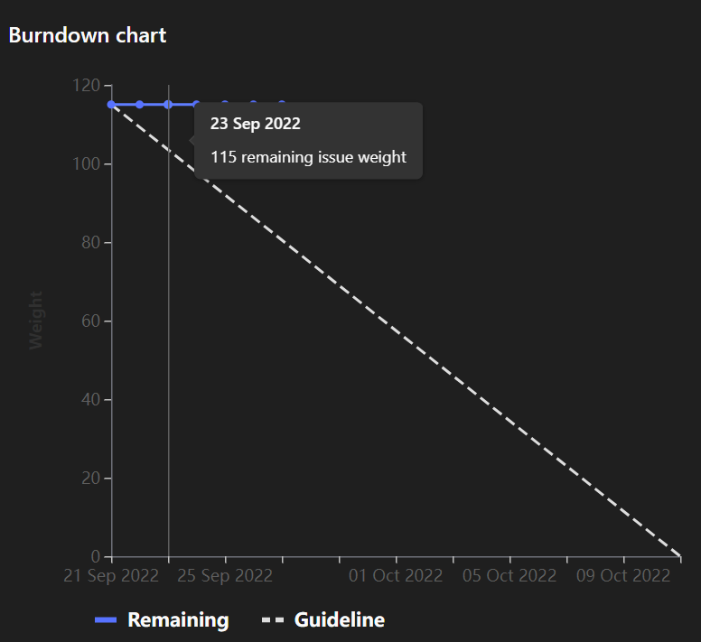

# [Sprint Goal](https://gitlab.com/msoe.edu/sdl/y23-senior-design/24-transcription-study-assistant/-/milestones/1): Finish the [Technology Report](https://gitlab.com/msoe.edu/sdl/y23-senior-design/24-transcription-study-assistant/-/wikis/Technology-Report).

# [Burndown Chart]():

# Team Member Contributions:
## *Christie, Angela*
### Weekly Hours: 10
### Weekly Rating: $`\frac{7}{10}`$
### Weekly Summary: 
- Attended weekly meeting with instructor
- Completed the SO1-4, SO3-5, and SO7-3 assignments
- Organized and attended a team meeting on Friday to discuss acceptance criteria and assign issues
- Filled out summary and acceptance criteria for issues #4 , #5 , and #9 
- Created a draft of the instructor interview questions
- Create a draft of the student survey questions
- Drafted a list of the department heads and other instructors we will contact
- Attended the weekly meeting with team members on Tuesday

## *Fass, Grant*
### Weekly Hours: 9.75
### Weekly Rating: $`\frac{8}{10}`$
### Weekly Summary:
- attended the weekly meeting
- prepped the draft of the status report
- added a summary and acceptance criteria to #8  
- Attended half of the friday meeting
- Began looking for text analysis stuff
- Added a ML Algorithms temp page for notes and research documents
- Added some of the models that were found to the technology report
- broke out some of the models into separate categories
- Research Topic Modeling
- added other models for preprocessing. added topic modeling algorithms to tech report, added classical models as well.
- Attended Tuesday meeting

## *Kaja, Nicholas*
### Weekly Hours: 10
### Weekly Rating: $`\frac{7}{10}`$
### Weekly Summary: 
- Attended weekly meeting, Friday meeting, and Tuesday meeting
- Began searching the web for lecture transcript / NLP datasets
    - Compiled early findings into a story comment
- Wrote Summary and Acceptance Criteria for Issue #2 Collect and Prepare Transcripts
- Began reading through Grant's ML wiki page to start getting a grasp on potential NLP tools and methods

## *Karpov, Alexander*
### Weekly Hours: 7
### Weekly Rating: $`\frac{7}{10}`$
### Weekly Summary:
- Attended meetings on Friday and Tuesday
- Completed SO3-5, SO1-4, SO7-3
- Got into contact with Dr. Durant about borrowing his Metting OWL 3
- Added `TODO` and `Results` section to [Issue \#1](https://gitlab.com/msoe.edu/sdl/y23-senior-design/24-transcription-study-assistant/-/issues/1)
  - Added a bunch of researched information to said categories
- Continued preparing code/procedure for testing sensors on the OWL

## *Toohill, Teresa*
### Weekly Hours: 6 Hours
### Weekly Rating: $`\frac{7}{10}`$
### Weekly Summary:
Began to do some research. When I feel more confident in my research on how to best construct the software infrastructure, I will upload it to the wiki (I have it in a doc). Looked at the security considerations of a desktop app vs a web app. Also began discussing GUI designs with my UX friend who is a Senior.

# Discussion:
## Meetings:
There was an optional team meeting held on Friday of week 3. This meeting was used for some of the team to outline more of the issue summaries and acceptance criteria. The team also assigned some issues at this meeting.

We held a second meeting this week on Tuesday Sept 27. This meeting ran from 6:00pm to 7:00pm. We ran through an update of findings for everybody this week and worked on outlining some of the testing for the owl device.

## [Technology Report](https://gitlab.com/msoe.edu/sdl/y23-senior-design/24-transcription-study-assistant/-/wikis/Technology-Report) Due Date
- October 11 2022

# Advisor Questions:
- Do we need to get 10+ hours each week or are we able to balance out hours over the course of a sprint?

# Conclusion
- Began evaluating choices for the technology report. Began figuring out approaches and performed a lot of research.