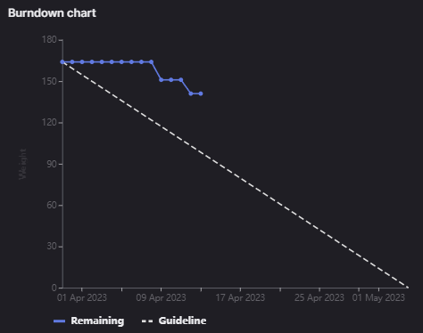

# [Sprint Goal](https://gitlab.com/msoe.edu/sdl/y23-senior-design/24-transcription-study-assistant/-/milestones/8#tab-issues): 
***Goal:***   
Planning out a four week sprint so we line up with the other teams again. This will also leave us more time to finish everything off.

Hardware: Build and Assemble Device, Program Interfacing

ML: Add in Question Generation

Software: OWASP backend updates, Frontend UX updates

General: Poster & Final Report

## Burndown Chart

# Team Member Contributions:
## *Christie, Angela*
### Weekly Hours: 10
### Weekly Rating: $`\frac{7}{10}`$
### Weekly Summary: 
- Attended the meeting with Dr. Sohoni
- Attended the Tuesday team meeting
- Worked on PCB assembly (issue #180)
  - Searched through the parts in the Maker Lab and asked EECS Tech Support if they had the parts we needed
  - Only found 100k resistors, all other resistors and capacitors were either the wrong size or wrong value
  - These resistors and capacitors were ordered on Monday 4/10 (refer to [Project BOM](https://gitlab.com/msoe.edu/sdl/y23-senior-design/24-transcription-study-assistant/-/wikis/%5BDocumentation%5D%20Project%20BOM) and [Part Order Information](https://gitlab.com/msoe.edu/sdl/y23-senior-design/24-transcription-study-assistant/-/wikis/%5BDocumentation%5D%20Part%20Order%20Information))
  - Holding off on PCB assembly until these parts arrive (now expected to arrive Thursday 4/13)
- Completed poster field notes (issue #187)
- Completed poster concept maps and sketches (issue #188)
- Continued to work on the final report (issue #191)

## *Fass, Grant*
### Weekly Hours: 9.75
### Weekly Rating: $`\frac{8}{10}`$ 
### Weekly Summary:
- Drafted weekly status report and notes
- Helped Teresa fix some angular issues
- Turned in the project paragraph on canvas and email.
- Worked on the OWASP Audit #158. There are a few items in sections 5, 8, 9, 14, and C that I marked as "Did Not Evaluate" since they almost directly related to the frontend.
- Implemented the timed logout for inactivity in backend. #177. Added two environment variables (also included in setup.py) so that it is easier to configure the logging interval and the inactivity interval.
- Removed get sentences by keyword and marked the documentation as [DEPRECATED] in the API Comms Doc. #183
- Looked through some of the poster field notes and sketches Angela created.

## *Kaja, Nicholas*
### Weekly Hours: 9
### Weekly Rating: $`\frac{7}{10}`$
### Weekly Summary: 
- Attended the Thursday and Tuesday weekly meetings
- Added unit tests for file related endpoints (#171)
- Completed question generation class and endpoint (#179)
 
## *Karpov, Alexander*
### Weekly Hours: 9.5
### Weekly Rating: $`\frac{x}{10}`$
### Weekly Summary:
- Attended Tuesday and Thursday weekly meetings
- Worked on interfacing
  - MCU side (issue #193)
  - Python side (issue #194)
- Re-started work on issue #112 / #196 
- Assembled the lower shell of the device

## *Toohill, Teresa*
### Weekly Hours: 12
### Weekly Rating: $`\frac{x}{10}`$
### Weekly Summary:
- Angular investigation ongoing (#131, #130, #129)
  - HTTP Post request documentation keeps changing so two year documentation is outdated
- Reaching out & Scheduling meeting person Alex suggested
- Tuesday and Thursday Meetings

# Discussion:
## Meetings:
Weekly Meeting Notes
- Burndown looks good
- Have to go with a camera with a USB header on it since a different camera would require a full redesign to accommodate the 15 pins required.
- Python installer and UTs
- Teresa ran into issues with angular
- Went over weekly status report and sprint plan
- 30 min meeting

Tuesday Meeting Notes
- Xander: Finished the base. Waiting on the camera to create the turret. Working on serial communication code.  
- Nick: Finished up the unit tests. Plan on getting the question generation functionality implemented.  
- Angela: Looked through the parts in the Maker Lab. Found some parts but others were the wrong size or value. Ordered the parts that were needed. Arriving on Wednesday and will finish PCB assembly then.  
- Teresa:  Gained a solid understand on how the API works and how to communicate in Angular. Found tutorials and worked on debugging. A lot of issues because of the change in Angular documentation. Close to communicating with the backend. Plans to reach out to Dr. Sohoni to get in contact with someone who has experience with Angular.  
- Grant:  
20 min meeting

# Advisor Questions:
- None

# Conclusion.
- None