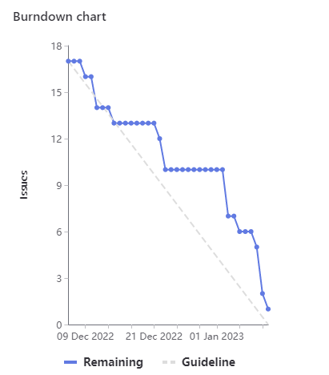

# [Sprint Goal](https://gitlab.com/msoe.edu/sdl/y23-senior-design/24-transcription-study-assistant/-/milestones/4#tab-issues): 
***Goal:***  
Hardware: Have main electrical components ordered, have 3d model of base shell, and have custom board designed.  
ML: Collect the transcript dataset, and touch up preprocessing  
Software: Finish prototyping and finish planning for main software device.

## Burndown Chart

# Team Member Contributions:
## *Christie, Angela*
### Weekly Hours: 9
### Weekly Rating: $`\frac{8}{10}`$
### Weekly Summary: 
- Attended the meeting with Dr. Sohoni
- Attended the Friday team meeting and discussed the sprint 4 retro and sprint 5 planning (issues #101 and #100)
- Piloted the instructor survey with Dr. Varnell (issue #114)
- Completed all of the footprints that needed to be designed (issue #115)
- Placed the footprints and routed them (issue #115)
- Performed a Design Rules check to ensure the board follows the set guidelines (issue #115)
- Took some time to think about and outline issues for general prototyping of the device
- Finished the CATME sprint 4 survey

## *Fass, Grant*
### Weekly Hours: 7.75
### Weekly Rating: $`\frac{9}{10}`$
### Weekly Summary:
- Prepared the weekly status report document
- attended the weekly instructor meeting and took notes.
- Started on some of the sprint planning and checked in to see issue status going into next sprint.
- Started working through some of the planning for the next sprint
- Attended the Friday team meeting
- Completed sprint 5 planning
- Revised some of the hardware issues for next sprint.
- Added mispointed issues to the sprint retrospective.
- CATME survey

## *Kaja, Nicholas*
### Weekly Hours: 7
### Weekly Rating: $`\frac{6}{10}`$
### Weekly Summary: 
- Attended the weekly Tuesday and Friday meetings
- Ran slightly more extensive LDA-grid search (#92)
- Added some acronym functionality to the preprocessing pipeline (#106)
  - See issue comment for rationale 

## *Karpov, Alexander*
### Weekly Hours: 4
### Weekly Rating: $`\frac{x}{10}`$
### Weekly Summary:
- Attended Tuesday and Friday meetings
- Did some modeling updates to the electrical components (handoff was done 1/9)
- Too much stuff happening on my end, so wasn't able to contribute as much as I wanted to

## *Toohill, Teresa*
### Weekly Hours: 10
### Weekly Rating: $`\frac{x}{10}`$
### Weekly Summary:
- Attended Tuesday Meeting w. Dr. Sohoni
- Attended Friday meeting and contributed to Sprint planning
- Worked to implement front end and backend communications with Angular (#67 )
- Researched and watched tutorials on Angular HTTP posts and requests

# Discussion:
## Meetings:
Weekly Meeting Notes:
- so6 look at what is being done software vs hardware and group accordingly. Can have the hardware and software teams each share their response to the SO objective.
- so3 has no deliverable other than the normal survey.
- so7 follow up to the so7-3 from last quarter. Explain how you went out and got the knowledge that you said you needed from last time. 
- week 8 is the next end of sprint
- so4-3 requires looking up the ACM code of ethics. pick one sub item for each of the three categories and address how you personally worked towards it. Three paragraphs total.
- need to fill out the student project show abstract next sprint
- presentation will need to be filled out next sprint
- software engineering team components is just an update tot he document from last quarter
- so2-1 quality analysis is a simple SO. the quality attributes example link is in week 4 modules. 
- Talk with Dr. Taylor about senior design lockers / storage.

Friday Meeting Notes:  
- 1 hour meeting
- Team filled out the KSS portion of the retrospective
- Team planned out and discussed what issues they would like to pursue for next sprint
  - Khan academy transfer learning issue to improve transformer performance. One 7pt investigation + one 7pt training issue.
  - Solder pins onto the dev board and the motor controller for 3pts
  - build and wire up the prototype for 7pts
  - implement the website gui features. Broken up by category of endpoints. probably 7pts per overall endpoint category. Only 2 go into this sprint
  - Design 3d model of test bench and print for 7pts
  - refine the 3d models of the electircal components with more exact caliper measurements for 5pts
  - the nodered issue for 7pts may be optional?
  - the ml backend issue for 7pts to do the ml endpoints of the API?
  - so objectives.

# Advisor Questions:
- No questions this week.

# Conclusion.

