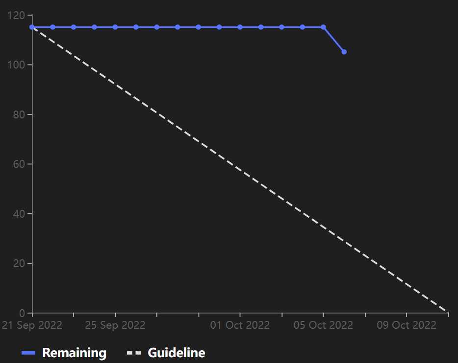

# [Sprint Goal](https://gitlab.com/msoe.edu/sdl/y23-senior-design/24-transcription-study-assistant/-/milestones/1): Finish the [Technology Report](https://gitlab.com/msoe.edu/sdl/y23-senior-design/24-transcription-study-assistant/-/wikis/Technology-Report).

# Burndown Chart:

# Team Member Contributions:
## *Christie, Angela*
### Weekly Hours: 10
### Weekly Rating: $`\frac{8}{10}`$
### Weekly Summary: 
- Finished the student survey final draft and created a google form
- Finished the instructor survey final draft and created a google form
- Researched some microphone specifications that we may need to consider if we decided to create out own board and device
- Researched and listed possible microphone suggestions if we decide to design our own system
- Attended the weekly Tuesday team meeting and discussed the plan to finish the tech report

## *Fass, Grant*
### Weekly Hours: 10
### Weekly Rating: $`\frac{9}{10}`$
### Weekly Summary:
- Created the draft of the week 5 status report
- commented on the hardware design decisions issue.
- Looked through the survey and interview questions that were drafted. Added some questions and comments.
- Added ML Algorithms evaluation strategies to the tech report
- Added prototyping plans to the tech report for the ML algorithms
- Added more links to the temp ML Algorithms document for later review
- Fixed the issues board to actually use labels for in progress and in review
- Moved #8 to In Review
- Added drafting for tech requirements to the software infrastructure page
- Added many languages to the software infrastructure page options
- filled in basic pros and cons for most of the languages on the software infrastructure page
- Reviewed and commented on some more of the issues
- Looked through the interview questions and provided feedback. started looking for how to integrate ML models with the actual app.
- Reviewed some of the other issues and performed added research for the software infrastructure
- Attended the weekly team meeting

## *Kaja, Nicholas*
### Weekly Hours: 8
### Weekly Rating: $`\frac{7}{10}`$
### Weekly Summary: 
- Reached out to one of my professors who was virtual this week to ask for lecture videos
- Downloaded ~20 videos, started skimming to note down general concepts - will put issue on hold for now
- Continued reading up on NLP tools and algorithms (mainly: spaCy and NLTK documentation, Word2Vec, Bag of Words, LDA) 
- Downloaded spaCy and followed some examples/tutorials to get a better grasp for how to use it
- Went through old Jupyter notebooks from my CS2300 class last year that dealt with Bag of Words, Countvectorizer, and TFIDFvectorizer
- Attended the Tuesday meeting

## *Karpov, Alexander*
### Weekly Hours: 8
### Weekly Rating: $`\frac{9}{10}`$
### Weekly Summary: 
- Overall productive week
- Researched audio processes
- Began programming some Python scripts in order to perform tests on accessible microphones and speakers
- Attended weekly meeting
- Finalized the 'renting' of an OWL device to use for testing

## *Toohill, Teresa*
### Weekly Hours: 10
### Weekly Rating: $`\frac{9}{10}`$
### Weekly Summary:
- Weekly meeting on 10/4 with group
- Developing & researching software infrastructure
- Making a design for the software infrastructure chart
- Reading through research and preparing for my contribution in the technology report
- Feedback on surveys
- GUI research/brainstorm

# Discussion:
## Meetings:
October 4th 2022
- In this meeting we mostly did a weekly standup and also helped each other fill out parts of the tech report and brainstormed ideas as a group.

## [Technology Report](https://gitlab.com/msoe.edu/sdl/y23-senior-design/24-transcription-study-assistant/-/wikis/Technology-Report) Due Date
- October 11 2022

# Advisor Questions:
- Do you still have a collection of previously recorded lecture videos you are willing to share with us for our dataset?
- How should we go about sending out the instructor and student surveys?

# Conclusion
- Continued work on the technology report. Mainly worked on finalizing the customer discovery surveys, filling out the software infrastructure, filling out the hardware investigation, and planning to investigate the OWL device.