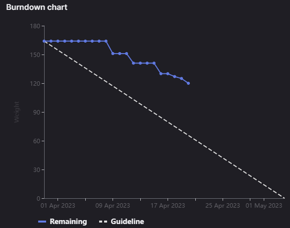

# [Sprint Goal](https://gitlab.com/msoe.edu/sdl/y23-senior-design/24-transcription-study-assistant/-/milestones/8#tab-issues): 
***Goal:***   
Planning out a four week sprint so we line up with the other teams again. This will also leave us more time to finish everything off.

Hardware: Build and Assemble Device, Program Interfacing

ML: Add in Question Generation

Software: OWASP backend updates, Frontend UX updates

General: Poster & Final Report

## Burndown Chart

# Team Member Contributions:
## *Christie, Angela*
### Weekly Hours: 11.25
### Weekly Rating: $`\frac{9}{10}`$
### Weekly Summary: 
- Attended the meeting with Dr. Sohoni
- Attended the device interfacing code meeting
- Attended the Tuesday team meeting
- Completed PCB Assembly, more details documented in the issue (issue #180)
- Started working on the device interfacing code, details documented in the issue (issue #193)

## *Fass, Grant*
### Weekly Hours: 11.0
### Weekly Rating: $`\frac{8}{10}`$ 
### Weekly Summary:
- Drafted the weekly status report with meeting notes.
- Closed issue #171. Added backend test for timing to each class. Implemented the missing tests for the account endpoints. Ran all tests to confirm that nothing unexpected was failing.
- Worked on the poster draft as a part of #189. Still missing a few things to add later after I talk with the team.
- Device Interfacing Meeting
- More poster drafting. Created more of a process flow based design.
- Weekly meeting and notes
- Created a more finalized version of the poster draft including the arrows, boxes, and better sample images.

## *Kaja, Nicholas*
### Weekly Hours: 5
### Weekly Rating: $`\frac{5}{10}`$
### Weekly Summary: 
Unfortunately got caught up with a lot of other coursework
- Attended the Tuesday and Thursday weekly meetings
- Attended the Monday Device Interfacing / Controller meeting
- Completed the CATME survey
- Verified / updated .vtt file upload functionality (#178)
- Updated API Doc for user file store format (#167)
 
## *Karpov, Alexander*
### Weekly Hours: 9.5
### Weekly Rating: $`\frac{x}{10}`$
### Weekly Summary:
- Attended the Tuesday and Thursday meetings
- Attended the Monday 'Interfacing' meeting
- Researched Arduino-Python serial communication approaches
- Planned out computer-side Python API
- Worked on modeling camera enclosure

## *Toohill, Teresa*
### Weekly Hours:  13
### Weekly Rating: $`\frac{x}{10}`$
### Weekly Summary:
- Figured out interface/piping issues with Angular which allows me to communicate with the backend
- Found updated tutorials
- Working towards wrapping up #129, #130, and #131 by next Monday
- Reached out to Alex's friend who has experience with Angular, will set up a meeting next week in case I run into issues
- Thursday and Tuesday meeting
- API communications implementation

# Discussion:
## Meetings:
Weekly Meeting Notes
- Everything looks good on the status report. 
- Teresa is missing some details in the weekly summary. could you link to the issues you worked on. 
- OWASP audit page should be sufficient for the assignment. Link to the table in the assignment submission. In the text area for the submission include the issue documentation.
- Need to add a timing / speed test endpoint then the backend UTs can be closed.
- Poster is ready to be drafted.

Monday Device Interfacing Meeting Notes:
- Using a USB camera so we will not need any code for the camera.
- Would need interfacing code for the microphone and motor. Just need some way to get the audio data and set the motor speed.
- Will run open cv over the video feed to detect the presenter.
- Would need to pass the audio over the USB connection as a bytes file or something. Probably need to use a callback every time new audio is received. 
- Device should be finished being assembled by Thursday.
- 30m

Tuesday Meeting Notes
- Xander
  - Looking more into serial communication stuff. Picked up the camera as well so looking at modeling with the camera.
- Angela
  - Mostly finished assembling PCB. Had issue with directional microphone. Accidentally ripped a pad off the directional mic. Do not really know how to fix it. Omni-directional microphone still works. Can just swap to using the omni mic only which makes the PCB fully assembled. Continuity test came back ok.
- Nick
  - Plan on going through some of the leftover stories in the sprint tonight. 
- Grant
  - closed testing issue and also worked on the poster draft. 
- Teresa
  - Figured out why Angular was not working. Was missing some information on types (Pipes?). Need to start organizing and get communications working. Aiming to get stuff done by Monday. Prioritize file upload and the summarization pages as they are needed for the poster.
- Need way to call methods in python Xander will make this class. Angela will start creating the interfacing code on the arduino side. One file with all of the C++ arduino code.
- 35 min meeting

# Advisor Questions:
- None

# Conclusion.
- None