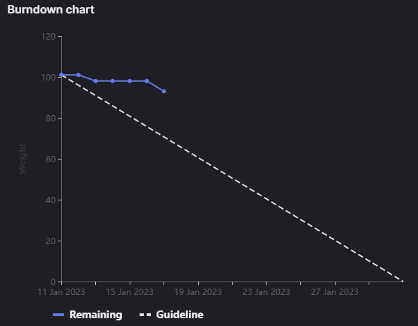

# [Sprint Goal](https://gitlab.com/msoe.edu/sdl/y23-senior-design/24-transcription-study-assistant/-/milestones/5#tab-issues): 
***Goal:***  
Hardware: Begin building the prototype to verify equipment functions as expected.

ML: Work on improving Transformer performance using Khan Academy Dataset

Software: Begin creating the application Frontend and implementing the Application Backend for the data processing endpoints

## Burndown Chart

# Team Member Contributions:
## *Christie, Angela*
### Weekly Hours: 7
### Weekly Rating: $`\frac{7}{10}`$
### Weekly Summary: 
- Attended the meeting with Dr. Sohoni
- Attended the Friday team meeting
- Attended the PCB Review Meeting (issue #116)
- Started making the recommended changes to the PCB layout (issue #116)
- Pins have been soldered onto the motor driver and the ESP32 development board - a continuity test was completed on each pin (issue #124)

## *Fass, Grant*
### Weekly Hours: 6
### Weekly Rating: $`\frac{7}{10}`$
### Weekly Summary:
- This week I have been blocked on code development as I was waiting for code from last sprint to be pushed into the repo. I did my best to focus on other tasks as I was able instead. If this is not resolved by the weekly meeting I likely will just rewrite the missing code myself.
- Attended the Friday meeting
- Completed my portion of SO6-3 as defined by canvas and recorded in #134 
- Completed my portion of SO7-4 as defined by canvas and recorded in #135 
- Updated the weekly status report for week 6 to be more consistent with past status reports
- Completed my portion of SO4-3 as defined by canvas and recorded in #136 
- Completed my portion of SO2-1 as defined by canvas and recorded in #137 
- Attended the PCB Layout Review Meeting as part of issue #116

## *Kaja, Nicholas*
### Weekly Hours: 6.5
### Weekly Rating: $`\frac{6}{10}`$
### Weekly Summary: 
- Was busy with midterms/projects, didn't get as many hours as I would've liked
- Attended Tuesday and Friday weekly meetings
- Began the Transformer fine-tuning investigation (#122)
- Created short presentation for ML recap 
- Attended the Monday PCB layout review meeting

## *Karpov, Alexander*
### Weekly Hours: 7
### Weekly Rating: $`\frac{x}{10}`$
### Weekly Summary:
- Attended PCB Review meeting
- Refined various electrical component models and pushed them to repo (#127)
- Mostly completed testbench model (#126). Pending changes as a result of PCB Layout meeting.

## *Toohill, Teresa*
### Weekly Hours: 7
### Weekly Rating: $`\frac{x}{10}`$
### Weekly Summary:
- Attended weekly meeting
- Restful API implementation of frontend and backend communicaton (#67)
- Fixing git credential issues issues 
- Email Grant the file
- Met with Dr. Sohoni
- Had a lot of midterm stuff going on so yeah

# Discussion:
## Meetings:
Weekly Meeting Notes:
- Prepare a 10 minutes explanation of the machine learning portion of the project for next week's meeting
- Sprint 5 plan looks good
- For lockers, there isn't a system to keep track of access
  - Maybe a locker is not in use
  - Don't know how to reset the code
    - Maybe IT or maintenance knows
  - Look and see if there are any instructions on using the lockers in the DH senior design lab
  - Also, check with Dr. Taylor, who may send us to Dr. Riley

Friday Meeting Notes:
- Teresa cannot push to git for some reason. Still working on the one PBI from last week
- Angela will be meeting with Xander later tonight to review PCB layout. Start working on soldering after this meeting. Possibly SO objectives after that.
- Nick will be working on the investigation for transfer learning. Also plans on making the presentation on ML for Dr. Sohoni. LDA param grid search ended up yielding that most of the params are not very useful. Acronym investigation did not go well as none of the established solutions worked.
- Grant plans to just do SO objective stuff this weekend as he is blocked waiting for some code to be pushed to the repo.
- Discussed the results of the Acronym investigation and LDA grid search issues.
- 15 min meeting for standup

Monday PCB Layout Review Meeting Notes:
- See the [Wiki Page](https://gitlab.com/msoe.edu/sdl/y23-senior-design/24-transcription-study-assistant/-/wikis/PCB%20Layout)
- dev board faces the back of the device
- Camera header is closer to where the motor will be. Same with the motor controller.
- Omni directional microphone has a footprint where we can solder wires to. Can have the wires go up and through to the camera holder. Grouped the resistors with their areas.
- Put the other microphone close to the front of the board
- 52mm x 45mm
- Power lines in the traces are large to handle any current. The 5v line has to drop under at one point and come back but should not cause issues.
- The power lines are minimally parallel to the high frequency microphone lines.
- The Mounting Holes are included in the design.
- The switch is a right angle mount so we have a square base with the board sitting flat in it. This lets the switch and the USB connector out the back of the device.
- Concern with the motor sitting directly above the board. Probably need to change the mounting behavior so that we mount vertically instead of horizontally. There will be an issue with the omnidirectional microphone that requires it to be run somewhere else.
- Changing the omni mic to be just wired to somewhere else means we can reduce the footprint of the board by shrinking the area.
- Probably going to do another meeting after the footprint change.

# Advisor Questions:
- None

# Conclusion.
- We want to review SO6-3 again later on once the frontend is actually completed. This should probably be done as a team during a weekly meeting.