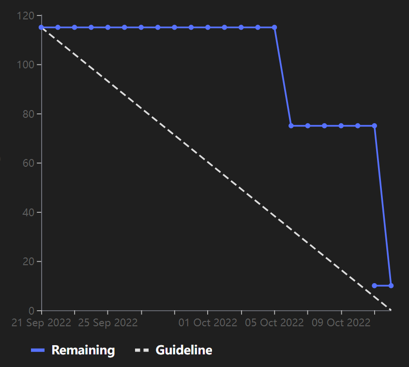

# [Sprint Goal](https://gitlab.com/msoe.edu/sdl/y23-senior-design/24-transcription-study-assistant/-/milestones/1): Finish the [Technology Report](https://gitlab.com/msoe.edu/sdl/y23-senior-design/24-transcription-study-assistant/-/wikis/Technology-Report).

# Burndown Chart:

# Team Member Contributions:
## *Christie, Angela*
### Weekly Hours: 12.5
### Weekly Rating: $`\frac{9}{10}`$
### Weekly Summary: 
- Completed most of the hardware sections for the tech report (issue #9):
  - Outlined potential hardware component options
  - Outlined the hardware technology issues
  - Researched examples of all-in-one devices
  - Researched examples of off-the-shelf microphones and cameras
  - Researched and listed examples of microphones, cameras, and motors for a custom board design
  - Listed the pros and cons of the hardware component options
  - Outlined general prototyping plans
  - Provided some strategies we would use to make our decision
- Attended the weekly Tuesday team meeting
- Edited issue #9 to better reflect the focus of the issue for Sprint 1

## *Fass, Grant*
### Weekly Hours: 11.5
### Weekly Rating: $`\frac{9}{10}`$
### Weekly Summary:
- Created the draft of the week 6 status report
- Created the draft of the Sprint 1 Retrospective
- Created the draft of the Sprint 2 Planning document
- Outlined possible functions of the GUI application and drafted up one of the windows as an example.
- Worked a bit more on the software infrastructure wiki
- Helped determine the speaker testing procedure and helped run some tests
- Reviewed changes from the weekend and set up a plan for the Tuesday meeting.
- Worked on transitioning the Temp pages to the Tech Report
- Investigated Hardware communication interfaces
- Tuesday meeting

## *Kaja, Nicholas*
### Weekly Hours: 10.5
### Weekly Rating: $`\frac{7}{10}`$
### Weekly Summary: 
- Attended the Tuesday meeting
- Brushed up on C++
- Went through Qt C++ tutorials and examples
- Looked at some QML documentation and examples
- Looked at how we could potentially implement ML models in a C++ project
- Looked at the Survey questions in order to get an idea of what we will need to analyze
- Looked at the GUI mockup to start formulating an idea of which features will be where in our application

## *Karpov, Alexander*
### Weekly Hours: 10.5
### Weekly Rating: $`\frac{8}{10}`$
### Weekly Summary:
- Looked into how to perform numerical audio analysis
- Prototyped/learned Python libraries to record and play audio
- Performed experimentation with control samples for microphone (test sample TBD)
- Performed visual analysis on gathered control sample audio
- Attended Tuesday's meeting

## *Toohill, Teresa*
### Weekly Hours: 11
### Weekly Rating: $`\frac{8}{10}`$
### Weekly Summary:
- Research on Software Infrastructure
- GUI Feedback
- Weighed pros and cons of various languages
- Tuesday Meeting

# Discussion:
## Meetings:
- October $11$th 2022
  - 2h15m meeting
  - looked through the tech report
  - identified primary options where applicable
  - did sprint 1 retro
  - worked on planning for sprint 2

## [Technology Report](https://gitlab.com/msoe.edu/sdl/y23-senior-design/24-transcription-study-assistant/-/wikis/Technology-Report) Due Date
- October 11 2022

# Advisor Questions:
- No questions this week

# Conclusion
- Worked on finishing up Sprint 1
- Worked on preparing for Sprint 2
- Finished up the first draft of the Technology Report