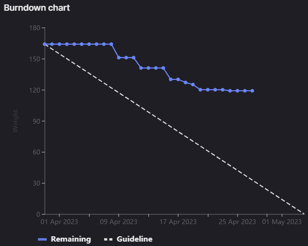

# [Sprint Goal](https://gitlab.com/msoe.edu/sdl/y23-senior-design/24-transcription-study-assistant/-/milestones/8#tab-issues): 
***Goal:***   
Planning out a four week sprint so we line up with the other teams again. This will also leave us more time to finish everything off.

Hardware: Build and Assemble Device, Program Interfacing

ML: Add in Question Generation

Software: OWASP backend updates, Frontend UX updates

General: Poster & Final Report

## Burndown Chart

# Team Member Contributions:
## *Christie, Angela*
### Weekly Hours: 10
### Weekly Rating: $`\frac{7}{10}`$
### Weekly Summary: 
- Attended the meeting with Dr. Sohoni
- Attended the Tuesday team meeting
- Completed the sprint 7 CATME survey
- Completed SO2-3 (issue #185)
- Completed SO5-2 (issue #186)
- Continued working on the device interfacing code, details documented in the issue (issue #193)

## *Fass, Grant*
### Weekly Hours: 12.5
### Weekly Rating: $`\frac{9}{10}`$ 
### Weekly Summary:
- drafted the weekly status report with notes. 
- Worked on final poster updates
- catme survey
- SO2-3 #185 
- SO5-2 #186 
- Worked on the OpenCV object detection as part of #194. Followed a tutorial at first then went through the logic for how the tutorial was performing moving object detection. Figured out that since we are rotating the camera the background calculation will have to be periodically updated. This means that the code from the tutorial will require updates. Read through all of the code in detail and recorded notes to begin rewriting it.
- Weekly team update meeting
- As a part of #194 Rewrote the entire moving object detection algorithm. Now has a rolling buffer that updates on an interval. Added in variables to tune the buffer size, recalculation interval, and number of dilation passes. Changed the object detection algorithm from contours to connected components. Also only displaying the largest component by area. (second largest since first is the background). Wrote in more controls to allow for the saving of the file.
- Example video can be found under the DeviceInterface directory. [PossibleDirectLink](https://gitlab.com/msoe.edu/sdl/y23-senior-design/24-transcription-study-assistant/-/blob/main/DeviceInterface/Example_Motion_Tracking.mp4)
- Collected more poster field notes and measurements
  - MSOE logo 4.25" - 3"
  - Other logo 2" - 3"
  - Title Text 1" - 1.5"
  - Headings 1/2"
  - Text 4/16" - 5/16"
  - Probably want a QR code that links to the repo on Git
  - Bezels are 1/2"
- Redrafted the poster for #190. Images can be seen under the issue.

## *Kaja, Nicholas*
### Weekly Hours: 5
### Weekly Rating: $`\frac{5}{10}`$
### Weekly Summary: 
- Attended the Tuesday and Thursday weekly meetings
- Completed SO2-3 and SO5-2
- Read through the Software Team Components Document
- Read through the Final Report Draft (began drafting ML technical summary)
- Went through the OWASP Audit results (#158) to find potential fixes to work on
- Briefly revisited cleaning of Khan Academy transcripts
 
## *Karpov, Alexander*
### Weekly Hours: 10
### Weekly Rating: $`\frac{x}{10}`$
### Weekly Summary:
- Attended Tuesday and Thursday meetings
- Completed CATME survey
- Modeled and printed camera turret... (issue #112, #196)
  - 3D printer misprinted -- spaghetti status
  - Will re-print, but it's going to take a bit.

## *Toohill, Teresa*
### Weekly Hours:  15
### Weekly Rating: $`\frac{x}{10}`$
### Weekly Summary:
- Worked on implementing #131 
  - Implemented various pages
  - Implemented links
  - Next focus is to implement API since we have pipelines
- Tuesday and Thursday Meeting

# Discussion:
## Meetings:
Weekly Meeting Notes
- Xander forgot to fill in hours and link issues.
- Can reduce the font size over by Team Members.
- May want to print a draft version to get an idea of the sizes.
- Lots of placeholder images for now. 
- Can lower the sizes of the frontend images to increase the size of the device controller image. Check the sizes since they may be very large.
- Project overview needs to be rewritten so that there is another sentence before "some presenters speak very quickly"
- Want more symmetry between the software and project overview columns. 
- Project overview should be more of a paragraph than bullets. (Could almost just be the paragraph from the booklet)
- Could have a sentence on the survey since we put a lot of time into it. 
- May want the PCB Schematic next to the assembled PCB image.
- The dashed lines give it an unfinished looks. If we need boxes make them solid to make sure they are not giving it a draft look.
- Better optical alignment of logos and text. Look at the color pallet and number of colors used.
- 15 min meeting

Tuesday Meeting Notes
- Xander: finished designing the camera tower and is working on printing it now. More news by thursday on this. Motor is attached to the PCB and is with Angela right now.
- Angela: Working on the device interfacing code right now. Created a rough draft of a few of the functions. Created a set speeds and set steps methods for the motor. Created a very rough draft of the timer interrupt and is still debugging it at shorter times since it is stalling and resetting. Continues to read the highest value. Need to figure out what is causing that. Try to finish that up by thursday and then do the SO assignments.
- Nick: Worked on the SO objectives. Plan on going through the software engineering teams components doc and the final report tonight.
- Grant: Working on OpenCV moving object detection for the python controller. Performed a demo of some of the OpenCV motion tracking as well as some of the backend communication in postman.
- Teresa: Made progress on #131. Trying to get it running again. Had to close some of the extra consoles. Performed a walk through of some of the frontend.
- 30 min meeting

# Advisor Questions:
- None

# Conclusion.
- None