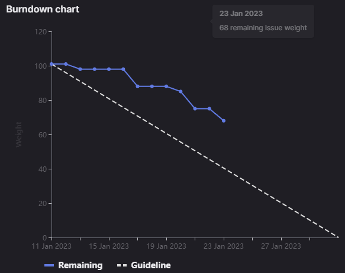

# [Sprint Goal](https://gitlab.com/msoe.edu/sdl/y23-senior-design/24-transcription-study-assistant/-/milestones/5#tab-issues): 
***Goal:***  
Hardware: Begin building the prototype to verify equipment functions as expected.

ML: Work on improving Transformer performance using Khan Academy Dataset

Software: Begin creating the application Frontend and implementing the Application Backend for the data processing endpoints

## Burndown Chart

# Team Member Contributions:
## *Christie, Angela*
### Weekly Hours: 11
### Weekly Rating: $`\frac{9}{10}`$
### Weekly Summary: 
- Attended the meeting with Dr. Sohoni
- Attended the Friday team meeting
- Attended the 2nd PCB Review Meeting (issue #116)
- Completed revision 2 of the PCB layout (issue #116)
- Completed wiring the prototype (issue #125)
- Started the distribution of surveys (issue #121)
- Began looking into using the TinyPICO development board (issue #140)
- Drafted an invitation email/letter to send with the instructor surveys (issue #121)
- Edited the Student Projects Show Abstract
- Exported and began checking the gerber/drill files for the PCB to prepare for ordering the board

## *Fass, Grant*
### Weekly Hours: 15.5
### Weekly Rating: $`\frac{10}{10}`$
### Weekly Summary:
- Drafted weekly status report page
- Met with Teresa for 15 min after the weekly update meeting. Talked about the missing code and issue #67. Determined that I am going to take over #67 as a part of my work for this sprint's #133.
- Created the endpoint stubs using REST and FLASK in python as part of #67 and #133. Added logging using structlog and uids using the uuid library.
- Verified backend communication works by sending request with postman. Image verification on issue #67 comments
- Attended Friday meeting
- Worked on the backend as a part of #133
- updated backend to parse inbound messages for data processing, file management, and account information endpoints. Skipped the auth topics for now due to their different format. Added structured logging. [commit](https://gitlab.com/msoe.edu/sdl/y23-senior-design/24-transcription-study-assistant/-/commit/c9436d19f02e2deb66893eb0425bf0e2993e6683)
- updated backend to properly log the response messages [commit](https://gitlab.com/msoe.edu/sdl/y23-senior-design/24-transcription-study-assistant/-/commit/80e4c05dcd46b6bb008da819e32978cf0e1aec22)
- Updated backend to use the cId instead of the auto generated uid that was previously in use. Also changed the response structured logging to use the cId directly instead of parsing out the response json. [commit](https://gitlab.com/msoe.edu/sdl/y23-senior-design/24-transcription-study-assistant/-/commit/22c5bc9f25dc0b3ebccba37b20155bcdee0bb4a3)
- Implemented the MINIO S3 object store using the python Boto3 library. Added method to write out a file to the object store. Added method to read body of text from the object store. Added method to iterate through files in a bucket in the object store. Added method to run pygtail to periodically write the log file to a different object store bucket. Added support for environment files to set object store data. Updated the file upload endpoint to be able to send files to the object store. Updated the get data endpoint to be able to pull information out of the object store and return it. [commit](https://gitlab.com/msoe.edu/sdl/y23-senior-design/24-transcription-study-assistant/-/commit/212329a6dbaea9938be9711d1be7cafa954239aa)
- Drafted the Student Projects Show Abstract
- Had to work from my parents house for the weekend so had to set up the project on a new computer. Realized that we really need to setup a readme and requirements file for the install.
- Added a simple implementation for proc/edit and proc/clean. Added method to check if a file exists in the object store and its size. [commit](https://gitlab.com/msoe.edu/sdl/y23-senior-design/24-transcription-study-assistant/-/commit/e7c53356ee6dbbd57984ad473125924d56fd842d)
- Determined it is not yet possible to fill in the backend for the transformer, LDA, question and answer, or sentences endpoints as these are not ready yet. These all need to have classes created so we can load them in the endpoints. Additionally the LDA endpoint needs to have full models trained so we can just query them over unseen information. See the comments on #133 for more details.
- Reviewed and updated the machine learning powerpoint for the week 7 advisor meeting
- Updated the README with installation directions. Required to run the backend. [commit](https://gitlab.com/msoe.edu/sdl/y23-senior-design/24-transcription-study-assistant/-/commit/44f6e0d711b1ac10c1c089cf4be7ab03886ad315)
- Had to make another change to the README to include info on the .env file setup

## *Kaja, Nicholas*
### Weekly Hours: 9
### Weekly Rating: $`\frac{8}{10}`$
### Weekly Summary: 
- Attended the Tuesday and Friday team meetings
- Performed research into Transformer Neural Network architecture
- Finalized the fine-tuning investigation (#122)
- Briefly began working on the fine-tuning implementation (#123)
- Finished SO7-4

## *Karpov, Alexander*
### Weekly Hours: 7
### Weekly Rating: $`\frac{x}{10}`$
### Weekly Summary:
- Attended Tuesday and Friday meeting
- Remade testbench to account for new layout (Completed #126)
- Continued getting rudder-run by trying to figure out who to contact for getting us a locker

## *Toohill, Teresa*
### Weekly Hours: 9
### Weekly Rating: $`\frac{x}{10}`$
### Weekly Summary:
- Friday meeting with group
- Tuesday meeting with Dr. Sohoni
- Student Show Abstract
- Working on menus and navigation (#132)
- Began re-forming the Software Architecture Diagram
- API Communication protocol
- Posters for survey & scheduled meeting with person to take it

# Discussion:
## Meetings:
Weekly Meeting Notes:
- really short meeting. Just gave an overview of team progress since last week.

Friday Meeting Notes:
- share the survey by word of mouth / poster that teresa is making.
- nick has been working on transform investigation and fine tuning. Looked at the fine tuning on the hugging face site since training a new one requires a ton of work. Should finish up this weekend. Also spent a few hours this week on how the transformer architecture works.
- Teresa is working on catching up in some way. Working on local development for frontend but has not pushed anything. 
- Grant finished issue #67 from last sprint and is now working to fill in the end points for #133. Plan to work on the student project show abstract as well
- Angela is almost done with wiring and should complete today. Need to solder wires to nondirectional mic. Having some issues with the switch for now but might need to solder wires to it. PCB review should be closed today. Started looking into how to use tiny pico development board as well. Worked on survey deployment. Have not followed up on the 2.2k resistors yet. 
- Xander has working on finishing up the prototype. Should be finished by end of the weekend. Try to print afterwards. Facilities director has no clue what we are talking about with the diericks hall lockers.
- PCB Layout Review.

# Advisor Questions:
- None

# Conclusion.
- None

# Note For Next Week:
- Need to setup the readme and requirements file. This involves information like how to setup MINIO, its users, and its buckets. Also need to deal with installing postman. May be easiest to create an installer script for powershell admin using chocolaty. Then need to run the pip install requirements file. Need to record what python version to use as well. Need setup info for the ENV file as well.
- Look at the comments under #133 in order to plan for next sprint.