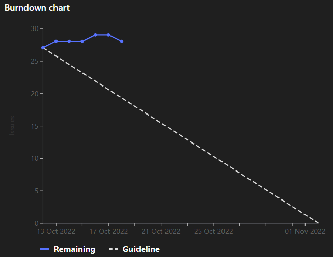

# [Sprint Goal](https://gitlab.com/msoe.edu/sdl/y23-senior-design/24-transcription-study-assistant/-/milestones/2): 
Begin Prototyping to Finalize Technology Decisions
# Burndown Chart:

# Team Member Contributions:
## *Christie, Angela*
### Weekly Hours: 10
### Weekly Rating: $`\frac{8}{10}`$
### Weekly Summary: 
- Created the hardware issues for sprint 2
- Created the Project BOM draft in the wiki
- Made changes to the surveys based on Dr. Sohoni's feedback
- Moved the surveys from Google Forms to Qualtrics
- Designed 4 sketches of the general design of the device (issue #55)
- Attended the Wednesday instructor meeting
- Attended the Tuesday team meeting and discussed the sketches and surveys
- Sent an email to Dr. Panciera about meeting to discuss the surveys

## *Fass, Grant*
### Weekly Hours: 10
### Weekly Rating: $`\frac{7}{10}`$
### Weekly Summary:
- Created the draft of the week 7 status report
- Created all of the software issues for sprint 2
- added table of contents to the technology report
- Wednesday meeting
- Add issue regarding surveys
- Looked through the ted talk dataset
- Started working on the LDA model
- Explored SpaCy and Gensim
- Set up software on my desktop and school laptop to train models
- Attended the weekly tuesday meeting

## *Kaja, Nicholas*
### Weekly Hours: 11.5 
### Weekly Rating: $`\frac{8}{10}`$
### Weekly Summary: 
- Attended Wednesday and Tuesday meetings  
- Set up Jupyter and Git on my laptop
- Started exploring and demonstrating word2vec options
  - MOOC, Gensim, spaCy
  - Started looking into top2vec, doc2vec for more concrete topic modelling
- Reviewed the LDA notebook
- Spent a couple hours researching the following: 
  - Latent semantic analysis (LSA)
  - Transformer-based summarization models
    - HuggingFace, BERT, T5
 

## *Karpov, Alexander*
### Weekly Hours: 10
### Weekly Rating: $`\frac{9}{10}`$
### Weekly Summary:
- Attended Tuesday and Wednesday meetings
- Performed testing on OWL device
  - [Audio, Video, UX Testing Files](https://drive.google.com/drive/folders/1IkPF0nvL7wVD4nlKw-VGd5KvBTSpyOMa?usp=sharing)
  - [Closed Analysis Issue](https://drive.google.com/drive/folders/1IkPF0nvL7wVD4nlKw-VGd5KvBTSpyOMa?usp=sharing)
- Did some brainstorming and sketches/blender concepts

## *Toohill, Teresa*
### Weekly Hours: 10
### Weekly Rating: $`\frac{9}{10}`$
### Weekly Summary:
- Researching Various Voice-To-Text APIs
- Considered the various pros and cons of those APIs
- Investigated legitimacy, languages, and security of those APIs
- Attended weekly Tuesday meeting
- Started investigating QTC++ and began looking at making prototype
- Wednesday meeting
- Catme survey
- Slight drafting of GUI

# Discussion:
## Meetings:
- Weekly Meeting
  - Went through the tech report
    - May want to add drop downs where possible
    - May want to add a section on what decisions were made.
  - record the survey links somewhere in the wiki
  - Record the GUI requirements somewhere in the wiki
  - Create a model comparison wiki page for the issue
  - Create a software language comparison wiki page for the issue.
  - contact dr. Shilling. and get access to the report for the similar senior design project. cc dr. Sohoni on it
  - surveys
    - reword the header paragraph in the surveys.
    - reorder survey so most important questions are at the front.
    - perhaps shorten the length of the survey.
    - make the what other study materials do you want not an optional question.
    - may want to add a question about what sort of device was used during online learning.
    - may want to have a few instructors take the survey as a sample with you there to answer questions.
    - talk with the UX professor about surveys.
    - change explain your answer to please expand on your answer.
- October $18$th 2022

# Advisor Questions:
- No questions this week

# Conclusion
This week we mostly all spent time running through some prototypes