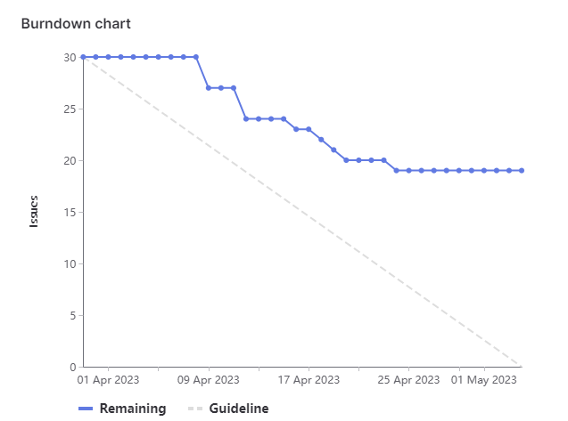

# [Sprint Goal](https://gitlab.com/msoe.edu/sdl/y23-senior-design/24-transcription-study-assistant/-/milestones/8#tab-issues): 
***Goal:***   
Planning out a four week sprint so we line up with the other teams again. This will also leave us more time to finish everything off.

Hardware: Build and Assemble Device, Program Interfacing

ML: Add in Question Generation

Software: OWASP backend updates, Frontend UX updates

General: Poster & Final Report

## Burndown Chart

# Team Member Contributions:
## *Christie, Angela*
### Weekly Hours: 7.75
### Weekly Rating: $`\frac{7}{10}`$
### Weekly Summary: 
- Attended the meeting with Dr. Sohoni and a brief team meeting after
- Attended the Tuesday team meeting
- Talked with Dr. Faulkner and fixed the microphone problem (issue #193)
  - Removed the potentiometer (with help from Xander), clipped the 3rd pin off, then connected it to the board again
  - Tested the microphone by printing readings, it works as expected

## *Fass, Grant*
### Weekly Hours: 4
### Weekly Rating: $`\frac{x}{10}`$ 
### Weekly Summary:
- Weekly Meeting + Notes + Status report setup.
- Added Xander's photo to the poster draft
- Worked with Teresa to figure out communications in Angular. Got the new account communication working as a sample by enabling proxies for the link going to the backend. Had to modify the backend to accept POST requests.

## *Kaja, Nicholas*
### Weekly Hours: 5
### Weekly Rating: $`\frac{4}{10}`$
### Weekly Summary: 
- Attended the Tuesday and Thursday weekly meetings
- Wrote the ML technical summary in the final report
- Briefly investigated tuning the question answering/generation models
 
## *Karpov, Alexander*
### Weekly Hours: 7
### Weekly Rating: $`\frac{x}{10}`$
### Weekly Summary:
- Attended Tuesday and Thursday meetings
- Worked on Issue #194/#193
  - Was able to communicate both ways, now just need to finish off the actual method stubs
  - Completed SO2-3

## *Toohill, Teresa*
### Weekly Hours:  15
### Weekly Rating: $`\frac{x}{10}`$
### Weekly Summary:
- Tuesday and Thursday meetings
- Worked on #129, #130, and #131 
- Met with Grant to debug API communications was, able to successfully get communications for create new user protocol working
- Implementing other protocols

# Discussion:
## Meetings:
Weekly Meeting Notes
- The poster is fine the way it is unless there are other things that we can put pictures for or want to reduce the text. The logos in the top section seem a little more squished than the other two. May want to make more horizontal space for the logos.
- Teresa has been implementing some of the other frontend issues and is trying to implement the API. 
- Talked about the controller and audio issues after the professor signed off
- 30 min meeting.

Tuesday Meeting Notes
- Xander: Figured out the serial comms between python and arduino. Just need to finish setting up the actual library and we are good.
- Angela: Capacitor is parallel to the resistor and we want it in serial. So we need to pull the potentiometer off and remove one of the pins touching to ground. Just leave pin 3 open since we already have part of the board assembled. Going to try and go back in tomorrow and desolder the potentiometer. Hopefully that is our audio problem.
- Nick: Looking at final report and summary for ML section.
- Grant: added xanders photo to poster draft.
- Teresa: Trying to implement a get request for creating new users. Trying to debug why HTTP is not working on angular.

Week 8 Thursday Meeting:
- Going to extend the sprint by another week to account for a lot of the issues being open. Main thing holding us up is the frontend being done. Our burndown is very flat due to not a lot of issues being fully completed, this needs to change.
- Angela finished most of the device side method stub stuff. Xander is working on making it communicate with the computer.

Week 9 Tuesday Meeting:
- Angela, Nick, & Grant did not do a ton over the last week.
- Poster is printed and at tech support for framing.
- Angela planned to look at the final report before Thursday.
- Teresa is continuing on the API and working on the login one. file upload should be in. Hopefully should be done by Thursday.

# Advisor Questions:
- None

# Conclusion.
- None