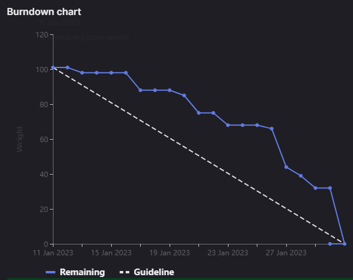

# [Sprint Goal](https://gitlab.com/msoe.edu/sdl/y23-senior-design/24-transcription-study-assistant/-/milestones/5#tab-issues): 
***Goal:***  
Hardware: Begin building the prototype to verify equipment functions as expected.

ML: Work on improving Transformer performance using Khan Academy Dataset

Software: Begin creating the application Frontend and implementing the Application Backend for the data processing endpoints

## Burndown Chart

# Team Member Contributions:
## *Christie, Angela*
### Weekly Hours: 14
### Weekly Rating: $`\frac{9}{10}`$
### Weekly Summary: 
- Attended the meeting with Dr. Sohoni
- Attended the Friday team meeting
  - Discussed the sprint 5 retro and helped organize the sprint 6 plan for the hardware team)
- Completed the test for the microphones (issue #140)
  - A report has been written discussing the details of the test, the results, and overall conclusions. This may be found in the [Microphone Test Report](https://gitlab.com/msoe.edu/sdl/y23-senior-design/24-transcription-study-assistant/-/wikis/Microphone%20Test%20Report)
- Completed SO7-4, SO4-3, SO2-1, and SO6-3 (issues #135, #136, #137, and #134)

## *Fass, Grant*
### Weekly Hours: 9
### Weekly Rating: $`\frac{8}{10}`$
### Weekly Summary:
- Drafted the weekly status report
- Attended the weekly meeting
- Helped Teresa fix her Git issues and setup SourceTree
- Began planning the sprint 6
- Drafted the sprint retro
- Completed the CATME survey
- Reviewed the STL files Xander made.
- Friday Weekly Meeting + a bit extra to wrap up planning
- A few more updates to sprint retro
- Issue #143 Update API Comms Doc which was done early to prepare for next sprint / remove blocks.
- 3 Hours, on 1/28, (Untracked from any issue and weekly status since it is for the GraphML class) attempting to figure out if it is possible to perform topic modeling using a graphical representation of the khan academy dataset.

## *Kaja, Nicholas*
### Weekly Hours: 14
### Weekly Rating: $`\frac{9}{10}`$
### Weekly Summary: 
- Attended Tuesday and Friday weekly meetings
- Completed the CATME Survey
- Completed SO4-3, SO2-1, and SO6-3
- Completed the Transformer Fine-tuning (#123)

## *Karpov, Alexander*
### Weekly Hours: 9
### Weekly Rating: $`\frac{x}{10}`$
### Weekly Summary:
- Attended Tuesday and Friday meetings
- SO6-3, SO2-1, SO4-3
- Continued to work on device package (put on hold due to changes in the PCB)

## *Toohill, Teresa*
### Weekly Hours: 14
### Weekly Rating: $`\frac{x}{10}`$
### Weekly Summary:
- Attended Tuesday and Friday Meetings
- SO7-4
- Researching #132, figured out how to link pages
- Wrapped up #132
- Wrapped up #128 (depended on less research because I was more familiar)
- Did the survey with one friend who

# Discussion:
## Meetings:
Weekly Meeting Notes:
- Doing an audio only call for the moment. starting with a status report
- Angela made the cover letter for the instructor surveys and got them sent out. Using word of mouth and poster for the student surveys. PCB is ready to order. Prototype is wired. Working on getting the microphones to work. Prototype is on the breadboard. Should be a 1-2 week lead time on the PCB to arrive.
- Nick finalized the transformer investigation. Lots of research on transformers. Going to need to do the presentation on ML next week. 
- Xander finalized the test bench. Grant is going to look over the model. No locker update
- Teresa getting caught up again. Worked on the students projects show abstract, meeting up with others to take the student survey. Reading through the API documentation. Started writing the menu and navigation for frontend.
-  Grant worked on filling in the backend including the object store, endpoints, and logging.
- Grant and Teresa stayed after to fix remaining git issues

Friday Meeting Notes:
- 1hr
- Planning for next sprint
- Sprint Retro
- Weekly status update
- Everybody should finish all issues, including SOs by end of sprint.

# Advisor Questions:
- None

# Conclusion.
- None