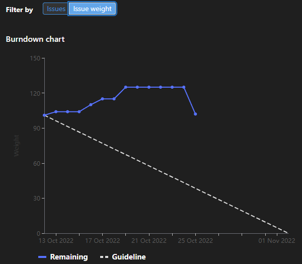

# [Sprint Goal](https://gitlab.com/msoe.edu/sdl/y23-senior-design/24-transcription-study-assistant/-/milestones/2): 
Begin Prototyping to Finalize Technology Decisions
# Burndown Chart:

# Team Member Contributions:
## *Christie, Angela*
### Weekly Hours: 10
### Weekly Rating: $`\frac{7}{10}`$
### Weekly Summary: 
- Created a wiki page for the sketches
- Added pros/cons to each design sketch
- Completed the readings and watched the video provided by Dr. Panciera
- Made the necessary changes to the surveys based on the readings and video
- Worked on SO3-4
- Attended the meeting with Dr. Sohoni
- Attended the Friday and Tuesday team meetings

## *Fass, Grant*
### Weekly Hours: 8.25
### Weekly Rating: $`\frac{8}{10}`$
### Weekly Summary:
- set up the weekly status report
- attended the weekly meeting.
- Attended the Friday team meeting
- Worked on the LDA model. Have it set up so that it can perform basic topic modeling with visualization.
- attended the tuesday meeting
- Updated and closed out the LDA issue

## *Kaja, Nicholas*
### Weekly Hours: 9 
### Weekly Rating: $`\frac{8}{10}`$
### Weekly Summary: 
- Worked on prototyping Transformer Text Summarizers through the HuggingFace platform
- Generated some summaries of TED Talks and one or Dr. Sohoni's lectures
- Started some research on how to generate longer summaries + use larger token inputs
- Created a cleaning method for .vvt transcript files (the ones Teams uses)
- Looked through the LDA notebook + new preprocessing pipeline method
- Attended the Wednesday, Friday, and Tuesday meetings
 

## *Karpov, Alexander*
### Weekly Hours: 5
### Weekly Rating: $`\frac{5}{10}`$
### Weekly Summary:
- Weekend and end of last week was particularly hellish, so wasn't able to put in as much time as I wanted to
- Attended Tuesday and Wednesday meetings
- Performed research into Microphones and categorized some microphones from DigiKey that we could use for the project

## *Toohill, Teresa*
### Weekly Hours: 12
### Weekly Rating: $`\frac{10}{10}`$
### Weekly Summary:
- Research for APIs
- Formatting APIs List
- Designing GUIs
- Began looking into Financial resources
- Meeting with Sohoni
- Meeting with Group on Friday
- Meeting with Group to wrap up week

# Discussion:
## Meetings:
- Weekly Meeting
  - may want to allow for both built in microphones and lapel microphones.
    - if we use the lapel microphone we may be able to track the instructor through the location somehow (rfid?)
  - may want to prototype different designs
  - need to record down in a wiki page why we picked certain designs (and put in tech report)
  - do we want an on board battery for the device as a battery backup.
  - video passthrough for screenshare? (button on lapel microphone to toggle without walking back to computer?)
  - record the screenshare and the video feed and in post processing figure out what to show (both if needed).
- October 21st 2022
  - Just a mid-week check in meeting
  - lasted 30 min
- October 26th 2022
  - Just a mid-week check in meeting
  - lasted 1 hour

# Advisor Questions:
- No questions this week

# Conclusion
This week we mostly all spent time running through some prototypes.