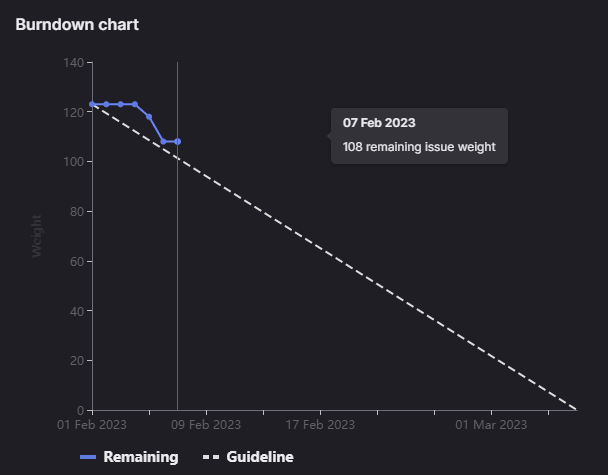

# [Sprint Goal](https://gitlab.com/msoe.edu/sdl/y23-senior-design/24-transcription-study-assistant/-/milestones/6#tab-issues): 
***Goal:***   
Hardware: Begin Assembling Prototype & Printing. Update designs based on survey feedback.

ML: Build out classes for Summarizers, Topic Modeling, and Sentences.

Software: Implement API endpoints in backend. Get frontend to be minimally viable.

## Burndown Chart

# Team Member Contributions:
## *Christie, Angela*
### Weekly Hours: 10
### Weekly Rating: $`\frac{7}{10}`$
### Weekly Summary: 
- Attended the meeting with Dr. Sohoni
- Attended the Friday team meeting
- Attended the Backend Meeting
- Uploaded PDFs of the student and instructor surveys
- Worked on the presentation draft (issue #139)
- Updated the microcontroller justification document and reviewed the hardware portions of the updated technology report (issue #95)
- Began testing the camera (issue #141)
- Completed the sprint 5 CATME survey

## *Fass, Grant*
### Weekly Hours: 17.5
### Weekly Rating: $`\frac{7}{10}`$ 
Would have been higher if I was not sick...  
### Weekly Summary:
- Drafted weekly status report
- Attended weekly meeting & took notes
- Spent 1h (for Graph ML) looking at the preprocessor and LDA. I am thinking that the preprocessor will need to be reworked to use pipelines and also no longer to bigram / trigram representations.
- Spent 5h (also for graph ml) updating the preprocessor and on creating a better baseline LDA notebook off the khan academy data
- Friday Meeting
- Drafted out the updates to the Overview and Functional Requirements Sections of the Tech Report
- Backend meeting
- Finished drafting most of the hardware related tech report page updates
- Finished updating and turned in the tech report
- Worked on updating parts of the presentation

## *Kaja, Nicholas*
### Weekly Hours: 10
### Weekly Rating: $`\frac{7}{10}`$
### Weekly Summary: 
- Attended the Tuesday, Friday weekly meetings
- Attended the Saturday backend discussion meeting
- Installed software for running / testing the backend
- Pushed tuned model to the HuggingFace Hub so we don't have to push it to this repo
- Developed the Transformer prediction class (#145)
- Added some content to the presentation slides
- Found some more transcripts and did some testing with the tuned model

## *Karpov, Alexander*
### Weekly Hours: 10
### Weekly Rating: $`\frac{x}{10}`$
### Weekly Summary:
- Attended Tuesday weekly meeting
- Completed CATME survey
- Worked on Issue #154 
- Worked on Issue #155 

## *Toohill, Teresa*
### Weekly Hours: 10
### Weekly Rating: $`\frac{x}{10}`$
### Weekly Summary:
- Met with Dr. Sohoni
- Attended Friday meeting for roughly 20 minutes (SSE conflict)
- Backend meeting with Grant, Angela, and Nicholas for roughly 1hour and 45mins
- Implemented backend
- Worked on various topic pages (#131, #130, #129)
- Added to slides for the draft

# Discussion:
## Meetings:
Weekly Meeting Notes:
- Ended up overwriting the Students Project Show Abstract submission. Earliest submission was the one we meant to submit. "Wraps in" feels like an addition and not as much as part of the project. There are a few long sentences as well. Have until March 31st to update it. Look at the two long sentences. Use all 150 words to describe the project. Talk more about the Hardware / ML impacts the project.
- Faculty survey: Jill sounded like she did not really want to send it out. Faculty Senate Chair notified that Dr. Sohoni can send it out himself through all program directors. Low response count should still end up yielding sufficient information. Friday March 10th for survey cutoff.
- This sprint ends up going through the first week of next quarter.
- ML Overview Presentation
- Send reminder by Friday if no word that survey was sent out.
- Take the time that is needed for the tech report.

Friday Meeting Notes:
- Teresa Standup: worked on the account info and file management topic pages. Plan to continue this weekend. 
- Angela Standup: worked on the presentation draft. Finished out most of the sections. Added PDF's of both surveys to the wiki. Started looking at camera testing. Try to continue camera testing this weekend. PCB redesign on hold.
- Nick Standup: Finishing up the SO objectives. Had to do fine tuning on ROSIE. Had to run 2 T4 GPU's and still took 4 hours to train. Results looking a lot better now.
- Grant Standup: Worked on LDA and Preprocessing updates for GraphML. Planning on tech report this weekend.

Saturday Meeting Notes:
- Held a 1.75 hr meeting on how to setup the backend.
- Found a lot of issues in the documentation and setup with various environments that will need to be fixed.

# Advisor Questions:
- None

# Conclusion.
- None

# Other:
- db call cannot take longer than 100ms. Greater than 250ms for entire rest call is bad. That includes the connections. Probably going to need to run transcription and stuff in backend on file upload.