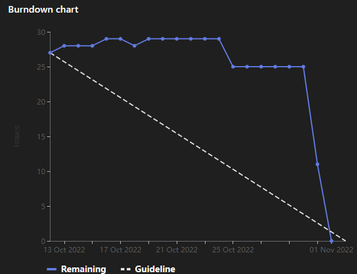

# [Sprint Goal](https://gitlab.com/msoe.edu/sdl/y23-senior-design/24-transcription-study-assistant/-/milestones/2): 
Begin Prototyping to Finalize Technology Decisions
# Burndown Chart:

# Team Member Contributions:
## *Christie, Angela*
### Weekly Hours: 10.5
### Weekly Rating: $`\frac{9}{10}`$
### Weekly Summary: 
- Emailed Dr. Panciera on Wednesday
- Completed SO5-4 and worked on SO3-4
- Reviewed issue #56 and provided some notes
- Took a further look into the camera choices
- Added hardware selection pages to the wiki so we can document our reasoning for the hardware choices
- Documented the microphone selection and reasoning (I will be using this for SO3-4)
- Met with Alexander to discuss hardware decisions
- Attended the team meeting with Dr. Sohoni
- Attended the Tuesday team meeting and discussed the sprint retro, planning, and other topics

## *Fass, Grant*
### Weekly Hours: 13
### Weekly Rating: $`\frac{10}{10}`$
### Weekly Summary:
- Created the Week 9 status report
- Started work on the communication protocols wiki page
- Attended the weekly team meeting with advisor
- Worked on SO5-4
- Finished the rough draft of the current communication protocols wiki page
- worked on the end of quarter presentation
- Worked on the planning for sprint 3
- Cleaned up some of the sprint 2 issues
- Worked on drafting some wiki pages
- Worked on planning for and attending the Tuesday team meeting.

## *Kaja, Nicholas*
### Weekly Hours: 10
### Weekly Rating: $`\frac{8}{10}`$
### Weekly Summary: 
- Continued work with Transformer Summarizers, comparing various models from HuggingFace
  - Briefly looked into decoding strategies and model parameters 
- Looked into Mask Filling and tried it on some examples
- Looked into the idea of using transfer-learning to fine-tune a model from HuggingFace
- Worked on SO5-4 and a little on SO3-4
- Attended the Wednesday and Tuesday meetings 
 

## *Karpov, Alexander*
### Weekly Hours: 9
### Weekly Rating: $`\frac{8}{10}`$
### Weekly Summary:
- Attended Tuesday and Wednesday meetings
- Completed SO5-4
- Reviewed and cataloged several microphone choices
- Reviewed some extra camera choices
- Did more research into communication protocols for cameras
- Met with Angela to review microphone, camera, and servo choices

## *Toohill, Teresa*
### Weekly Hours: 9
### Weekly Rating: $`\frac{x}{10}`$
### Weekly Summary:
- Weekly meeting with group
- Looked at QTC++ documentation and began trying to implement
- Looked at Angular documentation and began trying to implement
- Finance research

# Discussion:
## Meetings:
- Weekly Meeting
  - presentation should be about 10min
  - can probably close the high level design issue and move the remaining requirements into a new issue
  - any unstarted an deferred issues can just be moved to next sprint
- October 28th 2022
  - Canceled this meeting
- November 1st 2022
  - Sprint planning and weekly standup

# Advisor Questions:
- No questions this week

# Conclusion
This week we mostly all spent time running through some prototypes.